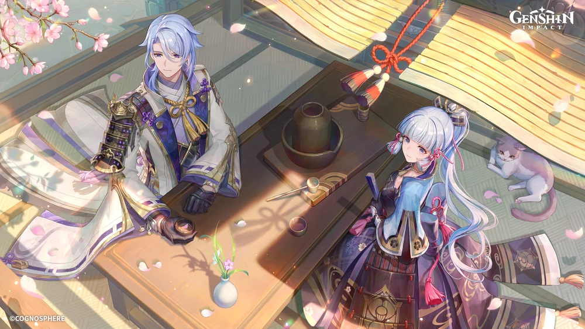
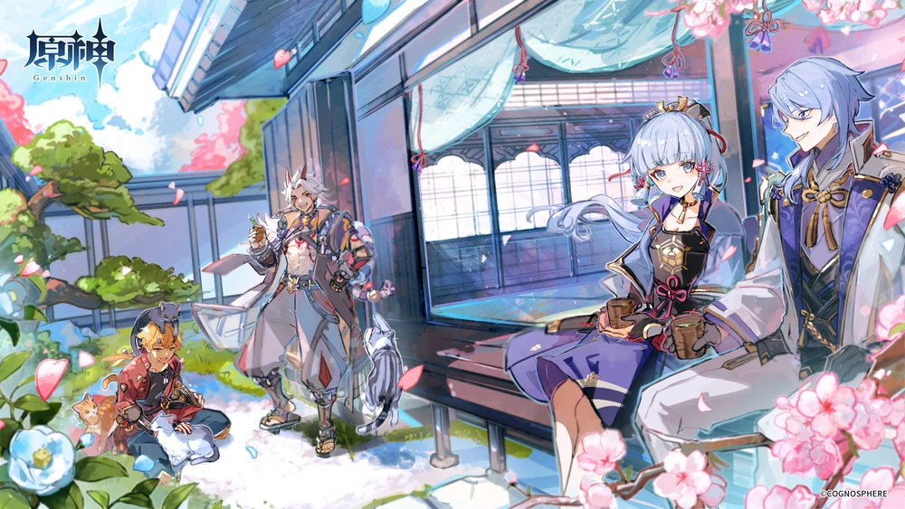

Table of Contents

- [Kamisato Ayato - Pillar of Fortitude](#kamisato-ayato---pillar-of-fortitude)
  - [Credits](#credits)
  - [General Overview](#general-overview)
  - [Pros and Cons](#pros-and-cons)
  - [Normal Attack - Kamisato Art: Marobashi](#normal-attack---kamisato-art-marobashi)
    - [Normal Attack](#normal-attack)
    - [Charged Attack](#charged-attack)
    - [Plunging Attack](#plunging-attack)
  - [Elemental Skill – Kamisato Art: Kyouka](#elemental-skill--kamisato-art-kyouka)
    - [Takimeguri Kanka](#takimeguri-kanka)
  - [TLDR](#tldr)
  - [Elemental Burst – Kamisato Art: Suiyuu](#elemental-burst--kamisato-art-suiyuu)
  - [A1 Passive -  Kamisato Art: Mine Wo Matoishi Kiyotaki](#a1-passive----kamisato-art-mine-wo-matoishi-kiyotaki)
  - [A4 Passive - Kamisato Art: Michiyuku Hagetsu](#a4-passive---kamisato-art-michiyuku-hagetsu)
  - [Utility Passive – Kamisato Art: Daily Cooking](#utility-passive--kamisato-art-daily-cooking)
  - [Talent Priority](#talent-priority)
    - [For On-Field DPS,](#for-on-field-dps)
    - [For Off-Field DPS,](#for-off-field-dps)
  - [Constellation overview](#constellation-overview)
    - [Constellation 1: Kyouka Fuushi](#constellation-1-kyouka-fuushi)
    - [Constellation 2: World Source](#constellation-2-world-source)
    - [Constellation 3: To Admire the Flowers](#constellation-3-to-admire-the-flowers)
    - [Constellation 4: Endless Flow](#constellation-4-endless-flow)
    - [Constellation 5: Bansui Ichiro](#constellation-5-bansui-ichiro)
    - [Constellation 6: Boundless Origin](#constellation-6-boundless-origin)
  - [Build](#build)
  - [General Gameplay Style](#general-gameplay-style)
  - [Artifact Recommendation](#artifact-recommendation)
    - [Artifact Mainstat Recommendations](#artifact-mainstat-recommendations)
    - [Substats](#substats)
  - [Best Artifact Sets](#best-artifact-sets)
    - [4pc Heart Of Depth](#4pc-heart-of-depth)
    - [4pc Gladiator’s Finale](#4pc-gladiators-finale)
    - [4pc Echoes Of An Offering](#4pc-echoes-of-an-offering)
    - [2pc-2pc Alternatives](#2pc-2pc-alternatives)
    - [4pc Emblem Of Severed Fate](#4pc-emblem-of-severed-fate)
    - [4pc Thundering Fury](#4pc-thundering-fury)
    - [4pc Blizzard Strayer](#4pc-blizzard-strayer)
    - [Below AR 45 artifacts](#below-ar-45-artifacts)
  - [Weapon Recommendation](#weapon-recommendation)
    - [Top Tier Weapons](#top-tier-weapons)
      - [Haran Geppaku Futsu](#haran-geppaku-futsu)
      - [Primordial Jade Cutter](#primordial-jade-cutter)
      - [Mistsplitter Reforged](#mistsplitter-reforged)
    - [Good-enough weapons](#good-enough-weapons)
      - [The Black Sword](#the-black-sword)
      - [Lion Roar](#lion-roar)
      - [Harbinger Of Dawn](#harbinger-of-dawn)
    - [Meh Weapons](#meh-weapons)
      - [Kagotsurube Isshin](#kagotsurube-isshin)
      - [Amenoma Kageuchi](#amenoma-kageuchi)
      - [Skyward Blade](#skyward-blade)
      - [Favonius Sword](#favonius-sword)
      - [Summit Shaper](#summit-shaper)

> “Everything comes at a cost. And if you aspire to things that most could never dream of, then naturally, there will be an unimaginable price to pay.”

Table of Contents

- [Kamisato Ayato - Pillar of Fortitude](#kamisato-ayato---pillar-of-fortitude)
  - [Credits](#credits)
  - [General Overview](#general-overview)
  - [Pros and Cons](#pros-and-cons)
  - [Normal Attack - Kamisato Art: Marobashi](#normal-attack---kamisato-art-marobashi)
    - [Normal Attack](#normal-attack)
    - [Charged Attack](#charged-attack)
    - [Plunging Attack](#plunging-attack)
  - [Elemental Skill – Kamisato Art: Kyouka](#elemental-skill--kamisato-art-kyouka)
    - [Takimeguri Kanka](#takimeguri-kanka)
  - [TLDR](#tldr)
  - [Elemental Burst – Kamisato Art: Suiyuu](#elemental-burst--kamisato-art-suiyuu)
  - [A1 Passive -  Kamisato Art: Mine Wo Matoishi Kiyotaki](#a1-passive----kamisato-art-mine-wo-matoishi-kiyotaki)
  - [A4 Passive - Kamisato Art: Michiyuku Hagetsu](#a4-passive---kamisato-art-michiyuku-hagetsu)
  - [Utility Passive – Kamisato Art: Daily Cooking](#utility-passive--kamisato-art-daily-cooking)
  - [Talent Priority](#talent-priority)
    - [For On-Field DPS,](#for-on-field-dps)
    - [For Off-Field DPS,](#for-off-field-dps)
  - [Constellation overview](#constellation-overview)
    - [Constellation 1: Kyouka Fuushi](#constellation-1-kyouka-fuushi)
    - [Constellation 2: World Source](#constellation-2-world-source)
    - [Constellation 3: To Admire the Flowers](#constellation-3-to-admire-the-flowers)
    - [Constellation 4: Endless Flow](#constellation-4-endless-flow)
    - [Constellation 5: Bansui Ichiro](#constellation-5-bansui-ichiro)
    - [Constellation 6: Boundless Origin](#constellation-6-boundless-origin)
  - [Build](#build)
  - [General Gameplay Style](#general-gameplay-style)
  - [Artifact Recommendation](#artifact-recommendation)
    - [Artifact Mainstat Recommendations](#artifact-mainstat-recommendations)
    - [Substats](#substats)
  - [Best Artifact Sets](#best-artifact-sets)
    - [4pc Heart Of Depth](#4pc-heart-of-depth)
    - [4pc Gladiator’s Finale](#4pc-gladiators-finale)
    - [4pc Echoes Of An Offering](#4pc-echoes-of-an-offering)
    - [2pc-2pc Alternatives](#2pc-2pc-alternatives)
    - [4pc Emblem Of Severed Fate](#4pc-emblem-of-severed-fate)
    - [4pc Thundering Fury](#4pc-thundering-fury)
    - [4pc Blizzard Strayer](#4pc-blizzard-strayer)
    - [Below AR 45 artifacts](#below-ar-45-artifacts)
  - [Weapon Recommendation](#weapon-recommendation)
    - [Top Tier Weapons](#top-tier-weapons)
      - [Haran Geppaku Futsu](#haran-geppaku-futsu)
      - [Primordial Jade Cutter](#primordial-jade-cutter)
      - [Mistsplitter Reforged](#mistsplitter-reforged)
    - [Good-enough weapons](#good-enough-weapons)
      - [The Black Sword](#the-black-sword)
      - [Lion Roar](#lion-roar)
      - [Harbinger Of Dawn](#harbinger-of-dawn)
    - [Meh Weapons](#meh-weapons)
      - [Kagotsurube Isshin](#kagotsurube-isshin)
      - [Amenoma Kageuchi](#amenoma-kageuchi)
      - [Skyward Blade](#skyward-blade)
      - [Favonius Sword](#favonius-sword)
      - [Summit Shaper](#summit-shaper)

# Kamisato Ayato - Pillar of Fortitude

## Credits
* Written by: Blanky
* Reviewed by: Arun
* Proofread by: Yet to be done
* Last updated on: 26th April, 2023
* Character guide updated till v3.6

## General Overview

As the newest 5* hydro sword character, Ayato, with his elegance skill and burst brings forth new cards to the table in the meta. He is your average DPS but with exceptional enabling abilities with his hydro application from his skill. As a hydro character, he is quite flexible and can be slotted into many different teams, although some can be quite frustrating to build, while also suffering from some stepbacks, in this guide, I will cover everything you need to know about him and further your knowledge on our dear boba man.

## Pros and Cons

<table>
  <tr>
    <th>Pros</th>
    <th>Cons</th>
  </tr>
  <tr>
    <td>Strong damage in both AoE and single target</td>
    <td>F2P weapons are underwhelming</td>
  </tr>
  <tr>
    <td>Wide variety of team compositions</td>
    <td>Lacking frontloaded damage</td>
  </tr>
  <tr>
    <td>Flexible with artifacts and weapon</td>
    <td>Constellations are underwhelming</td>
  </tr>
  <tr>
    <td>Resin-efficient artifact sets</td>
    <td>Many of his team use contested characters</td>
  </tr>
  <tr>
    <td>Low skill level to use</td>
    <td>May suffer energy issues</td>
  </tr>
  <tr>
    <td>Consistent damage</td>
    <td>Other hydro units can be better at his role</td>
  </tr>
</table>

## Normal Attack - Kamisato Art: Marobashi

### Normal Attack
Performs up to 5 rapid strikes.

### Charged Attack
Consumes a certain amount of Stamina to dash forward and perform an [iai](https://en.wikipedia.org/wiki/Iaido).

### Plunging Attack
Plunges from mid-air to strike the ground below, damaging opponents along the path and dealing [AoE](https://genshin-impact.fandom.com/wiki/AoE) DMG upon impact.

Your everyday normal attacks, nothing special, can be neglected. Do note that Shunsuiken slashes (convert from Normal Attacks) after casting his Skill **do not** scale off his Normal Attack.

## Elemental Skill – Kamisato Art: Kyouka
Kamisato Ayato shifts positions and enters the Takimeguri Kanka state.

After this shift, he will leave a watery illusion at his original location. After it is formed, the watery illusion will explode if opponents are nearby or after its duration ends, dealing **AoE Hydro DMG**.

### Takimeguri Kanka
In this state, Kamisato Ayato uses his Shunsuiken to engage in blindingly fast attacks, causing DMG from his Normal Attacks to be converted into **AoE Hydro DMG**. This cannot be overridden.

It also has the following properties:

* After a Shunsuiken attack hits an opponent, it will grant Ayato the Namisen effect, increasing the DMG dealt by Shunsuiken based on Ayato's current Max HP.

* The initial maximum number of Namisen stacks is 4, and 1 stack can be gained through Shunsuiken every 0.1s.
  
* This effect will be dispelled when Takimeguri Kanka ends. Kamisato Ayato's resistance to interruption is increased. Unable to use Charged or Plunging Attacks.

Takimeguri Kanka will be cleared when Ayato leaves the field. Using Kamisato Art: Kyouka again while in the Takimeguri Kanka state will reset and replace the pre-existing state.

## TLDR

Ayato goes forward, leaving an illusion behind that will explode after some time. In this state, holding the left click will allow Ayato to do Hydro AoE slashes and is able to gain stack to increase its damage. In this state, he cannot make a charge or plunge attack, and the state will be removed if you switch out.

Ayato’s primary source of damage. Able to deal AoE damage to enemies. While he has HP scaling, it is relatively low. As such, it is not recommended to build HP solely for this, but it can provide some niche improvement in damage.

You can do up to 15 slashes, even more, if you have an attack speed buff (Jean C2, Ayato C4, Yuijin C6, ETC) or have high FPS, but it isn’t necessary.

## Elemental Burst – Kamisato Art: Suiyuu
Unveils a garden of purity that silences the cacophony within.

While this space exists, Bloomwater Blades will constantly rain down and attack opponents within its AoE, dealing **Hydro DMG** and increasing the Normal Attack DMG of characters within.

Droplets will drop down dealing niche damage but it’s good for a Burst DPS Ayato whose purpose is to use his burst constantly. His off-field hydro application really shines here as it applies hydro via droplets which drop for about 18 seconds or in other words 36 droplets. It also has wide AoE so more enemies get hydro. It buffs Normal Attack DMG which is nice to have especially for Ayato as his skill is counted as Normal Attack DMG. However, it has a high energy cost, and while his A4 reduces it by a little, it is recommended to have some ER rolls on him (You can use the [Energy Recharge Calculator](https://docs.google.com/spreadsheets/d/1-vkmgp5n0bI9pvhUg110Aza3Emb2puLWdeoCgrxDlu4/edit#gid=1616109791) to help find the suitable amount of ER for your team)

## A1 Passive -  Kamisato Art: Mine Wo Matoishi Kiyotaki 

Kamisato Art: Kyouka has the following properties:

After it is used, Kamisato Ayato will gain 2 Namisen stacks. When the water illusion explodes, Ayato will gain a Namisen effect equal to the maximum number of stacks possible.

Ayato can have two Namisen stacks at the start of his rotation (so cool!!) What the stack gives is bonus damage for Ayato, although not a lot, but is nice to have.

## A4 Passive - Kamisato Art: Michiyuku Hagetsu

If Kamisato Ayato is not on the field and his Energy is less than 40, he will regenerate 2 Energy for himself every second.

Reduces Ayato's need for ER by a small amount because it can recover 6 to 16 Flat Energy for him during realistic rotations. Energy Recharge has no impact on this Flat Energy.

## Utility Passive – Kamisato Art: Daily Cooking

When Ayato cooks a dish perfectly, he has an 18% chance to receive an additional "Suspicious" dish of the same type. That’s basically it.

## Talent Priority

### For On-Field DPS,

Skill > Burst >>> NA

You can completely ignore normal attack on Ayato, and if anything you are levelling it just because you like him a lot. Other than that, you don’t need to put in valuable resources levelling it and instead upgrade your skill which is the top priority for DMG increased as well as your burst for nice bonus DMG as well as the increase of the Normal Attack DMG Bonus. 

### For Off-Field DPS,

Burst >= Skill >>> NA

Again, normal attack can be left alone. Instead, you can prioritise either Burst or Skill, whichever you want (Burst being slightly prioritised)

## Constellation overview

> “You want to know about me? Hmm. Things aren't always a case of the more you know, the better.”

### Constellation 1: Kyouka Fuushi

> “Shunsuiken DMG is increased by 40% against opponents with 50% HP or less.”

C1 is highly dependent on the enemies you are facing. Overall, it is conditional and insignificant.

### Constellation 2: World Source

> “Namisen’s maximum stack count is increased to 5. When Kamisato Ayato has at least 3 Namisen stacks, his Max HP is increased by 50%”

A strong constellation that boosts his Namisen stack damage (assuming 15 Shunsuiken strikes each Skill). A good place to halt if you're looking for low Constellations on Ayato.

### Constellation 3: To Admire the Flowers

> “Increases the Level of Kamisato Art: Kyouka by 3. Maximum upgrade level is 15.”

Based purely on the fact that it grants levels to his major source of damage, this constellation is already powerful. Yet, this Constellation also enhances his C2 due to the rise in HP-based Namisen stack scaling.

An excellent Constellation overall, and another place to halt for low Constellations.

### Constellation 4: Endless Flow

> “After using Kamisato Art: Suiyuu, all nearby party members will have 15% increased Normal Attack SPD for 15s.”

Ayato can often employ an additional two or three Shunsuiken attacks per Skill with this Constellation. Also, a nice buff for Off-Field Ayato as the one taking the field may benefit from the Normal Attack speed buff. An overall strong rise in damage.

### Constellation 5: Bansui Ichiro

> “Increases the Level of Kamisato Art: Suiyuu by 3. Maximum upgrade level is 15.”

This Constellation is not particularly strong because Ayato's Burst is not his main source of damage.

### Constellation 6: Boundless Origin

> “After using Kamisato Art: Kyouka, Ayato’s next Shunsuiken attack will create 2 extra Shunsuiken strikes when they hit opponents, each one dealing 450% of Ayato’s ATK as DMG.”

Namisen won't have an impact on either of these Shunsuiken strikes.

Ayato is able to frontload part of his damage thanks to a significant increase in DPS.

Overall, his constellations is underwhelming, and only give a little damage increase. As such, it isn’t recommended or needed to roll for his constellations, unless you really like him then by all means go for it.

## Build 

My favourite section. Ayato is mainly built as a Main DPS (On-Field DPS), however, you can choose to run him as a Burst DPS (Off-Field or Sub-DPS) instead. In this section, I will go through different artifact sets you can use on him depending on what type of Ayato you are going for, and even includes some fun playstyles you can use.

## General Gameplay Style 

The easiest way to explain Ayato is to think of him like Childe if Childe uses a sword. Ayato vs Childe has been a thing for a long time, and the main difference is that, unlike Childe, Ayato can fit in almost any team. National, International, Hyper, Fridge, Burgeon, Hyperbloom, Bloom, Electro-Charged, Freeze, Vape and Soup. That’s quite a handful, and while you can argue Childe can also do so, his highest utility and team would only be International (Xiangling, Bennett, Kazuha)

You can use Ayato either as an on-field damage dealer who utilises his kit the best and lowers his ER requirement but has longer rotation or as a burst DPS which leaves the field time for another character to deal more on-field damage in exchange for higher ER requirement.

Overall, you mostly want to use him on-field as it is his highest damage potential, but in some cases/teams, you can go for the burst DPS variant of Ayato.

Most importantly, play him however you want.

## Artifact Recommendation

### Artifact Mainstat Recommendations 

**Sands: ATK% or ER%**

Generally speaking, ATK% Sands is always advised. It is advised to use 1 Skill every rotation. ER% Sands should only be used to fulfil Ayato's ER requirement if you are using him as an Off-Fielder. ER % sands are not recommended for an On-Field build.

HP% Sands should be avoided even though it initially appears to be a feasible option. This is because it performs much worse than ATK% Sands when Ayato's Burst is taken into account. Additionally, HP% only adds to his Namisen stacks which are only marginal boosts to the main ATK scaling of his skill.

**Goblet: Hydro% DMG Bonus**

Universal best main stat to have on any goblet for a Hydro DPS.

**Circlet: Crit Rate or Crit DMG**

Use whichever one that is able to balance Ayato crit ratio (1:2)

### Substats

ER until you meet his ER requirements > Crit Rate = Crit DMG > ATK% > HP% > the rest

You would want to focus on getting enough ER rolls so that he is able to burst every rotation, then you can start getting his offensive stats higher.

## Best Artifact Sets

### 4pc Heart Of Depth

One of Ayato's best artifact which is more reliable than 4-piece Echoes' RNG and perhaps easier to get in terms of resin. (Also strongbox exists) 

Another thing to keep in mind is that 4-piece HoD performs better with gear and buffs like PJC and Amenoma that don't give DMG%.

### 4pc Gladiator’s Finale

Similar to 4 pc Heart of Depth in terms of performance, 4pc Glad performs somewhat better with weapons that have less ATK and more DMG% while slightly worsening with weapons that have more ATK and fewer DMG%.

It is also a very convenient option because bosses and the Strongbox both grant access to it. Use whichever of the four pc Glad or four pc HoD substats is preferable/better.

### 4pc Echoes Of An Offering

> “Disappointment is the only word I have for this artifact set, lol” - Blanky

Only use this if you have continuously low ping (sub 100). This is due to the fact that player ping and the average activation rate of the 4pc effect of 4pc Echoes are correlated, with higher ping typically resulting in a lower average proc rate.

From a live game point of view, every time you do damage, it gets registered in the server. The server does calculations based on the damage recorded to give an enemy reaction and show a damage number.

Since the set has an RNG proc happening at 50 ms, if you have 50 ms ping or low, you should be technically fine. However, if your ping is more than 50 ms, the RNG proc of the set gets delayed. This reduces the overall bonus the set gives. It may or may not be as good as a 4pc Gladiator or 4pc HoD sets.

If your ping is more than 100 ms, the reduction in this bonus is quite significant, and it performs less than 4pc Gladiator or 4pc HoD with identical stats.

While using weapons and buffs that increase DMG% and when using weapons and buffs that increase ATK, 4pc Echoes will outperform 4pc HoD and 4pc Glad if players have consistently low ping. Use whichever of these four-piece sets has the best substats once again. However, generally, I would not recommend you farm this set (Or this domain as a whole) as it is useless and you probably have some Glad pieces from world boss rewards that you can use instead of this RNG set.

As a safe option, it is recommended to go for 4pc Gladiator or 4pc HoD because of their unconditional passives.

### 2pc-2pc Alternatives
Pick any two from Emblem of Severed Fate, ATK%, ATK%, HoD (ATK% being: Glad, Shimenawa, Vermillion and Echoes)

With better substats and being simpler to obtain, any combination of the 2 can be just as powerful as the aforementioned 4-piece sets.

Emblem can be an excellent alternative for reducing the requirement for ER in substats while being more accessible than 4-piece sets.

For Burst DPS Ayato, the distance between these and the 4-piece sets closes, sometimes even surpassing the 4-piece sets.

### 4pc Emblem Of Severed Fate

By employing only 1 Skill for each Burst, Ayato's Burst does more of his damage than usual, and his ER needs are often higher. 4pc EoSF can be a good option for Burst DPS Ayato—performing similarly to all other alternatives.

4pc EoSF is not advised for On-Field Ayato as he preferred better artifact sets that can boost his On-Field Damage.

### 4pc Thundering Fury

<iframe width="260" height="286" style="position:absolute;top:0;left:0;width:100%;height:100%;" frameBorder="0" src="https://imgflip.com/embed/7cagpb"></iframe>

<a href="https://imgflip.com/gif/7cagpb">via Imgflip</a>

> “I heckin love 4 TF Ayato” - Zajef 

Ah, yes. The Zajef special. 4pc TF is a respectable option when playing Beidou against Electro-Charged opponents. Beidou benefits from having a driver on the field because it makes it more likely for her to activate her Elemental Burst, and also permits Ayato to remain on the field and launch his Shunsuiken slashes for a longer length of time. You can even run Hyperbloom Ayato (Which will be talked more of in the team section) with a team of Ayato-Beidou-Fischl/Kuki-Nahida/DMC/Yaoyao where Ayato, if done properly, will have 100% uptime on his skill. However, worth noting that the effect of 4 pc TF will only work in Hyperbloom Ayato if there is more than one Electro unit so that there will be a consistency of Electro application for 4 pc TF to take place.

It should be remembered that TF is only a marginal improvement over other sets, even in the best-case situation. This suggests that farming this set for Ayato might not be worthwhile. With superior substats and being more all-purpose, other possibilities may exceed this set in terms of performance. But, 4 pc TF is just so fun on Ayato, as such, if you are just looking for ways to mess around with Ayato, look no further than 4 pc TF.

### 4pc Blizzard Strayer

Only usable in freeze team where Ayato will be On-Field using his skill. On the assumption of high freeze time throughout, it may be noticeably superior to alternative options.

However, there is fierce competition in the freeze teams for the set because many characters (Ayaka, Ganyu), including Ayato, covet it. If there aren't enough Blizzard Strayer sets available, using 4 pc BS on those characters may be beneficial for the entire team because they will suffer more than Ayato.

### Below AR 45 artifacts

If you are lower than AR 45, it is advised not to try and get any of the artifact sets mentioned above and instead focus on levelling him up, his talent and his weapon. Here is some artifact set you can use for the time being.

2pc The Exile + 2pc Berserker
2pc ATK%+ 2pc ATK%
4pc Martial Artist

## Weapon Recommendation

In this section, most of the weapons will be those that can boost/buff Ayato’s damage capabilities and some are support weapons as a utility.

### Top Tier Weapons 

#### Haran Geppaku Futsu

Ayato’s signature, as such his BiS (Best in Slot), has a specialized passive that only presently functions very effectively with Ayato. Can be a good sword to use as a statstick for other sword characters. Pulling for HGF is not advised if players already own PJC or Mist and even then, not a needed weapon.

#### Primordial Jade Cutter

One of Ayato’s strongest weapons. An unconditional passive which fully buffs Ayato as he enjoys both HP and ATK buff.

#### Mistsplitter Reforged

Mistsplitter lags behind its CRIT 5* rivals despite having a passive that is more universal than HGF's as it frequently has trouble maintaining maximum stacks for very long or at all in many of its rotations.

The Burst DPS Ayato teams are the exception when the distance closes considerably.

### Good-enough weapons 

#### The Black Sword

One of Ayato's best 4* options, it offers beneficial Crit Rate and NA DMG Boost as well as a healing passive that occasionally comes in handy but is mostly insignificant.

It scales with refines relatively badly because only the NA DMG Boost in its passive is particularly helpful, especially given that each refines costs $10 (Battle Pass)

#### Lion Roar

Another strong 4*, although it can only be used in electro-charged and hyperbloom teams because that is the only setting in which its passive can maintain high uptime. Without its passive, it performs so far worse that players should choose to run any other weapon instead.

#### Harbinger Of Dawn

If players can keep 100% uptime on a 3*'s passive, it suddenly becomes a shockingly potent alternative. Ayato finds it challenging to accomplish this because his teams hardly ever use shielders and he spends most of his time anchored On-Field while performing Shunsuiken attacks. On teams without large ATK buffs (such as Bennett), Harbinger will suffer even more as a result of its terrible basic attack

### Meh Weapons

#### Kagotsurube Isshin

Only provides ATK. Even if the passive is cast at the start of a rotation, it may still be quickly snapshotted onto Ayato's Burst by performing a single Normal Attack while he is not in Takimeguri Kanka. Overall, a good F2P alternative ought to be employed in the absence of any other choices.

#### Amenoma Kageuchi

Amenoma's passive can occasionally be rendered worthless, at least during the first rotation, because Ayato frequently casts his Burst first in rotations. When Ayato's A4 Talent does activate, the flat Energy generation of its passive may reduce the quantity of Energy acquired from it.

On rotations where Ayato Bursts before casting any Skills, it is advised to overlook its passive and build ER on Ayato as usual. Nonetheless, it functions as an ATK statstick for F2P players to receive a little amount of Energy back.

#### Skyward Blade

When Ayato's ER requirements call for a substantial quantity of ER Skyward Blade gives, it can be a good choice because it can surpass other weapons in damage. Otherwise, Ayato receives relatively little benefit from its passive.

Overall, Ayato’s weapons options are not that bad, with decent F2P options as well as being able to use Crit Weapons effectively.

#### Favonius Sword

An okay weapon if you want to reduce the team's overall ER requirements.

#### Summit Shaper

An alright weapon to use for its ATK stats. Other than that, not the best.

