

Table of Contents

- [Barbara - The Shining Starlet](#barbara---the-shining-starlet)
  - [Credits](#credits)
  - [Barbara](#barbara)
  - [Etymology](#etymology)
  - [Constellation: Crater](#constellation-crater)
  - [Her Story](#her-story)
  - [Her Aspirations](#her-aspirations)
  - [Her Vision](#her-vision)
  - [Her Connections](#her-connections)
    - [Family](#family)
    - [Parents](#parents)
    - [Jean](#jean)
    - [Lisa](#lisa)
    - [Venti/Barbatos](#ventibarbatos)
    - [Bennett](#bennett)
    - [Rosaria](#rosaria)
    - [Noelle](#noelle)
    - [Varka](#varka)
    - [Alice](#alice)
    - [Barbara's Fan Club](#barbaras-fan-club)
  - [Her Quirks](#her-quirks)
    - [Spice, Spice, and everything nice!](#spice-spice-and-everything-nice)
    - [Surprise, Jean!](#surprise-jean)
    - [Barbara is human too](#barbara-is-human-too)
    - [Barbara is very kind](#barbara-is-very-kind)
    - [Barbara loves natural scenery and… is saving up for something?](#barbara-loves-natural-scenery-and-is-saving-up-for-something)
  - [Historical reference(s) from the real world](#historical-references-from-the-real-world)
  - [Lore Implication(s)](#lore-implications)
  - [Speculative Theor(ies)](#speculative-theories)
  - [Misconception(s)](#misconceptions)
    - [Barbara and Jean are half-sisters.](#barbara-and-jean-are-half-sisters)
    - [Does Diluc not like Barbara and her singing?](#does-diluc-not-like-barbara-and-her-singing)
    - [Aren't Albert's actions towards Barbara inappropriate?](#arent-alberts-actions-towards-barbara-inappropriate)
  - [Conclusion](#conclusion)

> _My dream is to bring a smile to the faces of all the people in my life! As long as I can help you on your journey, I'm happy._

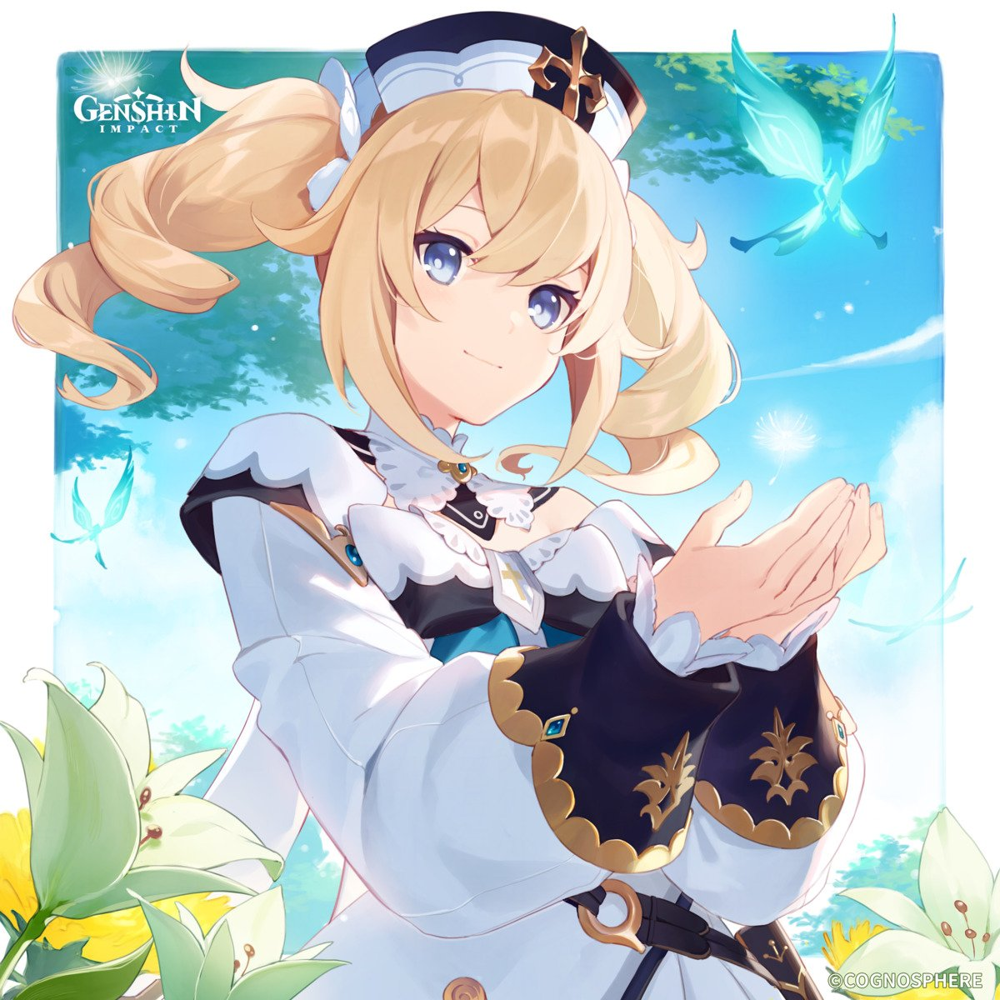

# Barbara - The Shining Starlet

## Credits

* Written by: wJ
* Reviewed by: Arun
* Proofread by: Lare
* Last updated on: 27th May 2023
* Character story updated till v3.7
* Story and Quest involvements - Work-in-Progress

## Barbara

* Title - Shining Starlet
* Type - Starter 4-star, Medium Female, Hydro Catalyst playable character
* Birthday - July 5th
* Constellation - Crater
* Affiliation - Deaconess, Church of Favonius
* Special Dish - Spicy Stew
* EN VA - Laura Stahl
* CN VA - 宋媛媛 (Song Yuanyuan)
* JP VA - 鬼頭明里 (Kitou Akari)
* KR VA - 윤아영 (Yun A-yeong)

Table of Contents

- [Barbara - The Shining Starlet](#barbara---the-shining-starlet)
  - [Credits](#credits)
  - [Barbara](#barbara)
  - [Etymology](#etymology)
  - [Constellation: Crater](#constellation-crater)
  - [Her Story](#her-story)
  - [Her Aspirations](#her-aspirations)
  - [Her Vision](#her-vision)
  - [Her Connections](#her-connections)
    - [Family](#family)
    - [Parents](#parents)
    - [Jean](#jean)
    - [Lisa](#lisa)
    - [Venti/Barbatos](#ventibarbatos)
    - [Bennett](#bennett)
    - [Rosaria](#rosaria)
    - [Noelle](#noelle)
    - [Varka](#varka)
    - [Alice](#alice)
    - [Barbara's Fan Club](#barbaras-fan-club)
  - [Her Quirks](#her-quirks)
    - [Spice, Spice, and everything nice!](#spice-spice-and-everything-nice)
    - [Surprise, Jean!](#surprise-jean)
    - [Barbara is human too](#barbara-is-human-too)
    - [Barbara is very kind](#barbara-is-very-kind)
    - [Barbara loves natural scenery and… is saving up for something?](#barbara-loves-natural-scenery-and-is-saving-up-for-something)
  - [Historical reference(s) from the real world](#historical-references-from-the-real-world)
  - [Lore Implication(s)](#lore-implications)
  - [Speculative Theor(ies)](#speculative-theories)
  - [Misconception(s)](#misconceptions)
    - [Barbara and Jean are half-sisters.](#barbara-and-jean-are-half-sisters)
    - [Does Diluc not like Barbara and her singing?](#does-diluc-not-like-barbara-and-her-singing)
    - [Aren't Albert's actions towards Barbara inappropriate?](#arent-alberts-actions-towards-barbara-inappropriate)
  - [Conclusion](#conclusion)

Barbara is the Deaconess of the Church of Favonius, whose faith lies in the God of Freedom, Barbatos. She is also the shining idol of Mondstadt, adored by all. Although the concept of a starlet is rather novel in a city of bards, the people of Mondstadt love her nonetheless. In fact, she can do much more than just put people in a better mood: she possesses great healing powers, which extend to flesh wounds and other physical ailments. Besides worshipping Barbatos, she is devoted to spreading joy and relieving the people's spiritual fatigue in the City of Freedom.

She holds a Hydro Vision from Mondstadt and wields a catalyst.

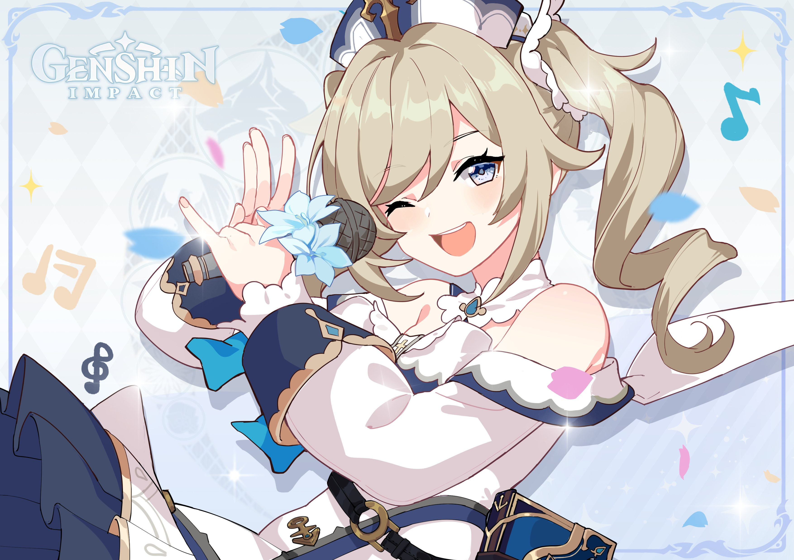

## Etymology

"Barbara" is a female name derived from the Greek word "βάρβαρος (barbaros)" and originates from the Latin word "barbarus", both meaning "foreign, strange". It shares the same root as "barbarian". Her name, "Barbara", would thus mean "foreign woman".

Barbara's name may also allude to Saint Barbara, known in the Eastern Orthodox Church as the Great Martyr Barbara.

Her last name, "Pegg", is a surname derived from the Middle English word "pegge", meaning "peg". It has several possible origins. It could be a metonymic occupational name for a maker or seller of wooden pegs, or a nickname surname for a person with a wooden leg or who walked with a limping gait.

## Constellation: Crater

Meaning: Cup (Latin)

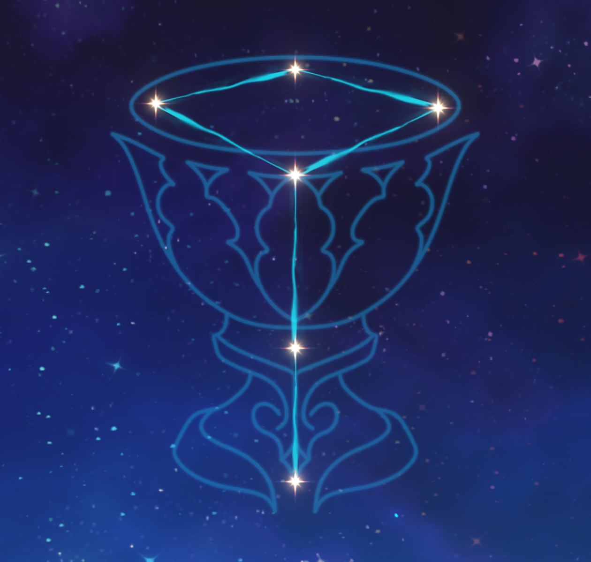

"Crater" is the Latin spelling of the Greek word "krater", a type of large cup or vase that was used to dilute wine with water. Kraters were often used in Greek symposiums (συμπόσιον sympósion or symposio, from συμπίνειν sympínein, "to drink together") that were part of banquets that took place after meals, when drinking for pleasure was accompanied by music, dancing, recitals, or conversation. Kraters were also seen in temples or used in religious ceremonies to hold libations, where a drink is poured out as an offering to a deity.

Barbara's constellation may be a nod to her role in the Cathedral and to her faith in Barbatos, the God of Freedom. It may also be a nod to Mondstadt's wine ceremonies that are held in honour of the Anemo Archon, who is partial towards wine.

## Her Story

Barbara's father, Seamus Pegg, was a famed adventurer throughout the continent. When he came to Mondstadt, he dusted off his past self and started anew with the Church of Favonius, climbed the ranks within it and became known as the Cardinal of Daybreak, Seneschal of the Church of Favonius. Her mother, on the other hand, "Alder Knight" Frederica Gunnhildr, reigned from the Gunnhildr Clan, a venerable knightly house in Mondstadt well known for their role in establishing and maintaining Mondstadt's freedom throughout the nation's history. The two lovers had two children, Jean and, later on, Barbara.

The two lovers eventually parted ways, with Barbara following their father and Jean following their mother.

Barbara has always been a bright and optimistic girl since she was young. Though at times she can be a bit clumsy and mess things up, she always bounces right back and has another go.

Barbara is the complete opposite of her sister, who is seen by all as the pride of her family. Unlike Barbara, her sister has always been the very definition of success in all aspects.

Initially, all Barbara had ever wanted was to surpass her sister in at least one thing, even if only once. However, be it swordplay, her grades, or anything else, she was never able to compare. Even for someone as optimistic as her, she found herself to be upset and down.

> "Hard work is the most miraculous magic. But when even that doesn't work... what then?"

Even so, Barbara has never once considered giving up.

Her determination and resilience even surprised her father. Barbara only allows herself to be depressed for 30 seconds. After that, she forces herself to brighten up, no matter what.

> "I'm not so good in combat, so I'll be sure to support those who are."

Under her father's counsel, Barbara joined the church and became a healer. She is as radiant as the sick and injured are pained. Her desire to be recognized gradually transformed into a simple desire to help others. She would also eventually receive her Hydro Vision.

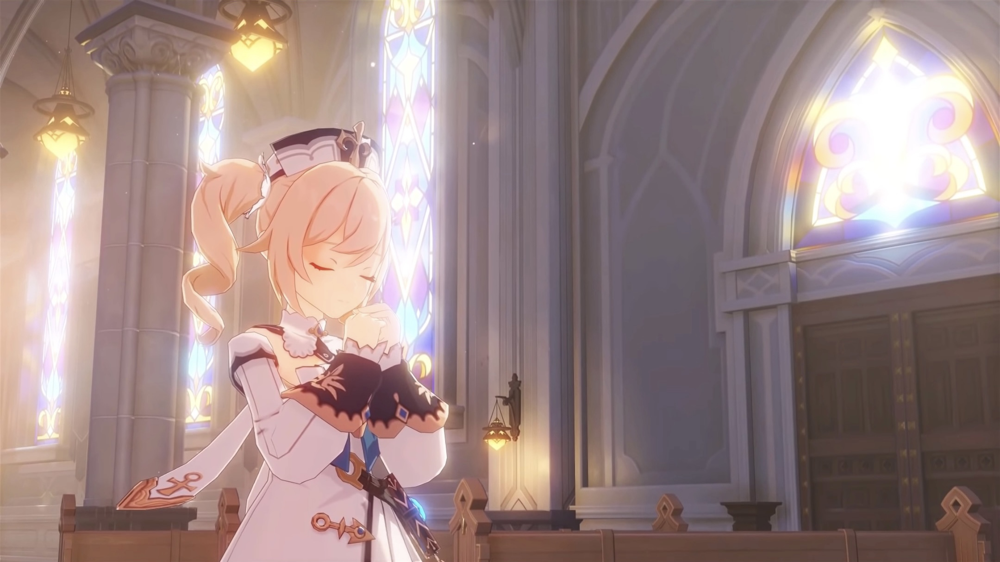

One day, she met Alice, an elder of the Hexenzirkel.

> "...Idol?"

The first time that Barbara heard this strange word, she was visibly confused.

> "But... aren't The Seven the ones that people are supposed to worship?"
> 
> "Yes, but not exclusively...
> 
> "Read this, it contains everything you will need to know."

"Idol Magazine" was the name of the assigned reading material. Barbara had no idea what world this magazine had come from, but by reading it she found out that there was indeed such a thing as an "idol," and that it mainly involved working hard at getting everyone to like you. She also discovered that an outstanding idol is capable of not just bringing joy to themselves, but also bringing spiritual healing to others through the power of song and dance.

Barbara set about learning one new song after another, dancing to the beat as she went, all to find happiness in the smiling faces of others.

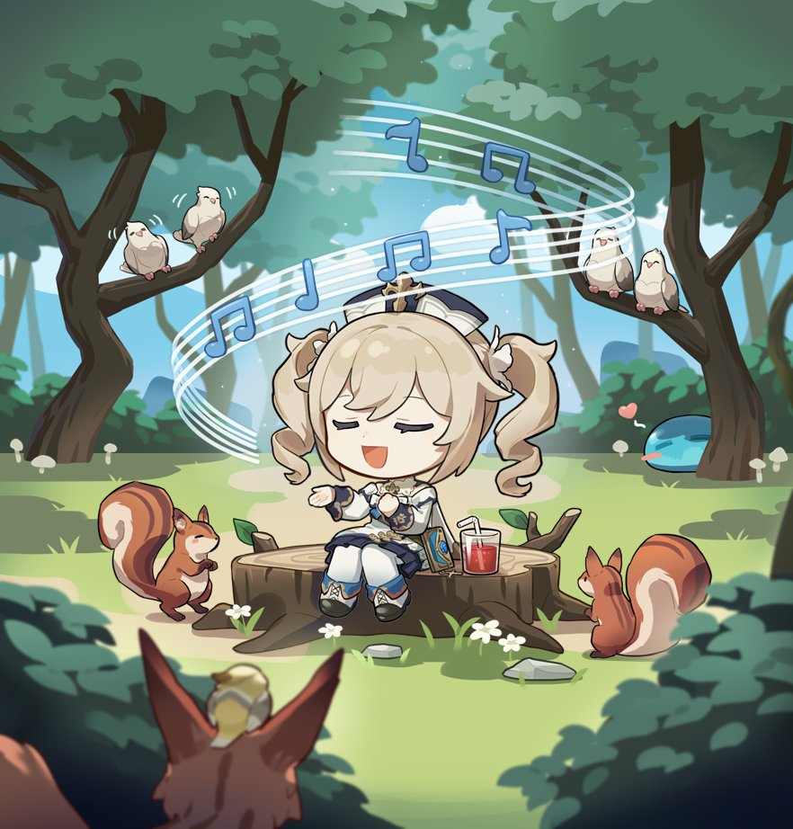

At first, Barbara's songs sounded strange to the citizens of Mondstadt, and many struggled to see the appeal. This was because for the longest time, the folk songs of bards were the only popular songs known in Mondstadt. Fortunately, Mondstadt stayed true to its reputation as the City of Freedom, and the people ultimately embraced the new while continuing to cherish the old. People accepted Barbara's songs, and over time her positive energy rubbed off on them. Soon, they could be heard humming her tunes all around Mondstadt.

Some time later, when Alice anxiously told Barbara that plans for "Teyvat Idols!" were falling through, Barbara was starting to make a name for herself through her performances in Mondstadt.

> "Hmm... Well, if I'm the only one left... I guess you can leave it to me to define what it really means to be an idol!"

Driven by this ever so slightly selfish ambition to spread joy and healing to others, Barbara is slyly swotting up on new tunes behind the scenes to this very day.

However, Barbara's feelings on her own success are mixed.

To the extent that an idol's duty is to make everyone adore her, she has done a fantastic job. There is no doubting that she has made the right choice. However, an idol is also expected to spread joy and relieve people's spiritual fatigue... Has she really accomplished that?

She sang for blind Glory, encouraging her to believe that her lover would one day return. She sang, too, for sick Anna, promising her that her illness would one day be cured. Yet, the smiles on their faces never last long after the songs end.

This has led Barbara to become somewhat disillusioned and doubtful.

"Thank you" are the two words that Barbara hears most often.

When she feels lost, she will suddenly find that there is someone wanting to hold her hand.

> "Thanks for being here with me. I feel so much better."_

To Barbara, the greatest reward is seeing the smiles on people's faces.

Therefore, whenever she is massaging her swollen calves or drinking tea to care for her sore throat, Barbara recalls all those who have been kind to her.

> "It's the encouragement I receive from others that keeps me going."_

Just maybe, the smiles she receives are proof that her songs really can heal people.

Her ambition to surpass her sister and become the most popular person in all of Mondstadt hasn't been abandoned by Barbara, it is simply buried deep inside her heart.

> "If only I excelled more, perhaps I could be of help to Jean."_

This is what she believes.

> "Okay... Barbara, go!"_

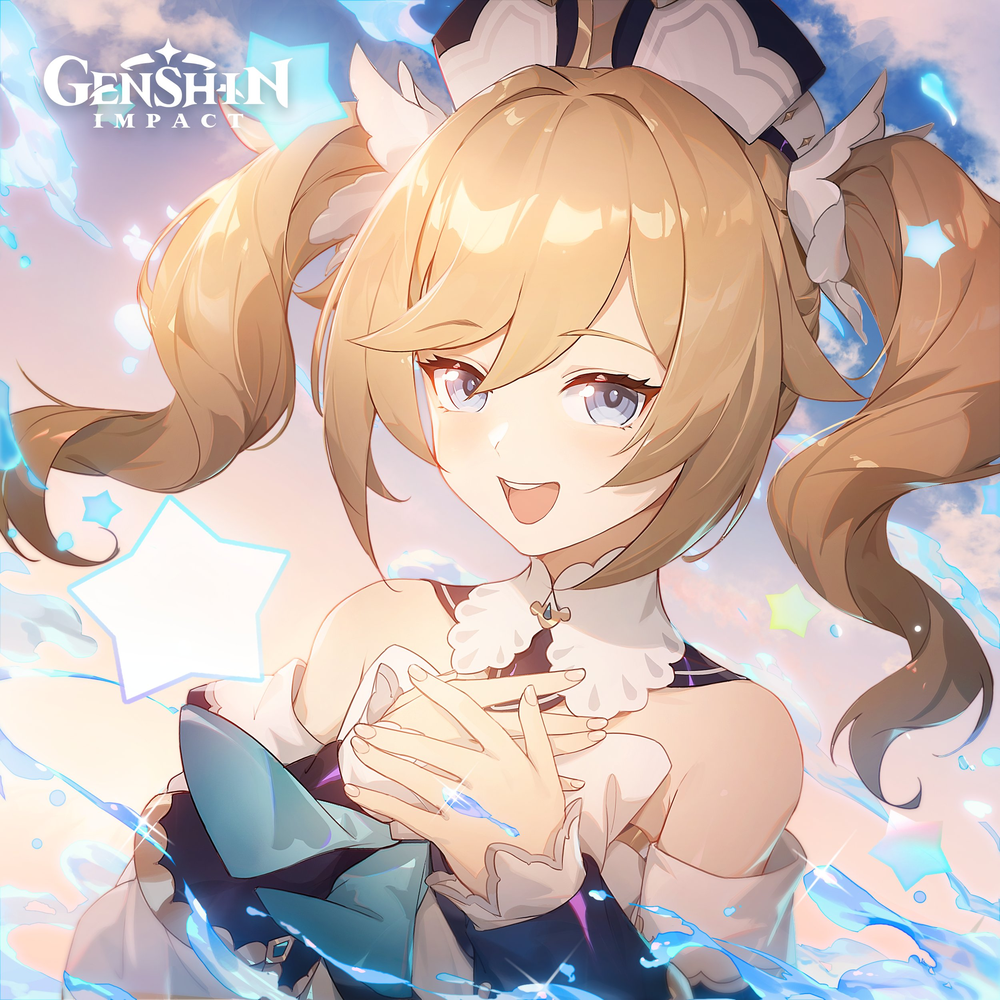

## Her Aspirations

Barbara aspires to heal and support others. Be it healing their physical wounds or helping them with their tasks, she wishes to bring a smile to their face, spreading joy and spiritual healing to all she cares for.

(Perhaps one day, she could be of help to her sister too.)

> Everyone has their own desires. To bring together and fulfil those desires and make everyone happy — that is the purpose my Archon has bestowed upon me.

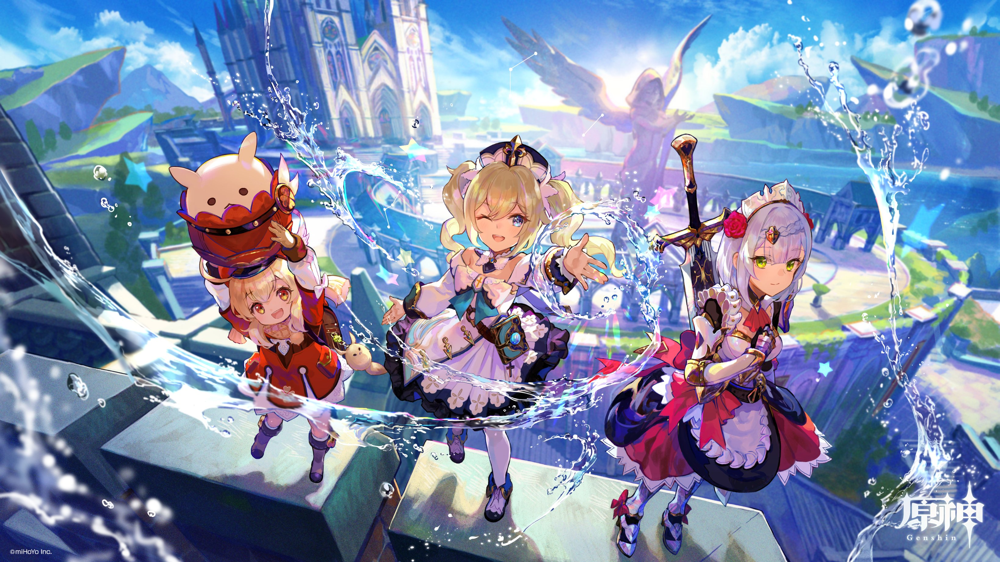

## Her Vision

The story of how Barbara obtained her Vision is hardly the typical tale of high-stakes heroism.

She had just joined the church and was looking after a little boy with a high and persistent fever. Nothing Barbara could think of would console the boy and bring an end to his relentless tears. Someone remarked that while the boy had already taken his medicine, there was no way to cure the pain of missing one's family. Another suggested that Barbara sing a song for the boy to raise his spirits. Barbara had never sung a song in her life up until this point, but how could she shy away from it in a moment like this?

> "Never having sung before is no reason to abandon a child in their time of need",
> 
> --- Barbara thought to herself.

And so, Barbara took the boy in her arms and sang him a song: a lullaby, the only song she knew.

It was an unceremonious beginning to her singing career. After quickly realising that she barely knew any of the words, she had to resort to humming the tune instead. Nevertheless, her voice began to soothe the child, and so she kept singing. She sang the same song, over and over again, until her throat was dry and her voice was hoarse. Finally, the boy fell asleep. Exhausted, Barbara lay down by the wall and fell straight asleep herself.

Early the next morning, Barbara awoke to discover that the boy's fever had come down. Perhaps it was because she had sung for him, or perhaps it had something to do with the Vision which had mysteriously appeared next to her hand at some point during the night. Barbara was not preoccupied with the Vision, however. It was the sight of the boy smiling once again that filled her heart with joy. Barbara received her Vision for the simple but beautiful wish that took hold in her heart that night: A dream of healing the sick through the power of song.

## Her Connections

### Family
* Father: Seamus Pegg
* Mother: Frederica Gunnhildr
* Older sister: Jean Gunnhildr

### Parents

After parting ways, Barbara was raised by her father and the Church. To this day, Barbara remains close with both her mother and father.

At the Cathedral, Barbara works closely with her father, the Seneschal, becoming an excellent healer under his guidance. She would also sometimes visit her mother and sister whenever she is free. In return, her mother would sometimes give her gifts, such as Barbara's sunflower-style dress.

At the moment, both "Alder Knight" Frederica and Seamus, Seneschal of the Church of Favonius, are accompanying Grand Master Varka on his expedition away from Mondstadt and have yet to return.

### Jean

Barbara did not share much of her childhood with her older sister after their parents parted, so their relationship is currently quite strained. They would often address each other in formal terms, though Barbara does tend to slip up and call Jean "Big sis" or "Jean" before correcting herself to address her as "Master Jean".

However, they do care about each other very much and share the mutual desire to be closer to the other sister. Barbara would often worry about Jean being too hard on herself, unfortunately there is not much she can do about it.

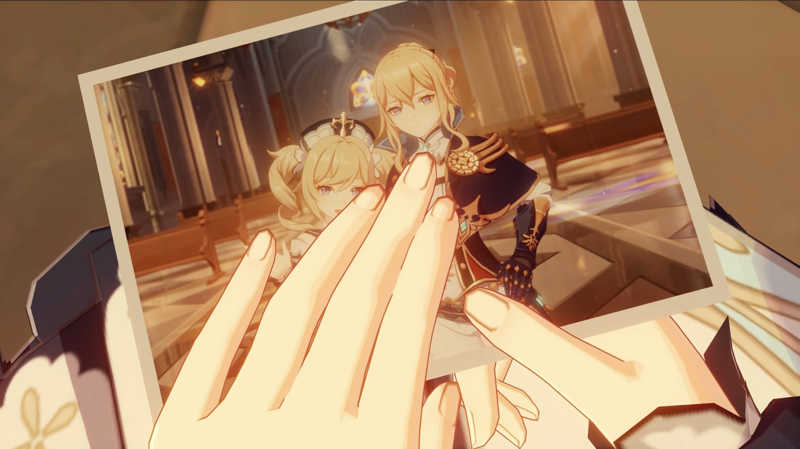

When she was young, Barbara was jealous of how "perfect" and "popular" Jean was, being the pride of the family and the Dandelion Knight.

> "_Acting Grand Master… Leader of the Knights of Favonius… Everyone seems to like her a lot. Oh? Me? I… Of course I have nothing but admiration for her!"_

Barbara wanted to be better than Jean in something, even if it was just one thing. However, she could never compare herself to Jean. Nonetheless, she never gave up. She became an idol in the City of Freedom, not only to bring smiles to the people, but to also fulfil her ambition to surpass her sister and become the most popular person in all of Mondstadt, an ambition that is buried deep inside her heart.

> "_If only I excelled more, perhaps I could be of help to Jean."_

With how busy Jean is as the Acting Grand Master, Barbara feels distant from her sister. Barbara wishes to spend quality time with her family, much like any other girl her age. These small wishes seem simple to anyone else, but they are a luxury for Barbara. When she can steal moments to be with her family, the time she can spend with her parents and sister is ever so brief. Her brilliant, busy sister is often stuck to her desk due to official business, and every time Barbara wants to go to her to share her feelings, she is silenced by the mountain of work piled in front of Jean. Her sister's exhaustion is plain to see, and Barbara sees it too. It can't be helped: Jean Gunnhildr is everyone's Acting Grand Master.

> _"But... could you just... give me my sister back, just for a while?"_

Even so, Barbara never gave up.

Whenever Jean is burnt out from work stress, Barbara would be the one to heal and take care of her, though, like everyone else, she is unable to fully convince Jean to rest more. Sometimes, Barbara would also visit Jean at her office. Though it is uncertain if it is for work or personal reasons, it does allow her to steal some time to be with her sister. Over time, they seem to have slowly patched up their relationship through these short moments of conversation, growing a little closer to each other. Barbara was not only comfortable with calling Jean "Big Sis" during their Midsummer Island Adventure in v1.6, she even confided in Jean her worries about not improving and asked for advice from her.

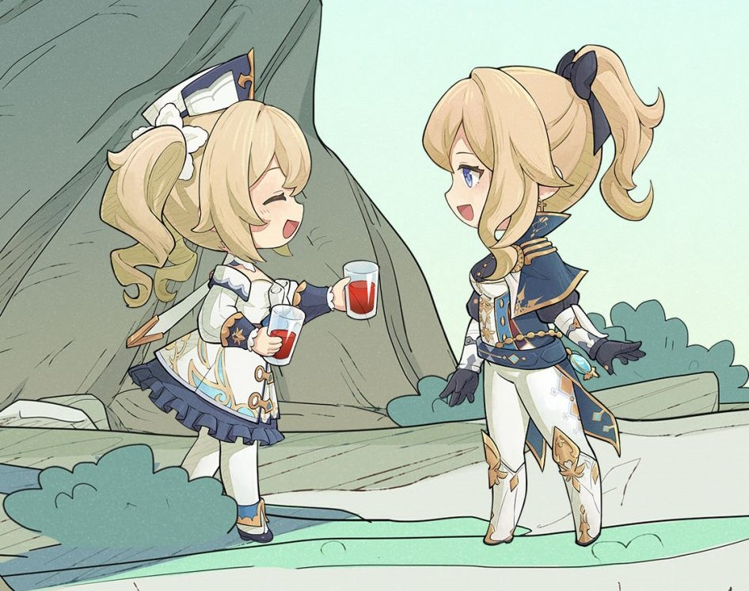

Barbara will always be there to help organise time for Jean to take a break from her office. Be it parties, birthday celebrations, or vacations, Barbara and Jean's friends will do their best to surprise her and ensure that Jean is having fun too.

Though the two sisters still have a long way to go with their relationship, it is great to see that they have developed trust in each other and continue to hold on to their hopes for each other to live a happy, peaceful life.

### Lisa

> "_I always take good care of Lisa. If she ever wants to become a star, she'll have my unconditional support, I'll cheer at the top of my lungs until my voice goes hoarse… Hmm, that might scare off her other fans though…"_

Barbara and Lisa are great friends. Being the closest to Jean, they often work together to make sure Jean gets the rest she needs.

In preparation for their Midsummer Island Adventure in v1.6, Barbara asked Lisa for help to pick a set of summer clothes for Jean. Together, they searched every store before deciding on the most suitable design. With their friends' help, they created a lovely set of summer clothes (Sea Breeze Dandelion, 4-Star character outfit), specially for Jean.

### Venti/Barbatos

Barbara places her faith in Mondstadt's Archon, Barbatos, the God of Freedom.

> "_To the wind that guides me: When I'm exhausted, bless me with the strength to keep going forward. When I'm uncertain, bless me with the wisdom to distinguish good from evil. When I suffer from injustice, bless me with the courage to fight back…" - Barbara's prayers._

Although the Anemo Archon has not appeared in Mondstadt for over a millenia, she still believes in him, believing that he has always been watching over Mondstadt and his people. She also believes that her Vision and purpose were bestowed upon her by her Archon.

What she doesn't know is that she has met her Archon in person.

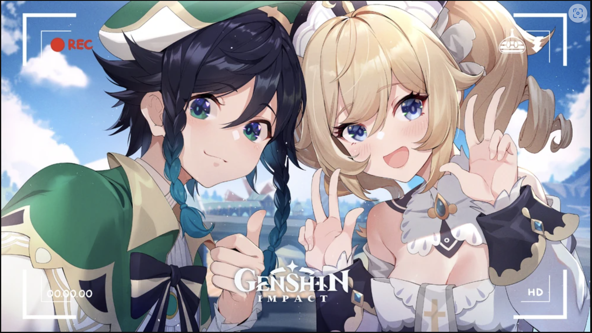

Barbatos roams the streets in his mortal form, Venti the bard, singing songs and reciting poetry to the citizens of Mondstadt. Barbara highly praises his voice and has tried to learn to sing his songs. However, his songs are very different from hers, and their melodies are too complicated for her.

Once, at a small charity sale, Barbara met Venti, who persuaded her to perform an impromptu song with him. She thinks the music he plays is quite refined and elegant. At first, she did not want to sing too loudly, in case she ruined the style he was going for, but he sang a harmony to guide her in, and before long, they were sounding great together. In the end, the audience loved it, and they sold a lot at the event.

### Bennett

> "_Bennett always comes to the Cathedral covered in scrapes and bruises… Though it clearly never bothers him a bit, given the big grin he always has on his face. He really should take better care of himself."_

Whenever he suffers severe injuries such as fractures or excessive loss of blood, Bennett will go to the Cathedral to seek treatment from Deaconess Barbara. They eventually became friends who care a lot about each other. No matter how many times Bennett visits the Cathedral, Barbara would always be there to patiently treat and heal him, giving him adhesive bandages to keep in his utility pouch for future use.

Barbara was also once surprised by his skills in treating dislocated joints.

Bennett thinks that she is the best singer and dancer and would often watch her in concert after an adventure goes south. It lifts his mood as he chants along with all the other fans and cheers her on.

### Rosaria

While both Barbara and Rosaria are sisters of the Church, Barbara does not know her well, especially given how Rosaria never joins in on prayers.

> "_But… Oh, I'm sure she believes in the Anemo Archon! Although, I still don't really have the courage to try to talk to her…"_

Even so, Barbara is the one person in the Church who always makes the effort to get close to Rosaria.

> "Please don't smoke in the Cathedral…"
> 
> "Could you try to attend the ceremony on time next time…?"
> 
> "And… Hey, come back, I'm still talking to you!"

Barbara is forever anxiously chasing after Rosaria, urging her to complete her various daily tasks. Yet, she is unable to persuade Rosaria.

However, this does not mean Rosaria dislikes her. In fact, she can be quite protective of her, making sure she does not recklessly run off into battle lest she hurt herself, or reassuring her that her sister is not in danger.

### Noelle

> "_Noelle is just the cutest! She's so kind and patient, you just feel totally relaxed when you're around her. …Oh yeah, and she makes the tastiest snacks! Best part is, they're also healthy. Hehehe!"_

They take tea breaks together sometimes. Barbara would often start humming a tune, saying inspiration has come to her. Noelle would not know how to give useful feedback, but she loves spending time with Barbara.

### Varka

Barbara is worried about her father who left on the expedition with Grand Master Varka. However, with the Grand Master who is none other than the Knight of Boreas, she feels more at ease. Still, she prays for their safe return.

### Alice

Alice was the one who introduced the foreign concept of an "idol" to Barbara, giving her a magazine from another world called "Idol Magazine" that taught her all she needed to know to become an idol. With this little push, Barbara eventually became a shining starlet in the City of Freedom.

Alice was planning to form "Teyvet Idols!", an idol group consisting of members from all over Teyvet, however, her plans eventually fell through, leaving Barbara as a solo idol to define what it means to be an idol.

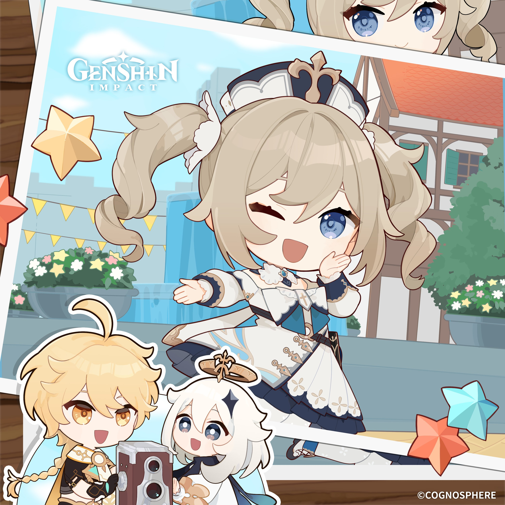

### Barbara's Fan Club

Barbara has her very own fan club, consisting of various citizens of Mondstadt. It is led by Albert, a huge fan of Barbara.

While Barbara does love and appreciate her fans and their support, she is sometimes overwhelmed by their sheer admiration for her.

She can hardly walk around the streets of Mondstadt on her own without being crowded by her fans, each asking how she's doing and wanting an autograph from her. She would oftentimes have to flee and hide from her fans just to have some alone time. The Sisters of the church even asked her to tell them where she would be, just in case they needed to go rescue her from the crowds.

Barbara's fans would also sometimes do questionable things to gain her attention. (Mainly Albert.)

1. Albert is often seen hanging around the Cathedral, either cheering for Barbara or attempting to sing one of her songs. He has become quite a nuisance to the Church of Favonius and the Sisters of the Church would often have to chase him away.
2. During the Windblume Festival in v1.4, an anonymous fan sent her an ominous letter, telling her that they had buried her most precious thing. This scared Barbara, even leading to her momentarily believing that her sister had been buried underground.
3. Albedo once had the opportunity to sketch Barbara a simple portrait. Albert offered to purchase it, but Albedo rejected his bid and gave it to the Acting Grand Master instead.
4. Albert would apparently get bumps and bruises on purpose sometimes, with the intention of going to the Cathedral to see her. He is also jealous of Bennett for being able to see Barbara far more often than him.
5. When Barbara mentioned that the Church was running low on certain medicine ingredients, particularly red Wolfhook berries, Albert wanted to lend her a hand, so he decided to go to Wolvendom to look for Barbara while picking red Wolfhooks along the way. He intended to take them back to the Church, for it was his "duty to make sure Barbara-sama's life is easier".

## Her Quirks

### Spice, Spice, and everything nice!

Barbara loves spicy dishes. In fact, her special dish is a spicy stew, her favourite dish is spicy dried fish (she carries some in her bag), and she even has her own home-made Chillibrew (made from Jueyun Chillies and Sweet Flowers). However, since overconsumption of spice is not good for her stomach and throat, she could not cave in to her cravings all the time.

> "_I really want to eat some spicy squid at Good Hunter… but my stomach, er… Never mind…"_

Even so, Liyue Chillibrew (made only from Jueyun Chillies) is too spicy, even for Barbara.

Barbara started making and drinking Chillibrew to keep herself awake. In fact, she was chewing Jueyun Chillies before Sara told her to instead use them to make a drink that has a milder flavour. Sara was also the one who suggested using Sweet Flowers to temper the flavour. After a while, Barbara actually started to enjoy the flavour. Whenever she drank it, the spiciness would always push her to work harder.

### Surprise, Jean!

Considering how busy Jean is on a regular basis, her friends took it upon themselves to make sure that Jean is resting and relaxing from time to time. This group of friends include Barbara.

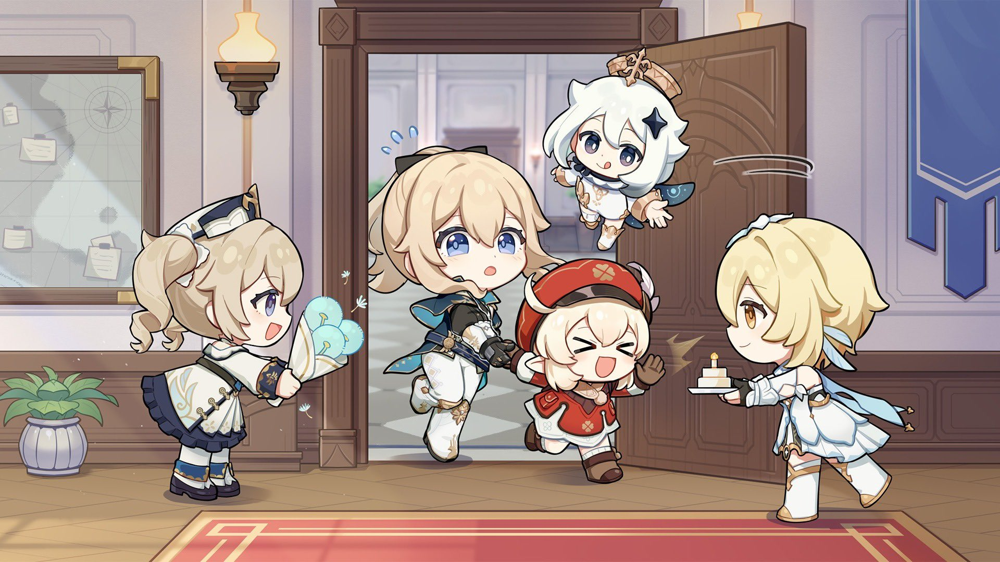

Together, they would organise parties for Jean, be it to thank her for her hard work or to celebrate her birthday. They would also shower her in gifts, such as gifting her a lovely set of summer clothes (Sea Breeze Dandelion; 4-Star character outfit), which was Barbara's idea.

### Barbara is human too

While Barbara may seem confident, she actually carries much doubt about herself and her skills. She would often compare herself to Jean, believing she is nowhere as brilliant as her sister. Aside from singing and performing, she does not think she has any abilities worth mentioning.

> "_Hard work is the most miraculous magic. But when even that doesn't work... what then?"_

This is one of the reasons why Barbara pushes herself very hard.

She can be quite stubborn when it comes to receiving help from others. At the church, Barbara is responsible for cleaning the Cathedral. She always said she could handle it herself and that there's no need to ask anyone else to help her even though she is exhausted after she's finished with the cleaning. When the Honorary Knight offered to help clean in Barbara's stead during her Hangout Event, Sister Victoria was surprised that Barbara was willing to let them help.

As an idol, Barbara often sings for others, attempting to spread joy and relieve others' spiritual fatigue, but she doubts she had accomplished that, for their smiles never last long after the songs end.

She is also very thankful for all her fans, but she thinks there are simply too many of them. She always does her best to fulfil people's requests and not let them down, but she sometimes does not have the strength to do so. Even when she is in the church, people would still come hoping to greet her. She is constantly in a state of tension, no matter where she goes. She would sometimes leave the city to venture the wilderness, to not think about anything and to not be bothered by anyone.

Even though Barbara does not want to be bothered by her fans during her personal time, she still feels guilty for it, thinking she is being impolite or immature when she avoids them or turns their requests down.

Barbara worries she would be disturbing others if she were to practise singing out loud. She always makes sure she is being considerate of other people, putting others first.

Once, when she was practising a new song, she asked the Traveller to watch her performance and give her suggestions.

> "_Um… Please don't laugh at me if there are parts that still need practising._
> 
> "I've thought about this a lot of times in the past, but it's taken me this long to finally pluck up the courage to perform for you at such a close distance. If you laughed at me, there'd be nowhere I could run from my embarrassment…"

She is quite shy when she is not performing on stage for her concerts.

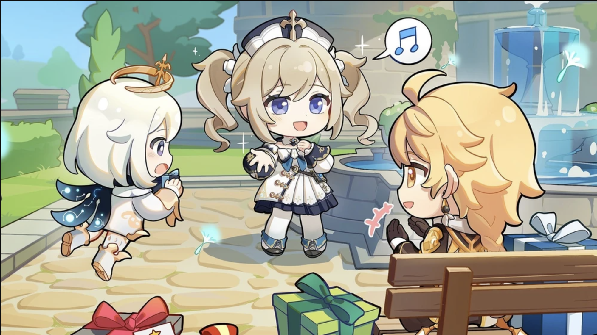

Barbara is also quite shy when she receives compliments.

> "_Ahh... please, no need to shower me with compliments… Only with constructive criticism can we grow, right...?"_

### Barbara is very kind

In fact, she can sometimes be too kind.

She is always willing to lend a hand, accepting everyone's requests even though she will become even more exhausted than she would be after working hours.

During her Hangout Event, the Traveller and Barbara would encounter an injured Treasure Hoarder in the wilderness. Even though he was a Treasure Hoarder who could have been feigning injury to strike at the opportune moment, Barbara wanted to heal him. In her eyes, he had not done anything wrong, he was merely a person who was really in need of healing.

> "_I'm a deaconess, healing the wounded is something I must do. Besides… I have a Vision. Even if he did try anything, I'd have been able to handle it."_

### Barbara loves natural scenery and… is saving up for something?

She loves the breathtakingly beautiful nature that surrounds Mondstadt, and was very excited to visit the Golden Apple Archipelago in 1.6 to enjoy the summer beach. She thinks it is very relaxing to be surrounded by nature, away from the city, where she could be herself and not think about anything.

> "_I've heard that there are blue trees that exist by the sea shore near Inazuma City. I just need to save up a little more, and… What's that? You want to know what I'm saving up for? \*chuckles\* That's my little secret."_

She wishes to visit Inazuma city too.

## Historical reference(s) from the real world

Barbara's name may allude to Saint Barbara, known in the Eastern Orthodox Church as the Great Martyr Barbara. She was an early Christian Greek saint and martyr, often portrayed with miniature chains and a tower. She was one of the Fourteen Holy Helpers, who remained true to her Christian faith till her death.

## Lore Implication(s)

As the Deaconess of the Church of Favonius, Barbara will always be there to support the Knights of Favonius and the citizens of Mondstadt, healing them when they are hurt. If the nations ever go to war, she will only do her very best to support everyone and keep them going, till they can finally find peace amidst the storms.

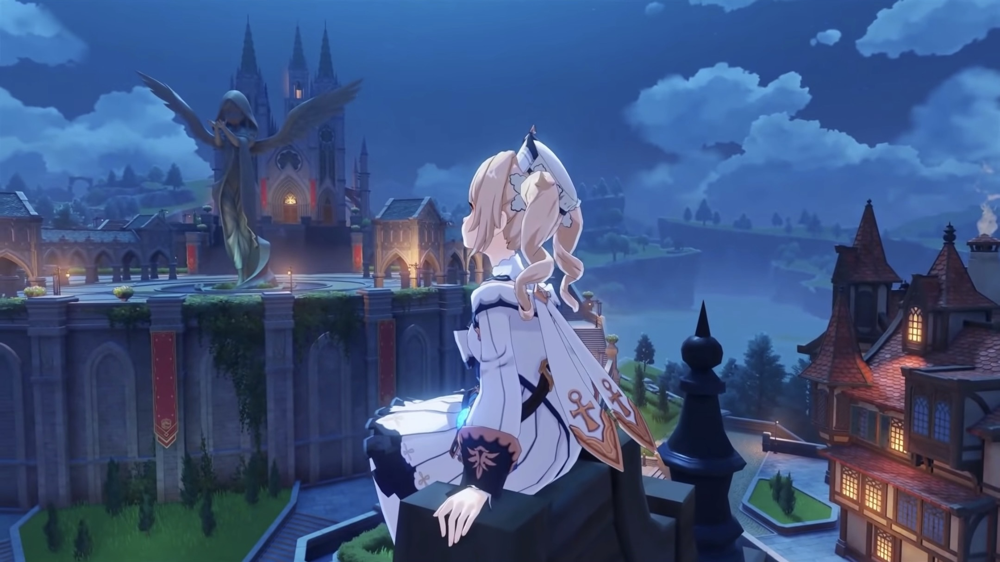

## Speculative Theor(ies)

Will Barbara ever find out Venti's true identity, or perhaps the fate of the Lost Statue of The Seven?

Only time will tell.

## Misconception(s)

### Barbara and Jean are half-sisters.

Both Barbara and Jean share the same father and mother, namely Seamus Pegg and Frederica Gunnhildr.

Then, why do they have different surnames?

Their parents separated, and so did they. Barbara followed their father and inherited his last name, "Pegg". On the other hand, Jean followed their mother and inherited her last name, "Gunnhildr". Therefore, they have different surnames.

Nonetheless, they are sisters.

### Does Diluc not like Barbara and her singing?

No, this is not necessarily true.

For context, when Barbara was performing at Angel's Share, Diluc kept frowning, leading her to believe that he does not like her singing.

Knowing Diluc, he does not smile often nowadays, as pointed out by Kaeya and Klee. His "frown" may in fact be his resting face, or he could be frowning because of some of the customers' inappropriate drunkard behaviours.

To those who are not close to him, they could easily misinterpret his expressions.

How was he feeling during Barbara's performance? Only he would know.

### Aren't Albert's actions towards Barbara inappropriate?

Yes, to some extent, but not necessarily to the extent that the fandom has deemed it to be.

It is true that Albert is an obsessive fan of Barbara, going through great lengths to gain the attention of his idol and oftentimes being considered as a nuisance to the Church of Favonius, however, his attraction towards Barbara is not necessarily of paedophilic nature. By definition, a paedophile is a person who is sexually attracted to children. It should be noted that as far as we know, Albert does not harbour any sexual feelings towards Barbara, simply admiration for her and her talents. It should also be noted that Barbara's age is uncertain, so it is uncertain if she is considered as a minor.

This, however, does not excuse his over-the-top behaviour to gain Barbara's attention. Hopefully, some day, he will realise this.

The closest real-life equivalent of Albert is that he is a [Sasaeng.](https://en.wikipedia.org/wiki/Sasaeng_fan)

## Conclusion

Barbara is every bit as wonderful as people say. She is always trying her very best to support and heal others, caring for everyone she cares for. No matter where she goes or who she meets, she shows them kindness, bringing a smile to their face. She may not be her sister, but she brings the best version of herself to others and is always striving to improve. Hopefully, one day, she will realise that she too is brilliant; a star that brightens everyone's day and night.

Go Barbara, go!

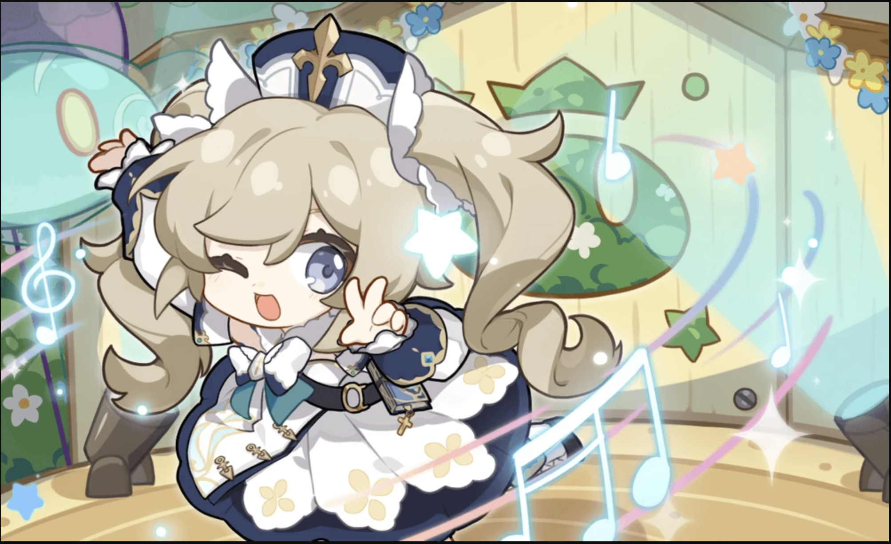

Hey… isn't it time for Barbara's concert? … \*gasp\* It is!

We'd better hurry, Traveller, we can't miss it!

> "_I'm doing my best everyday... I hope my efforts earn the trust of the people of Mondstadt."_

