

Table of Contents

- [Diluc - The Dark Side of the Dawn](#diluc---the-dark-side-of-the-dawn)
  - [Credits](#credits)
  - [Diluc](#diluc)
  - [Etymology](#etymology)
  - [Constellation: Noctua](#constellation-noctua)
  - [The Aspiring Knight](#the-aspiring-knight)
  - [Tragedy and Betrayal](#tragedy-and-betrayal)
  - [His Quest for Answers](#his-quest-for-answers)
  - [The Dark Knight Returns](#the-dark-knight-returns)
  - [Vision](#vision)
  - [Aspirations](#aspirations)
  - [Connections to other characters](#connections-to-other-characters)
    - [Crepus Ragnvindr](#crepus-ragnvindr)
    - [Kaeya Alberich](#kaeya-alberich)
    - [Jean Gunnhildr](#jean-gunnhildr)
    - [Adelinde](#adelinde)
    - [Elzer](#elzer)
  - [Quirks and Misconceptions](#quirks-and-misconceptions)
  - [Real-world connections](#real-world-connections)
  - [Lore implications](#lore-implications)
  - [Conclusion](#conclusion)

> "Knights of Favonius... Always so inefficient".

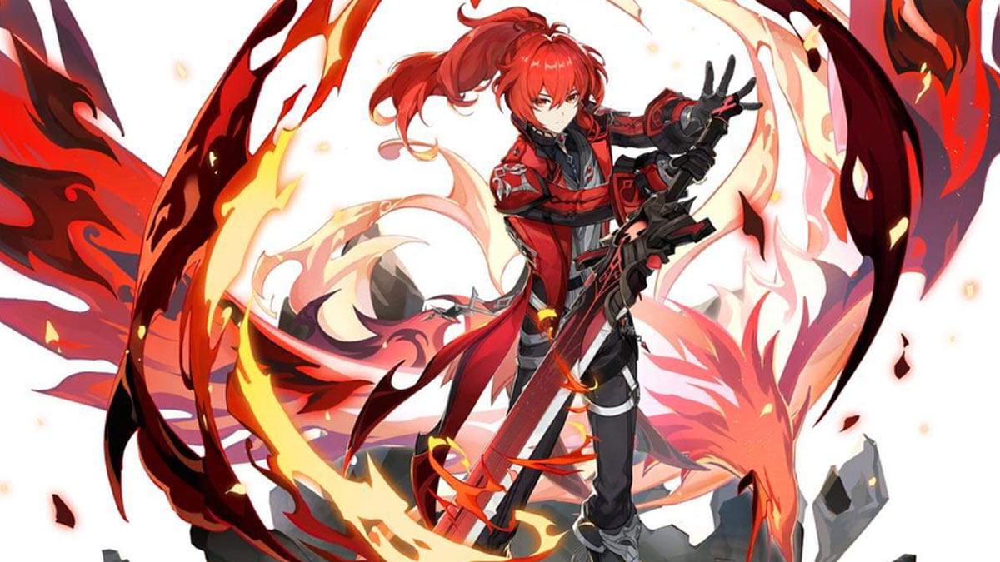

_Diluc in his new skin_

# Diluc - The Dark Side of the Dawn

## Credits

* Written by: Spieds
* Reviewed by: Arun
* Last updated on: 25th February, 2023
* Proofread by: Lare
* Character story updated till v3.4
* Story and Quest involvements - Work-in-progress

## Diluc

* Title - The Dark Side of the Dawn
* Type - Standard 5-star, Tall  Male, Pyro Claymore playable character
* Birthday - April 30th
* Constellation - Noctua
* Affiliation - Dawn Winery
* Special Dish - Once Upon a Time in Mondstadt
* EN VA - Sean Chiplock
* CN VA - Ma Yang (马洋)
* JP VA - Ono Kensho (小野賢章)
* KR VA - Choi Seung-hoon (최승훈)

Table of Contents

- [Diluc - The Dark Side of the Dawn](#diluc---the-dark-side-of-the-dawn)
  - [Credits](#credits)
  - [Diluc](#diluc)
  - [Etymology](#etymology)
  - [Constellation: Noctua](#constellation-noctua)
  - [The Aspiring Knight](#the-aspiring-knight)
  - [Tragedy and Betrayal](#tragedy-and-betrayal)
  - [His Quest for Answers](#his-quest-for-answers)
  - [The Dark Knight Returns](#the-dark-knight-returns)
  - [Vision](#vision)
  - [Aspirations](#aspirations)
  - [Connections to other characters](#connections-to-other-characters)
    - [Crepus Ragnvindr](#crepus-ragnvindr)
    - [Kaeya Alberich](#kaeya-alberich)
    - [Jean Gunnhildr](#jean-gunnhildr)
    - [Adelinde](#adelinde)
    - [Elzer](#elzer)
  - [Quirks and Misconceptions](#quirks-and-misconceptions)
  - [Real-world connections](#real-world-connections)
  - [Lore implications](#lore-implications)
  - [Conclusion](#conclusion)

Diluc is a descendant of the Ragnvindr clan, son of Crepus Ragnvindr. He was the Cavalry Captain of the Knights of Favonius, and now a tycoon of a winery empire in Mondstadt. He’s the owner of the Dawn Winery, which in turn established and funded Angel’s Share tavern. Though he severed his ties with the knights, Diluc still upholds Mondstadt’s peace in his own ways.

Diluc appears as a tall young man, with pale skin, red eyes, and red hair tied in a ponytail that goes down to his back.

He holds a Pyro Vision, and wields a Claymore.

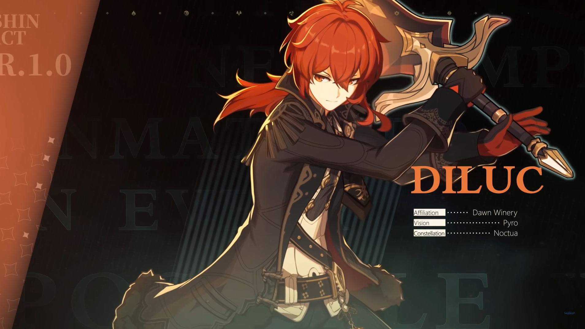

## Etymology

Diluc’s name seems to derive from the Latin word “diluculum” which means twilight, dawn, or daybreak. In turn, his father’s name, Crepus, comes from the Latin “crepusculum” and means glimmer, dusk, or partial night.

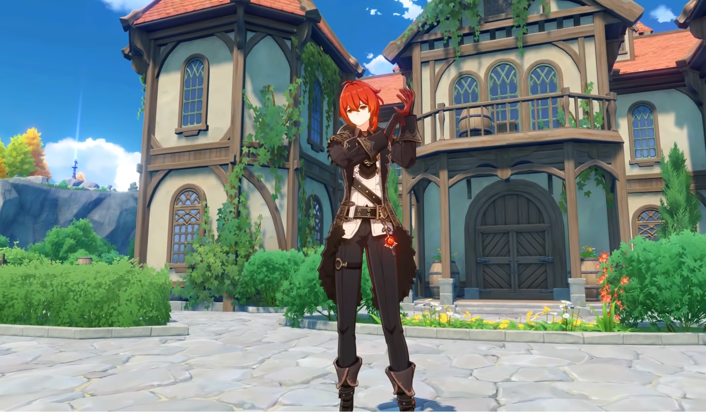

## Constellation: Noctua

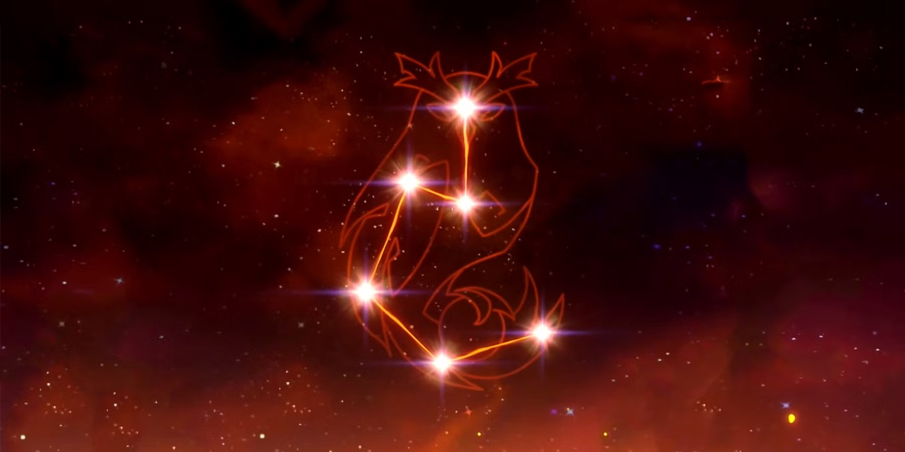

Diluc’s constellation, Noctua or Night Owl, probably refers to his night actions as the Darknight Hero of Mondstadt. It might also refer to Athene noctua, a species of owls whose name derives from the Greek goddess Athene. She is associated with wisdom, warfare, and handicraft - qualities which Diluc shares.

## The Aspiring Knight

Diluc adored his father, mister Crepus, who wished for his son to become the most respected knight and to protect Mondstadt. And per his wishes, Diluc underwent austere training, passed the Knights of Favonius’ trials, swore the oath of protection to his homeland and joined their ranks. Receiving the early promotion, he became the youngest ever Cavalry Captain.

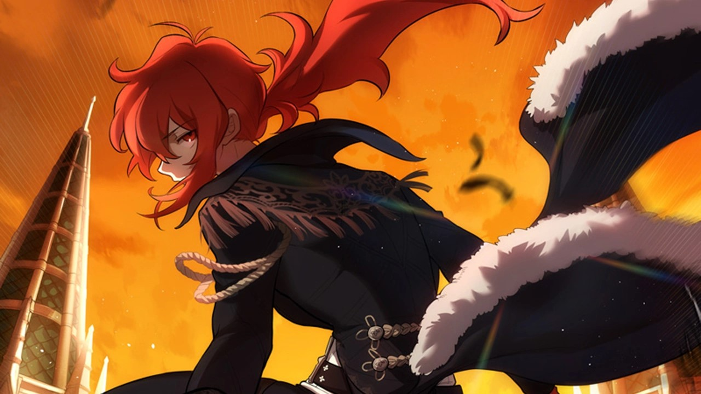

No matter the mission and challenge, Diluc always maintained his composure, passion and courage. He never backed from the front lines. All of this earned him recognition and praise from the denizen of Mondstadt. But to Diluc the most invaluable were the words of his father: 

> “Good job. Now, that's my son.”

These words fueled his passion and resolve and served as his greatest motivation.

## Tragedy and Betrayal

But the tragedy caught him unaware. That day, Diluc was celebrating his coming of age. On the way home, a horrific monster, “Ursa the Drake”, attacked the transport fleet he and his father were travelling with. The monster was stronger than anything he had seen before.

But the end of the battle wasn't anything that Diluc could have anticipated. His father, who had no Vision, and was denied by the Knights of Favonius, used a mysterious power to defeat the draconic creature. And the same power backfired to kill Crepus.

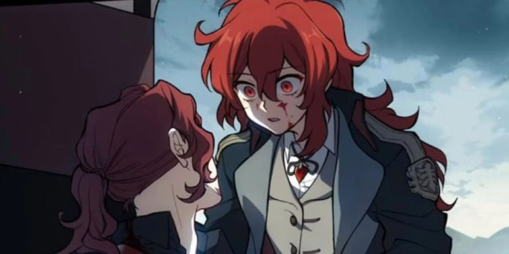

_A shocked Diluc sees his father dying in his arms_

Upon returning to Mondstadt and the Knights’ headquarters, Diluc heard unbelievable words uttered by Inspector Eroch: "This incident could not be disclosed to the public."

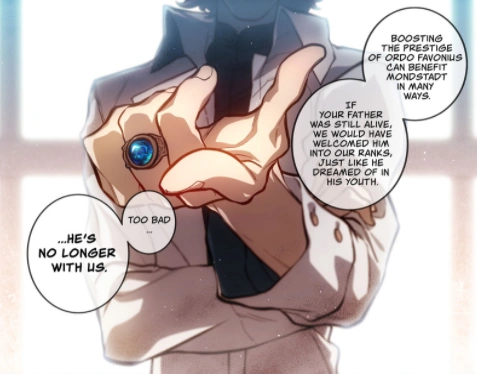

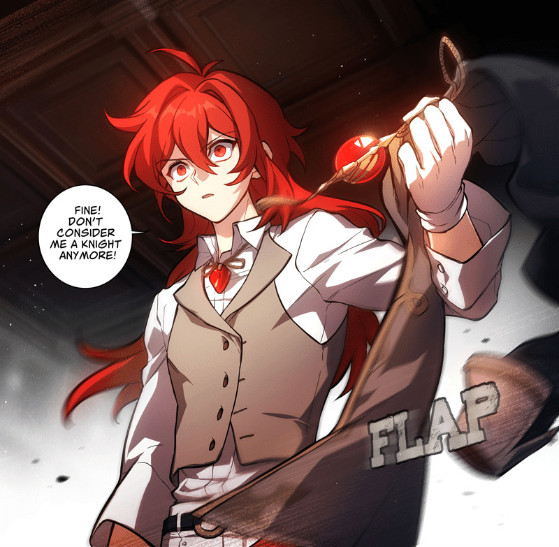

Eroch insisted that Ordo Favonius would lose all credibility if people were to discover that the incident had been settled by a “mere businessman”. After such disrespect from the Knights that trampled upon his and Crepus’ faith, Diluc resigned on the spot and left everything, including his vision.

## His Quest for Answers

He swore to find the source of the strange power that killed his father and avenge him. Diluc handed the running of the Dawn Winery to Adeline, the head housemaid, and left Mondstadt, travelling across all the nations of Teyvat in search of truth.

All the clues pointed toward a single organization: The Fatui. They were making Vision-like devices, called “Delusions”. And even though Delusions could amplify the power of their wielder, they had a great risk of backfiring on the user. That was what killed Diluc’s father.
Diluc didn’t know where or why Crepus got the Delusion in his possession, and he may never learn it. But that didn’t stop him in his pursuit of the whole truth.

The Fatui Harbingers monitored Diluc from the shadows and were forced to take action when it was clear that he won’t stop going after the Fatui. Thanks to an observer from the north, who was part of a vast underground intelligence network, Diluc managed to escape death at the hands of the Harbingers.

After assessing the events that led him to this moment, that anger that he harboured for so long, Diluc acknowledged his shortcomings and decided to join the underground intelligence network. Soon enough, he worked his way up its ranks and became a prominent member.

## The Dark Knight Returns

Four years later, Diluc had returned to Mondstadt and taken over as head of the family winery. The return of the Dawn Winery's master should have been a significant occasion for Mondstadt, yet everybody was too preoccupied pondering about the new unknown "Guardian of Mondstadt". The word of that guardian spread quickly, and he soon came to be known as the "Darknight Hero."

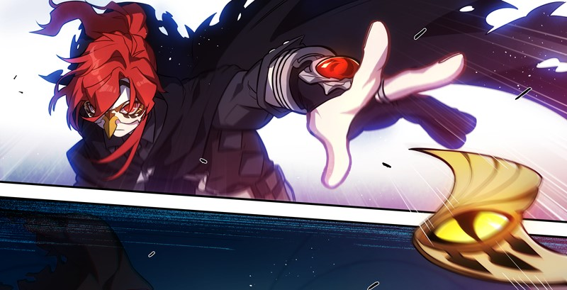

Wearing a bird mask, Diluc uses throwing knives and the Delusion left after his father’s demise to protect Mondstadt from the shadows.

Sometime later, along with various members of Knights of Favonius, he stops a Fatui recruitment attempt to get soldiers and “test subjects” for Il Dottore. And he helps to foil the Fatui’s plan to sow the seeds of discord at that year’s “Ludi Harpastum”.

In the end, on the nudge from Kaeya, Diluc uses his Delusion to pose and get caught as the culprit of the “Black Fire Affair”, indirectly saving Collei from getting caught by the Fatui. After fleeing while being transported, he sends his mask and Delusion to Il Dottore, the harbinger behind the whole ordeal in Mondstadt.

While working at the tavern, Kaeya brings him a gift in the form of a vase, returning Diluc’s vision inside of it.

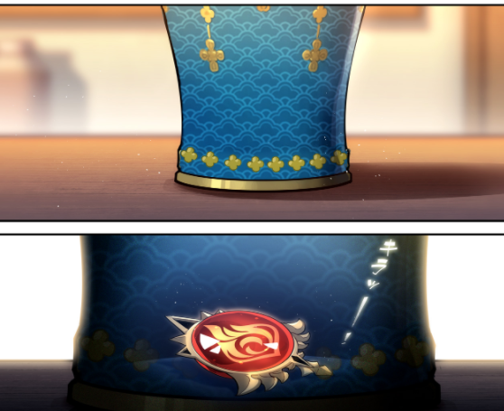

Now Diluc aspires to shoulder his late father’s will, defending Mondstadt with unbreakable convictions and the flames of justice.

## Vision

> I've become stronger... Though it is still not enough, I will always face the darkness. For dawn to come, there must be those who dare to pierce the darkness with their light.

For Diluc, the moment when he received his Vision was a sign of acknowledgement by the gods of the ambition he shared with his father. Yet those ambitions were short-lived, for the death of his father a few years later extinguished Diluc’s fire.

It seemed to him that his Vision and his status as a knight were both equally ineffectual at enabling him to protect the things that he treasured most.

When he recognized his own powerlessness, his Vision became no better than a Delusion.
Empty titles were of no interest to him. His sight was set only on an unshakable resolve. Resolve that will guide the hand of justice and help in the search for truth.

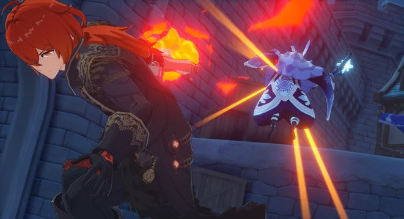

To the lost, perhaps a Vision is a beacon of light given by the gods to help them find the path forward. But to those with conviction, a Vision is simply an extension of their strength, a medium for channelling their willpower, a tribute to the experiences that have shaped them, and a testament to the story of their life so far.

## Aspirations

> The darkness that seethes with evil, full of demons that must be vanquished... will take more than a blade to be torn asunder.

Through and through, Diluc strives hard to make Mondstadt a peaceful place in his own way. That is probably his biggest aspiration and ambition.

## Connections to other characters

### Crepus Ragnvindr

Diluc’s father and adoptive father of Kaeya. Prior to his death, he was the head of the Dawn Winery. As Diluc believed, he contributed to Mondstadt as much as the Knights had but in his own way. Crepus was a talented winemaker and greatly respected by those in his employ. Also regarded as a father figure by Elzer.

### Kaeya Alberich

Adoptive son of Crepus and Diluc’s brother. Current Cavalry Captain of the Knights of Favonius. The most trusted aide for Jean. Kaeya is often the one wrapping things up in every incident that occurs in Mondstadt's vicinity.

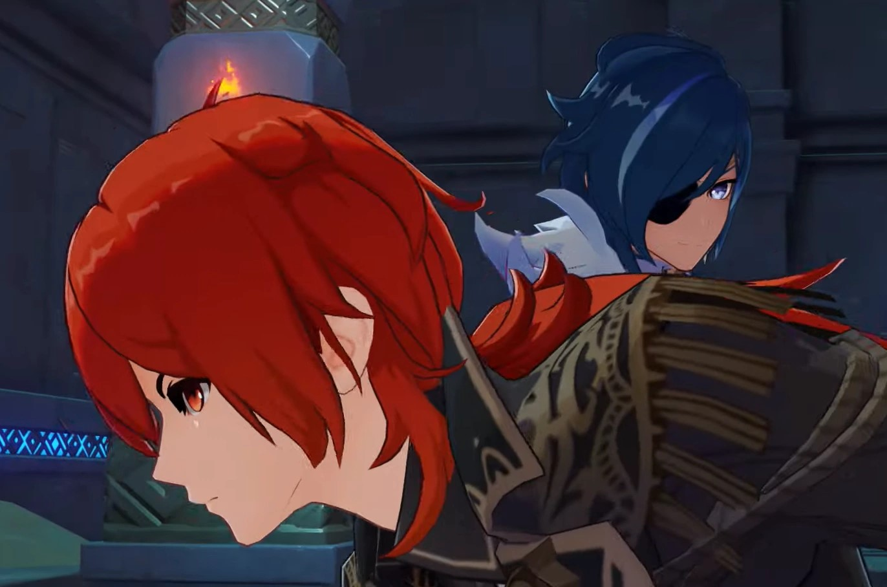

He was Diluc's friend, brother, supporter, and sounding board. But after their father’s death, and with Kaeya disclosing his secret, Kaeya and Diluc separated and have gone their separate ways. While there is tension between the sworn brothers, the animosity has reduced considerably with time.

### Jean Gunnhildr

The Acting Grand Master of the Knights of Favonius. Diluc’s past colleague, junior, and one of his childhood friends. She has a habit of calling Diluc a senior even now.

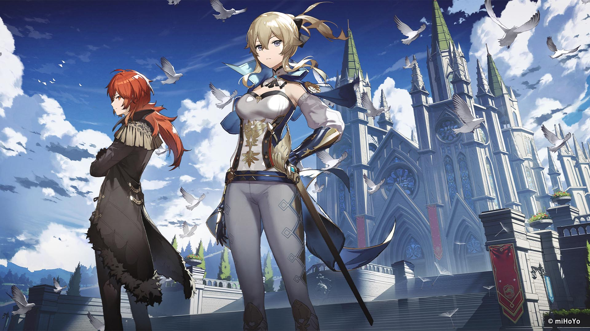

_Jean and Diluc - the White Knight and the Dark Knight of Mondstadt_

While Diluc personally has a grudge against the Knights of Favonius, he has utmost respect for Jean for her hard work.

### Adelinde
Head Housemaid of the Dawn Winery. Might be considered Diluc’s and Keaya’s guardian figure after the death of Mr Crepus.

### Elzer
The Executive Chairman of the Mondstadt Wine Guild. Served the Dawn Winery while Crepus was still alive. Assumed most of the Winery's affairs together with Adelinde when Diluc departed from Mondstadt after Mr Crepus’ death.

## Quirks and Misconceptions

* Even though Diluc holds the whole wine industry in his hands, he himself dislikes alcohol. This led to the development of Dawn Winery’s Apple Cider for those who still want to partake in the drinking culture.

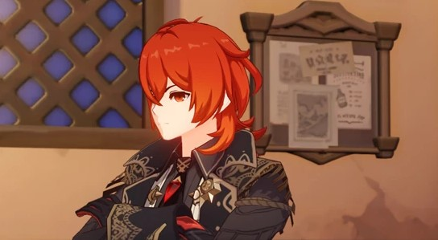

* Although not explicitly mentioned, it is subtly implied that Diluc is the uncrowned King of Mondstadt because of his rich business avenues and connections.

* Diluc is on the Fatui's wanted list and is officially barred from entering Snezhnaya.

* Diluc dislikes the name of the “Darknight Hero”, thinking it to be a stupid name.

* Diluc is often seen adjusting his gloves - specifically his glove on his left hand. This might be because of his habit of using his father's delusion on his left hand.

* According to Vile (one of Kaeya's black market informant), Diluc once tasted "Snezhnayan Fire-Water" (the ingame equivalent of Russian Vodka) offered by merchants from Snezhnaya for a trade deal with Dawn Winery in a banquet. Diluc passed out for three whole days, only to reject this alcohol saying "The people of Mondstadt can't handle this". For more details, do check this [Reddit Post](https://www.reddit.com/r/Genshin_Impact/comments/mcynvb/so_i_just_found_out_about_the_time_diluc_downed_a/)

* While Diluc dislikes the Knights of Favonuis, he has respect and is willing to help and associate himself with some of their individual members. 

* Despite coming off as standoffish and being called a “weird grown-up”, he’s quite hospitable and caring about people. Even after discovering the truth about Kaeya, they are still on speaking terms. And great care could be seen in his character voice lines for him and others.

## Real-world connections

Without a shadow of a doubt, it became quite obvious to the entire fandom that Diluc’s character is inspired by Bruce Wayne aka Batman of DC comics.

> A talented and intelligent rich kid, hailing from a renowned family name, who had a peaceful childhood and adored his parents. The death of his parents broke his innocent world-view and made him into an aloof, secretive individual, who went on a journey that lead him to learn a lot of skills, organizations plotting for the destruction of his city and nation, and some insights about the shady secrets held by his parents.
> 
> On top of that, he came back to his hometown after his long sojourn to adorn a dual identity: One in the day, and one in the night.

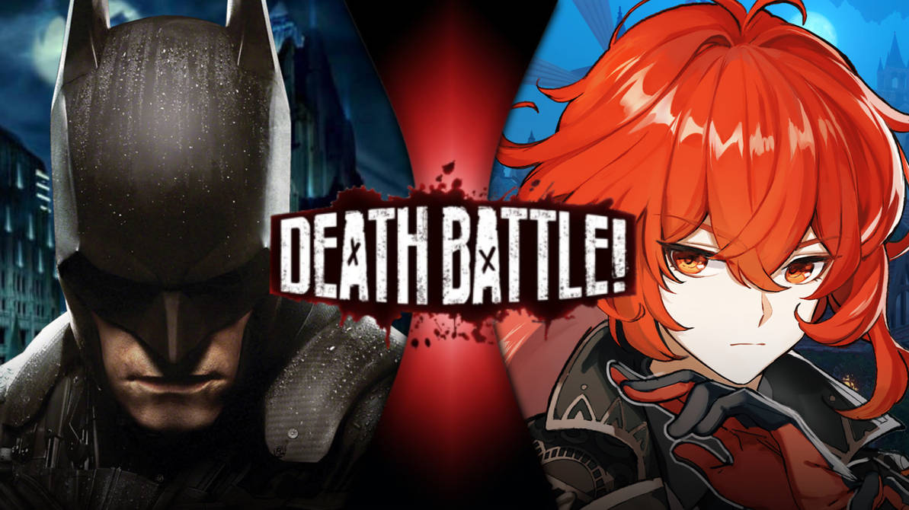

_Batman vs Diluc - Courtesy: TheSpiderPatriot, Deviant Art. Link: [Original Artwork](https://www.deviantart.com/thespiderpatriot/art/Batman-VS-Diluc-882864841)_

> During the day, he is a wealthy philanthropist business tycoon who with the help of his butler takes care of his business. He throws parties every now and then to make public appearances. He is also a certified young and attractive bachelor pinned by a lot of ladies, but he chose not to be romantically attached to anyone. And publicly maintains his disdain towards “Vigilante” justice.
> 
> During the night, he adorns the identity of a nocturnal flying bird-themed mask and cape and becomes a justice-seeking, fear-driving, “Vigilante”, who hunts criminals by the night, by being the beacon of hope and justice in the dark. His deeds often being praised by the public, giving him the moniker “The Dark Knight”.

These passages refer to both Diluc and Bruce Wayne word-for-word. The resemblance is quite uncanny and on the nose.

## Lore implications

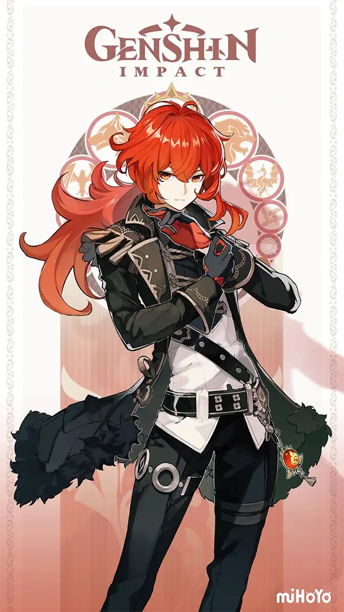

The possession of a Delusion by Crepus implies that he might have been associated with the Fatui at some point. Some players theorize that he might even have connections to the Harbingers in some way.

There is also a recent video by [Ashikai](https://www.youtube.com/watch?v=yTARw6XjaiE), where she speculates that Crepus might've been a Harbringer.

Diluc’s appearance might hint at his (or the Ragnvindr clan as a whole) connections with The Children of Murata, and it’s theorized that Venessa might be one of his ancestors. Another theory implies that Diluc’s falcon might be an incarnation of Vanessa.

Kaeya’s connections to Khaenri'ah and Diluc’s opposition to Abyss Order and conviction to protect Mondstadt might foreshadow a future confrontation between the two brothers.

Dainsleif mentions a rather ominous dialogue about Diluc in his collected miscellany

> "But if the disaster from five centuries ago were to happen again, if he were to face the same evil that I once did..."
> "Would he still hold fast to his resolve?"
> "This, too, makes me most curious indeed."

Is this a potential foreshadowing of a probable disaster to happen in Mondstadt? We don't know.

## Conclusion

Whether one finds him to be an overrated character, or as a badass hero, one thing is pretty clear: Diluc is an indispensable part of of Mondstadt.

Whether he will eventually join the Knights, or continue his own journey of retribution, the story of this Dark Knight blazing bright in the dark is far from over.

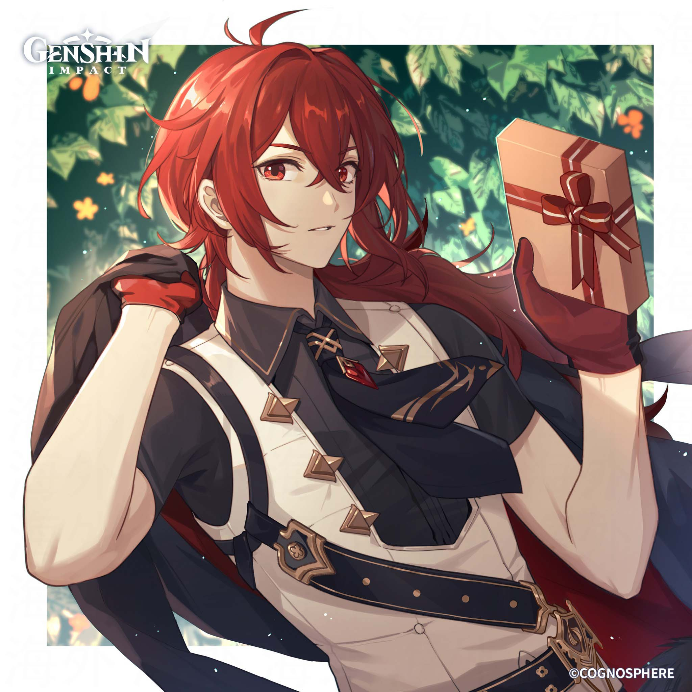

> I used to believe... if I was to stamp out evil, I would have to walk alone in darkness. However, seeing your perseverance, I know I was wrong. Friend... I owe you my thanks.

