

Table of Contents

- [Jean - The Dandelion Knight](#jean---the-dandelion-knight)
  - [Credits](#credits)
  - [Jean](#jean)
  - [Etymology](#etymology)
  - [Constellation: Leo Minor](#constellation-leo-minor)
  - [Her Story](#her-story)
  - [Her Aspirations](#her-aspirations)
  - [Her Vision](#her-vision)
  - [Her Connections](#her-connections)
    - [Family](#family)
    - [Parents](#parents)
    - [Barbara](#barbara)
    - [Varka](#varka)
    - [Diluc](#diluc)
    - [Lisa](#lisa)
    - [Kaeya](#kaeya)
    - [Klee](#klee)
    - [Eula](#eula)
    - [Noelle](#noelle)
    - [Amber](#amber)
    - [Ellin](#ellin)
    - [Venti / Barbatos](#venti--barbatos)
    - [Ningguang](#ningguang)
  - [Her Quirks](#her-quirks)
    - [Jean drinks coffee - a lot](#jean-drinks-coffee---a-lot)
    - [Jean even takes trivial requests from citizens](#jean-even-takes-trivial-requests-from-citizens)
    - [Jean is a romantic](#jean-is-a-romantic)
    - [Jean's favourite food is pizza](#jeans-favourite-food-is-pizza)
    - [Jean had a pet tortoise when she was a child.](#jean-had-a-pet-tortoise-when-she-was-a-child)
    - [Jean is very organised and has a strict schedule for herself](#jean-is-very-organised-and-has-a-strict-schedule-for-herself)
    - [Klee is not the only one Jean sends to solitary confinement](#klee-is-not-the-only-one-jean-sends-to-solitary-confinement)
    - [Jean can sing quite well](#jean-can-sing-quite-well)
    - [Jean granted the "Honorary Knight" to the Traveler](#jean-granted-the-honorary-knight-to-the-traveler)
    - [Jean is a normal person](#jean-is-a-normal-person)
    - [Jean on her birthday](#jean-on-her-birthday)
  - [Lore Implication(s)](#lore-implications)
  - [Speculative Theor(ies)](#speculative-theories)
  - [Misconception(s)](#misconceptions)
  - [Conclusion](#conclusion)

"_As the wind continues to blow, so too shall I continue to fight."_

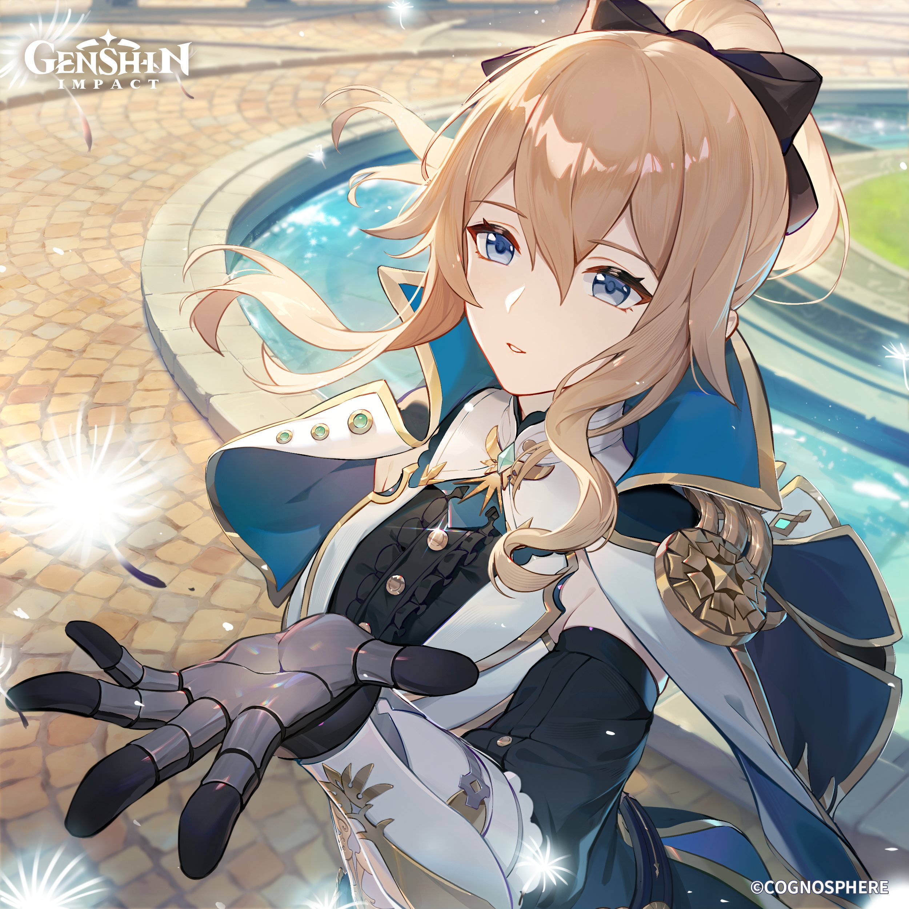

_Jean birthday image_

# Jean - The Dandelion Knight

## Credits
* Written by: wJ
* Reviewed by: Arun
* Last updated on: 23rd February, 2023
* Character story updated till v3.4
* Story and Quest involvements - Work-in-Progress

## Jean

* Title - Dandelion Knight
* Type - Standard 5-star, Tall Female, Anemo Sword playable character
* Birthday - March 14th
* Constellation - Leo Minor
* Affiliation - Acting Grand Master, Knights of Favonius
* Special Dish - Invigorating Pizza
* EN VA - Stephanie Southerland
* CN VA - 林簌 (Lin Su)
* JP VA - 斎藤 千和 (Saitou Chiwa)
* KR VA - 안영미 (Ahn Young-mi)

Jean is the eldest daughter of the prestigious Gunnhildr Clan in Mondstadt. She holds the title of Dandelion Knight and is the Master of the Knights, second-in-command to Varka, the Grand Master of Mondstadt's Knights of Favonius. When Varka led an expedition away from Mondstadt, she was appointed to lead the Knights of Favonius as Acting Grand Master in Varka's stead, devoted to defending the City of Freedom and making it a kinder, more prosperous and peaceful on Varka's return.

She holds an Anemo Vision from Mondstadt and wields a sword.

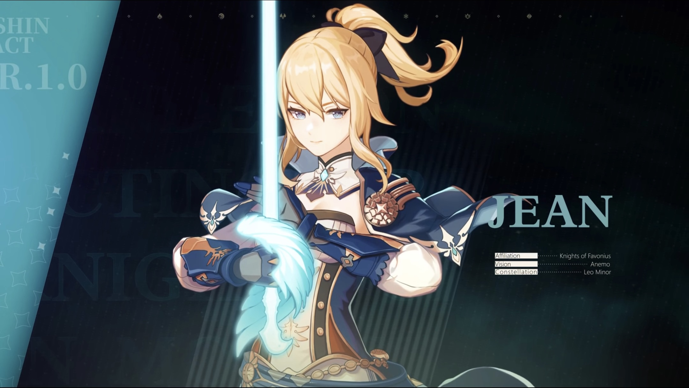

## Etymology

"Jean" is a female English name derived from "John", which itself is derived from the Biblical Hebrew name "יוחנן (Yôḥānān)", a short form of the name "יְהוֹחָנָן (Yehochanan)", meaning "Yahweh is Gracious" (Yahweh was the national god of ancient Israel and Judah).

Her last name, "Gunnhildr", is comprised of two Old Norse words, "Gunn"＋ "hildr", both of which mean "battle" or "war".

## Constellation: Leo Minor

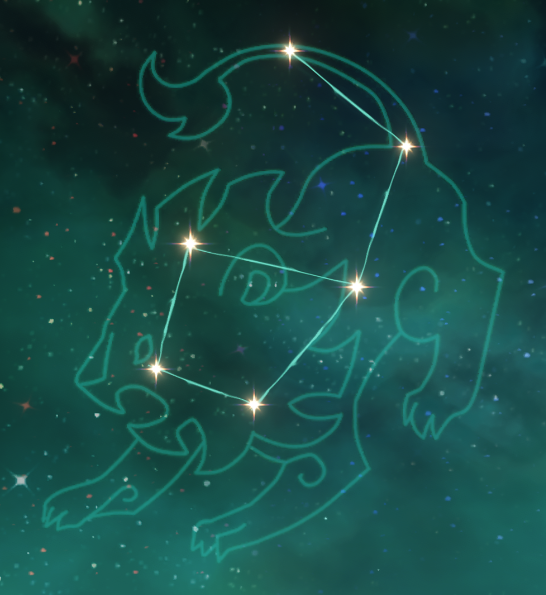

Meaning: The Lesser Lion (Latin)

The word "dandelion" derives from the French "dent-de-lion", which also translates to "lion's tooth".

The same is said in German, where "löwenzahn" translates to both "dandelion" and "lion's tooth".

Linking Jean to a constellation that depicts a lion is a nod to her title of Dandelion Knight, also known as the Lionfang Knight.

According to Mona, the Astrologist, the constellation: "Leo Minor" represents "strength and responsibility shouldered too young". This is true for Jean as she was conferred the title of Dandelion Knight at the age of fifteen and was raised to be the successor to the Gunnhildr clan since she was a child.

Mona adds that "though the lioness has been separated from her pride for a long time, she grows from strength to strength, and the day will come when she is ready to return as its glorious leader." This could refer to how Jean looks up to Vennessa, the first Lionfang and Dandelion Knight, and hopes to follow in her footsteps to be truly worthy of the title of Dandelion Knight.

This could also be why Jean is linked to the smaller lion constellation Leo Minor instead of Leo, the larger lion constellation, showing she still has much room to grow as the Dandelion Knight.

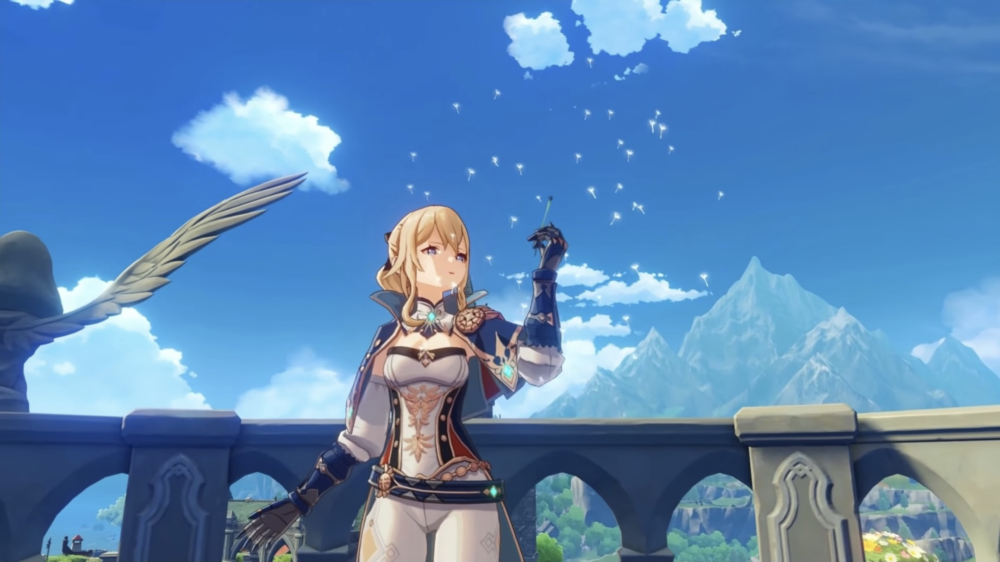

## Her Story

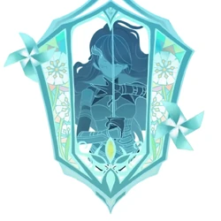

Jean was born into the Gunnhildr Clan, a venerable knightly house in Mondstadt well known for their role in establishing and maintaining Mondstadt's freedom throughout the nation's history. She inherited the prideful blood from her mother, Frederica, who is known as the Alder Knight. Her father, on the other hand, Seamus Pegg, was a famed adventurer throughout the continent. When he came to Mondstadt, he dusted off his past self and started anew with the Church of Favonius, climbed the ranks within it and became known as the Cardinal of Daybreak, Seneschal of the Church of Favonius. The two lovers had two children, Jean and later on, Barbara.

The two lovers eventually parted ways, with Jean following their mother and Barbara following their father.

From then on, Jean was raised by her mother to be the successor to the Gunnhildr Clan and she joined the Knights of Favonius. She was trained in all the things a knight must know and all the qualities they must exhibit, from discipline, etiquette and conduct, to knowledge of history and ballads, as well as maintaining peak swordsmanship and physical fitness. Only by upholding this standard can Jean carry the mantle of the Gunnhildr Clan, whose motto is: "For Mondstadt, as always." Even though she realised that she may never be able to experience the same childhood as the other children, she continues to uphold this motto, inspired to give her all to be a worthy knight so that the children of Mondstadt will always be able to play freely.

At the age of 15, Jean was conferred the title of "Dandelion Knight", a title passed down through generations of knights to those most distinguished and with great leadership potential. On the day she received the title, Jean excused herself from the celebrations that followed the conferment ceremony. As if following in the footsteps of her childhood hero, she went and stood before the great tree in Windrise. The title of Dandelion Knight symbolises Vennessa's legacy of resistance and benevolence. So how, Jean thought, could one such as herself be worthy of this honourable title? Did she really have what it would take to continue to protect this ancient and proud land of freedom?

Beneath her outwardly mature visage lay the heart of a young girl, who had only just received the title and remained wholly unprepared for the task that lay before her. The wind blew from far away, and she felt it flow within her as it gently whisked away her doubts and worries, leaving her with an unwavering determination:

> For Mondstadt, as always.

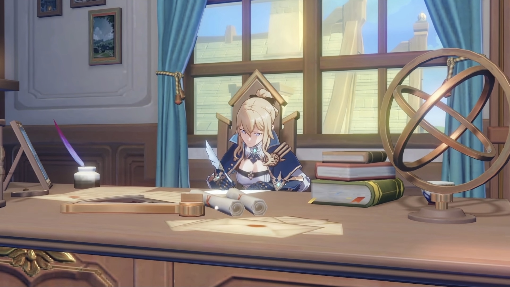

To become a warrior as kind and as determined as Vennessa, and to fight for her people and freedom. This, she realised, was the true meaning of her simple family motto.

Jean had also climbed the ranks within the Knights of Favonius, becoming Captain of her squad. Whether she received the title of Captain or Dandelion Knight first is uncertain. (Though it should be noted that Diluc was the youngest Captain in the history of the Knights of Favonius when he was 14.)

After Crepus' death and Diluc's departure from the Knights of Favonius, Eroch, an Inspector of the Knights of Favonius, schemed to take the credit for "Ursa the Drake's" defeat for himself. Jean discovered his scheme and reported it to Grand Master Varka, who conferred her with the authority to punish Eroch as she saw fit. She discharged him as a traitor to the Knights of Favonius.

Later, Jean was promoted to Master of the Knights. She would also eventually receive her Anemo Vision.

Now, Jean is second-in-command to Varka, Grand Master of the Knights of Favonius, which means she not only answers to the Grand Master directly but also often helps him out with his tasks. Whenever Varka is on an expedition away from Mondstadt, Jean would step in as Acting Grand Master.

## Her Aspirations

> "For Mondstadt, as always."

Jean aspires to uphold her family's motto and to follow in the footsteps of Vennessa; to become a warrior as kind and as determined as Vennessa, to fight for her people and freedom, and continue to protect her nation just like those before her.

> "_Every time I use my Vision, I am reminded of my mother and the hopes of the people of Mondstadt. For Mondstadt, for freedom — that is what I fight for."_

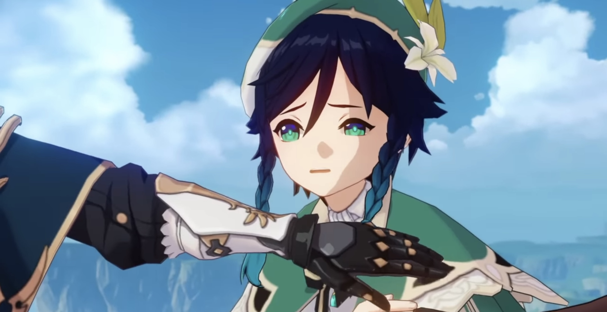

## Her Vision

If one were to go by skill alone, Jean has long become one of the best swordsmen in Mondstadt.

But in Jean's heart, she would rather be a shield that defends freedom and song than a sword that cuts through corruption and darkness.

> "Protecting" has always been a tougher task than "destroying."

Around the time when she was promoted from Captain of her squad to Master of the Knights, a huge challenge stood before her. From without, the Fatui exerted diplomatic pressure, and from within, there were traitors — comrades of the former Inspector, Eroch. Regrouping and finding a way to break through was no easy task.

But Jean was able to fend off the external pressure with one hand, and lead the Knights to smash the many plots of the Abyss Order with the other, re-establishing the authority of the Knights of Favonius.

Jean will never forget the moment she received her Vision. At that moment, all seemed to grow quiet as she felt the breeze flow through her hand. The world seemed to fade away, save for the time-honoured motto of the house of Gunnhildr:

> "For Mondstadt, as always."

## Her Connections

### Family

* Father: Seamus Pegg
* Mother: Frederica Gunnhildr
* Younger sister: Barbara Pegg
  
### Parents

After parting ways, Jean was raised by her mother alone. To this day, she remains close to her mother, though the same could not be said for her father. Jean's usual uniform (Favonion Devotion; default character outfit) is hand-sewn by her mother. Her mother also gave Jean her old uniform (Gunnhildr's Legacy; alternate character outfit) from when she was granted the title of 'Alder Knight'.Jean continues to uphold her mother's teachings of chivalry and strives to bring pride to her family.

At the moment, both "Alder Knight" Frederica and Seamus, Seneschal of the Church of Favonius, are accompanying Grand Master Varka on his expedition away from Mondstadt and have yet to return.

### Barbara

Jean did not share much of her childhood with her younger sister after their parents parted, so their relationship is currently quite strained. They would often address each other in formal terms, though Barbara does tend to slip up and call Jean "Big Sis" or "Jean" before correcting herself to say "Master Jean".However, they do care about each other very much and share the mutual desire to be closer to the other sister. Jean would sometimes worry about Barbara being too hard on herself but is often not able to find the words to say to Barbara.

Whenever Jean is burnt out from work stress, Barbara would be the one to heal and take care of her, though like everyone else, she is unable to fully convince Jean to rest more. On the other hand, while Jean does trust Barbara and her skills in healing, Jean would not let Barbara near any potential dangers. This is all to protect her dear younger sister, as an older sister would do.

Sometimes, Barbara would visit Jean at her office. Though it is uncertain if it is for work or personal reasons, it does give them some time to converse with each other considering Jean's busy schedule.

Over time, they seem to have slowly patched up their relationship through these short moments of conversation, growing a little closer to each other. Barbara was not only comfortable with calling Jean "Big Sis" during their Midsummer Island Adventure [Event Quest], she even confided in Jean her worries about not improving and asked for advice from her.

Though the two sisters still have a long way to go with their relationship, it is great to see that they have developed trust in each other and continue to hold on to their hopes for each other to live a happy, peaceful life.

### Varka

Jean has the utmost respect for Varka and sees him as a legend of his generation. Though Varka is the Grand Master of the Knights of Favonius, Jean seems to do much of his work in maintaining peace and freedom in the city while he goes on great expeditions for new frontiers and great conquests. She does not resent Varka for this; perhaps there is wisdom in his conduct. However, what Varka leaves undone falls on her shoulders, and it is then down to her to do the right thing.After seeing the Grand Master off to his most recent expedition, Jean made a vow alone: 

> "Upon your return, I will show you a kinder, more prosperous, and more peaceful Mondstadt."

### Diluc

Jean continues to view Diluc as her senior from when they were both knights, so she continues to address him as "Sir" even though Diluc insists on not being addressed as such. They remain friends to this day and would sometimes work together outside of work and without relations to the Knights' affairs. She has the utmost respect for him and hopes that he will one day view the Knights of Favonius in a better light, making it her duty to improve the Knights of Favonius and change his opinion.
When Diluc decided to leave Mondstadt to pursue the truth behind the Delusion Crepus wore after his death, Jean wanted to write and try to dissuade him, but Kaeya advised her against it.

Later, when Diluc returned to Mondstadt, Jean wrote a letter to Diluc:

> Dear Diluc,
> 
> Welcome back to Mondstadt, Sir.
> 
> It has been some time since the incident. We discovered that Eroch had betrayed us, and he has been punished severely. I hope that this news will put your mind at ease.
> 
> In other news, our people have discovered that the Abyss Order has stepped up its activities between Wolvendom and Stone Gate lately. Also — a mysterious individual that people are calling the "Darknight Hero" has suddenly started showing up out of nowhere all around Mondstadt City. He typically acts in the dead of night, and his intentions are currently unclear.
> 
> Please stay safe, and notify the Knights as soon as possible should you see anything suspicious. We will send support immediately. Whether you are presently in our ranks or not, all faithful knights will remember your contributions to the Knights of Favonius.
> 
> May you remain in good health.
>
> Jean

Diluc then wrote a reply to Jean:

> Dear Jean,
> 
> Thank you for your concern, Acting Grand Master. It is as you say. That incident should no longer weigh heavily on my mind. Punishing Eroch for his malfeasance was the right way to correct the Knights of Favonius's past mistakes. This is an important step indeed for the Knights.
> 
> As for my own personal safety, you need not concern yourself too much. The Knights of Favonius should focus their efforts where it counts by looking after those who need it most. 
> 
> May you also remain in good health.
>
> Diluc

_Jean and Diluc - the White Knight and the Dark Knight of Mondstadt_

Kaeya also wrote a letter to Diluc sometime after his return, mentioning that

"The appearance of the Darknight Hero has indeed bought the Knights of Favonius some valuable time during the Abyss Order's last attack", and that "this helped Jean convince the Knights of Favonius to stop focusing on trying to stop him".

Whether Jean is aware of the true identity of the Darknight Hero is uncertain, but at least she is not too concerned about the activities of the Darknight Hero anymore.

### Lisa

Jean and Lisa are close friends. They would often work together, with Jean leading the Knights, while Lisa works behind the scenes to help search for solutions. Outside of work, Lisa would be the one to try and persuade Jean to take a break, leading to daily scheduled breakfast trips and occasional tea breaks with the knights.All-in-all, when Lisa is around, Jean always has peace of mind. If both Jean and Kaeya are absent from duty, the Knight's affairs would be entrusted to her.

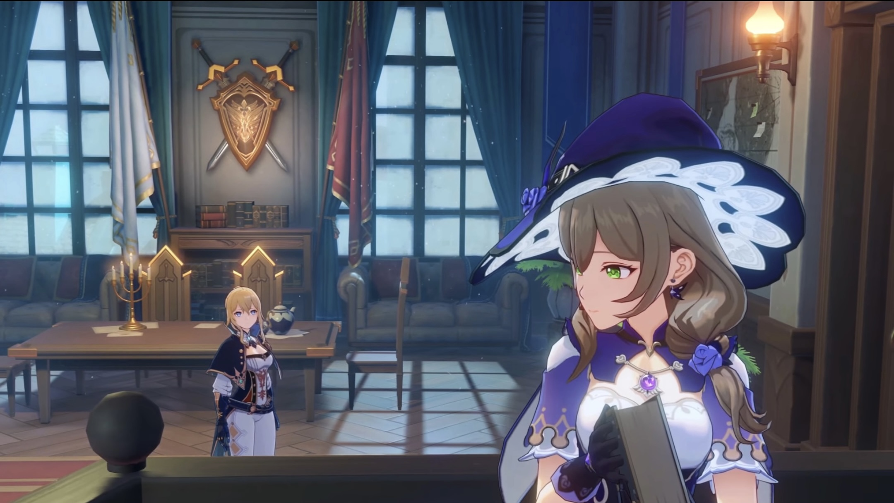

### Kaeya

Kaeya is the most trusted aide for the Acting Grand Master Jean, though she does sometimes disapprove of his reckless approach to completing his tasks. Nonetheless, Jean has a lot of trust in Kaeya and sees him as an excellent knight. In the case where Jean is absent from duty, the Knights' affairs will be entrusted to Kaeya. Outside of work, they are friends who look out for each other, possibly ever since they were both young knights.

### Klee

About 3 years prior to the events of Mondstadt's Archon Quest, Klee was entrusted to the Knights of Favonius by her parents. Under the protection of the Knights of Favonius, she is protected from harm and those of ill intent.

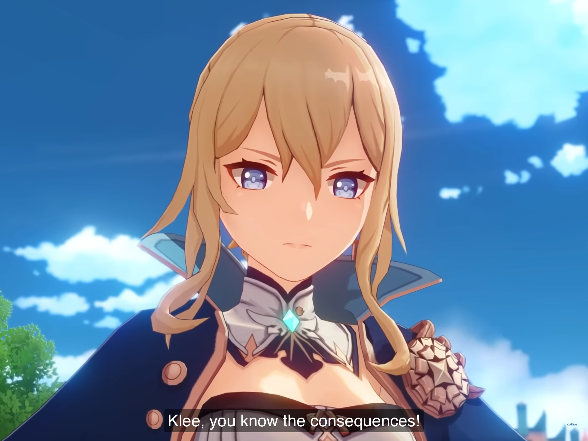

Jean is always on the lookout for Klee and cares a lot about her and her well-being, but she is often troubled about Klee and her use of her bombs. Whenever Klee uses her bombs to blast things or even the fishes in Starfell Lake, Jean would sternly send her to solitary confinement in the Knights of Favonius Headquarters for a variable amount of time since she has violated the rules.

<iframe src="https://giphy.com/embed/fWtJrVD5I2WIJRmfAw" width="480" height="270" frameBorder="0" class="giphy-embed" allowFullScreen></iframe>
<a href="https://giphy.com/gifs/jrpg-genshin-impact-fWtJrVD5I2WIJRmfAw">via GIPHY</a>

As stated in the Knights of Favonius Handbook: 

> "Knights who are minors at the time of the violation, and who therefore do not receive a formal salary, will be penalized with solitary confinement in lieu of a fine, with the period of incarceration to be determined based on the severity of the violation. The fish and other aquatic life found in Mondstadt's lakes and rivers are classed as public property, and as such must not be destroyed under any circumstances!"

This happens about once or twice a week.

As much as Jean wants to protect Klee from danger by not approving her request for leave from the Knights of Favonius, Jean admits that she has never been able to stop Klee; Klee will go where she wants to anyway. So instead, rather than have Klee run headlong into danger, she agrees it is better to agree to her request, and even accompany her if necessary.

### Eula

Jean does not see Eula as a vengeful descendent of the once-aristocratic Lawrance Clan, instead, she sees her as simply Eula herself. They would share tea breaks together with Lisa and possibly spar together, as friends would do. Jean has nothing but high praise for her talents and morality, thinking she is simply misunderstood by others.

### Noelle

Jean sees great potential in Noelle to become a great knight, however, she does not think that she is prepared for the dangers that lie beyond the city. She tasked Kaeya to work in the background to support Noelle, even though Noelle is capable enough to not need any support from her seniors. Jean has also instructed Noelle to immediately report any work-shy knights who attempt to delegate their existing duties to her. Though, it seems that Noelle would willingly run errands for Kaeya sometimes…

### Amber

Jean has witnessed much growth and development in Amber over the years as an Outrider and praises her for it. She trusts Amber and would often task her with scouting and tracking enemies down. She hopes that Amber's deeds will one day become the words of a bard's tale to remember her by.

### Ellin

Ellin greatly admires Jean; she wants to join the Knights of Favonius and fight alongside Jean, climb the ranks to become Jean's second-in-command, and even receive the title of Grand Master from Master Jean's own hands. She truly idolises Jean, seeing her as the one who would be able to protect Mondstadt through all sorts of dangers. She is even trying to copy Jean's sword-fighting techniques, thinking that such style is only for those with great character. She can be seen practising diligently behind the Knights of Favonius Headquarters.

> _She's an incredibly upright and diligent woman, talented and always gets the job done. Honest, kind, gentle, not to mention... Sorry, once I get talking about Master Jean, I get a bit excited…"_

### Venti / Barbatos

Being the Dandelion Knight, Jean is devoted to protecting the land of freedom left behind by Barbatos, remaining faithful to him and his philosophy of Freedom like those before her.

After Mondstadt - Prologue Act II [Archon Quest], Jean realises Venti's true identity. She does, however, continue to address Venti as "Venti" instead of "Barbatos", especially since this is what Venti wants. Ever since then, Jean would pretend to be unaware of Venti's true identity and treat him like how she would to every other citizen of Mondstadt, making sure that his true identity is never disclosed to anyone else.

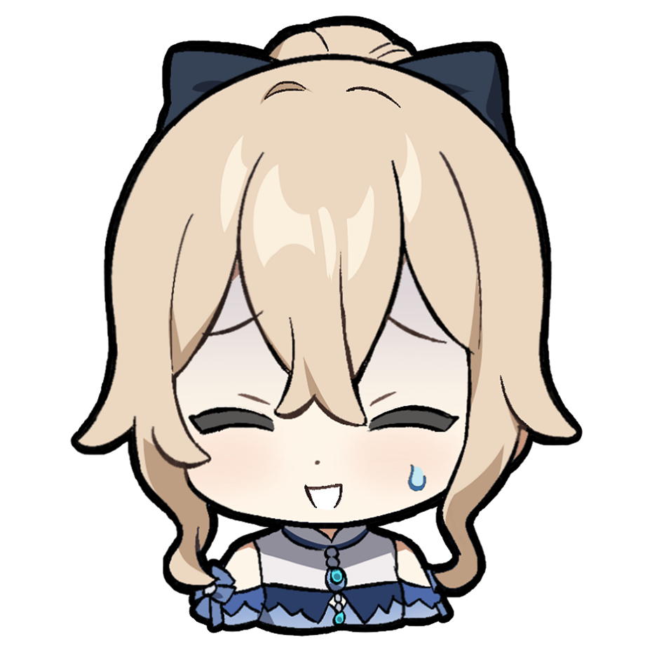

During 1.4 Invitation to Windblume [Event Quest], when the Traveller tried to ask Venti what his favourite flower was to decide on what to offer to the Anemo Archon as Windblumes, Jean diverted the conversation with a cough (_"Ahem…"_), implying to the Traveller to stop talking to Barbatos and focus on picking a Windblume to offer.

During 1.6 Midsummer Island Adventure [Event Quest], when Venti used his lyre to summon Dvalin, surprising Barbara in the process, Jean tried to divert the focus on Dvalin to show gratitude to this "dear poet" for his aid.

Not suspicious at all.

### Ningguang

As Acting Grand Master of the Knights of Favonius, Jean would often correspond with the Tianquan of the Liyue Qixing via letters pertaining to political affairs and relations between the two nations. Through their letters, Jean spoke highly of the Traveller, which piqued Ningguang's interest in them. As such, she has been putting eyes and ears out ever since the Traveller reached Liyue, and she eventually got wind of their movements when they were on their way to Wangshu Inn thanks to the people of Wangshu Inn. How sneaky.

## Her Quirks

### Jean drinks coffee - a lot

Jean is an avid coffee drinker due to her busy schedule. While she does try to limit her coffee intake, she seems to easily hit her monthly quota within the first few days of the month. Jean claims to have grown immune to the effects of coffee and would like to ask Lisa for help in making something stronger. She would even like to ask Lisa to help her make a potion that would keep her awake forever. While this is a very concerning health issue for Jean, making this much coffee has led to her mastery of the art of coffee making, which Amber praises highly.

### Jean even takes trivial requests from citizens

Although she is the Acting Grand Master, Jean seems to take on many strange requests from her citizens which are oftentimes too trivial to require her attention. As seen from her Story Quest Leo Minor, the citizens of Mondstadt would request Jean's help in dispatching a party of knights to clear out nearby hilichurls, handle quarterly tax returns, and look for their missing cat. Surely, these are not tasks for the Acting Grand Master to handle, right?

### Jean is a romantic

She loves reading romance novels. This is not for the years as a young girl that she missed amid her training and duties, or due to the rift that formed in her parent's marriage. Jean simply yearns for the mutual attraction spoken of in such stories, for those emotions as subtle and fragile as spider silk. However, as a knight, she has to put Mondstadt and the Knights of Favonius first.

Sometimes, deep at night in her office, she would reread the book "Vera's Melancholy" and wish to visit Cape Oath sometime.

* "Vera's Melancholy" is a story about two young friends, Vera and Sachi, who were swept into an otherworldly adventure, with Sachi eventually falling in love with Vera and doing all he could to revive her after her death. It is left off at a cliffhanger after Sachi professed his love to Vera after reviving her as they were both brought back in time to their youth.
   
* Cape Oath is a popular place amongst young lovebirds and has a legend: Two lovers made an oath to each other there and left behind a deeply touching story.

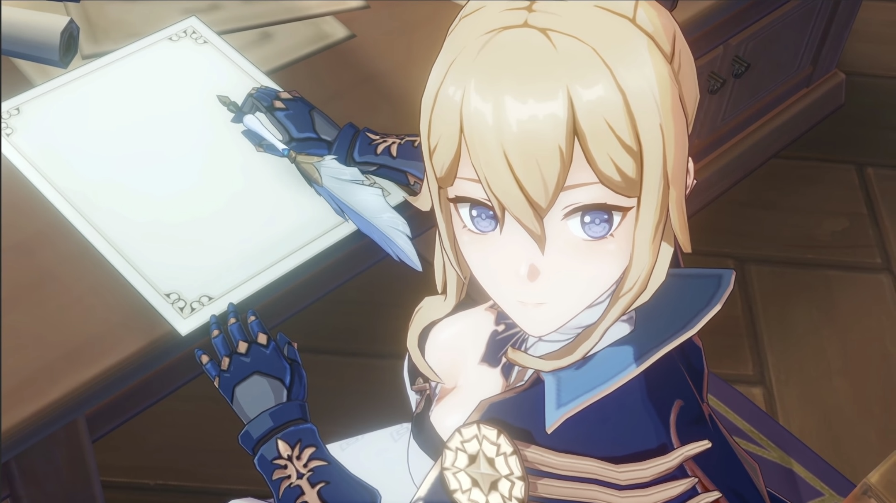

She also desires to wear gorgeous gowns, much like those described in novels. Her wish was eventually granted by her friends, who together made a beautiful set of form-fitting summer wear (Sea Breeze Dandelion; 4-Star character outfit), made just for her. (She gets quite self-conscious about her looks, even though she looks great as always! Don't worry, the Traveller reassured her that she looked marvellous.)

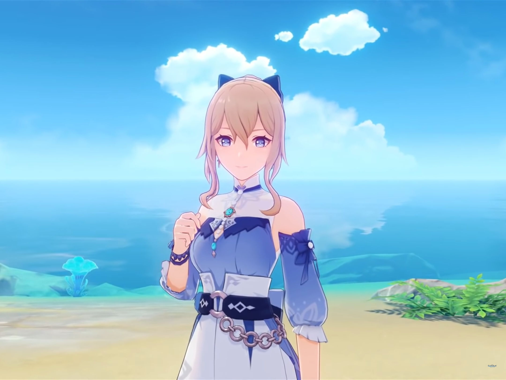

### Jean's favourite food is pizza

Specifically the one sold at the Cat's Tail, and her special dish is Invigorating Pizza. She seems to love pizza so much that she created her own recipe, one that makes the pizza almost seem more art than food and one slice of it is enough to have you raring to go. She would sometimes make some for Lisa too.

### Jean had a pet tortoise when she was a child.

She would sometimes lose her tortoise, so she discovered a method to find it:

> _"The secret to finding what you are looking for is to never look for it in the first place. Don't think too much about it and don't search too hard… and before you know it, what you are looking for will appear right before your very eyes. Pay attention to what you see in your peripheral vision, and you might just stumble upon what you're looking for."_

### Jean is very organised and has a strict schedule for herself

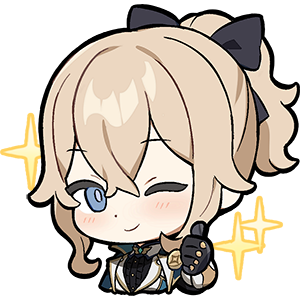

It is accurate down to the minute. From a morning run with Amber followed by a breakfast trip with Lisa on the way to doing her own laundry by hand and settling her own change of clothes at night — all things great and small pack Jean's schedule rather tightly. Every completed item is ticked off, while ones delayed due to external factors list the detailed whys and wherefores.

Jean sometimes thinks that the inspiration for this schedule may have been the training program her mother drew up for her ten years ago.

### Klee is not the only one Jean sends to solitary confinement

It seems that the solitary confinement room is not only reserved for our little Spark Knight. Jean sends Klee's "associates" to the room as well whenever they cause trouble for the citizens of Mondstadt.

One day, Noelle went to ask Klee for tips on how to become a knight, but Klee instead took her outside the Knights headquarters to play with bombs. Noelle thought it was some kind of training exercise at first, so she stayed with Klee. Jean found them and sent both to solitary confinement.

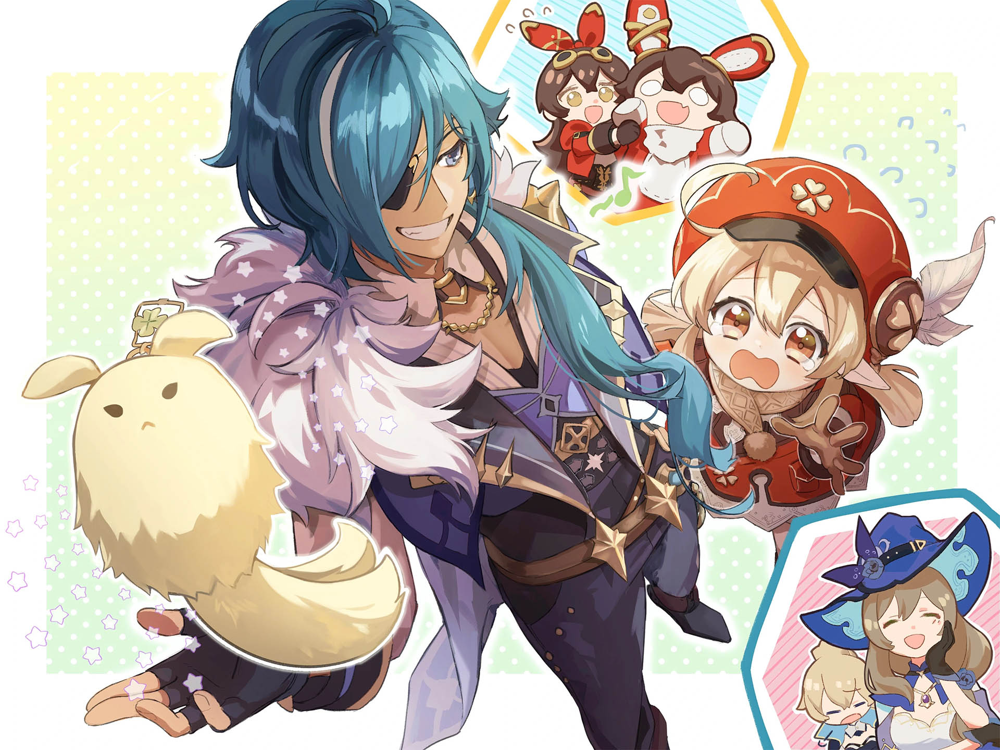

Another day, Kaeya and Klee were at Good Hunter. Klee blew up the stove there, so both Klee and Kaeya were sent to solitary confinement, even though both were supposed to travel to the Chasm to help out with demolition.

Besides sending the Knights to solitary confinement, there are other "punishments" at hand for those who were caught scheming destructive plans.

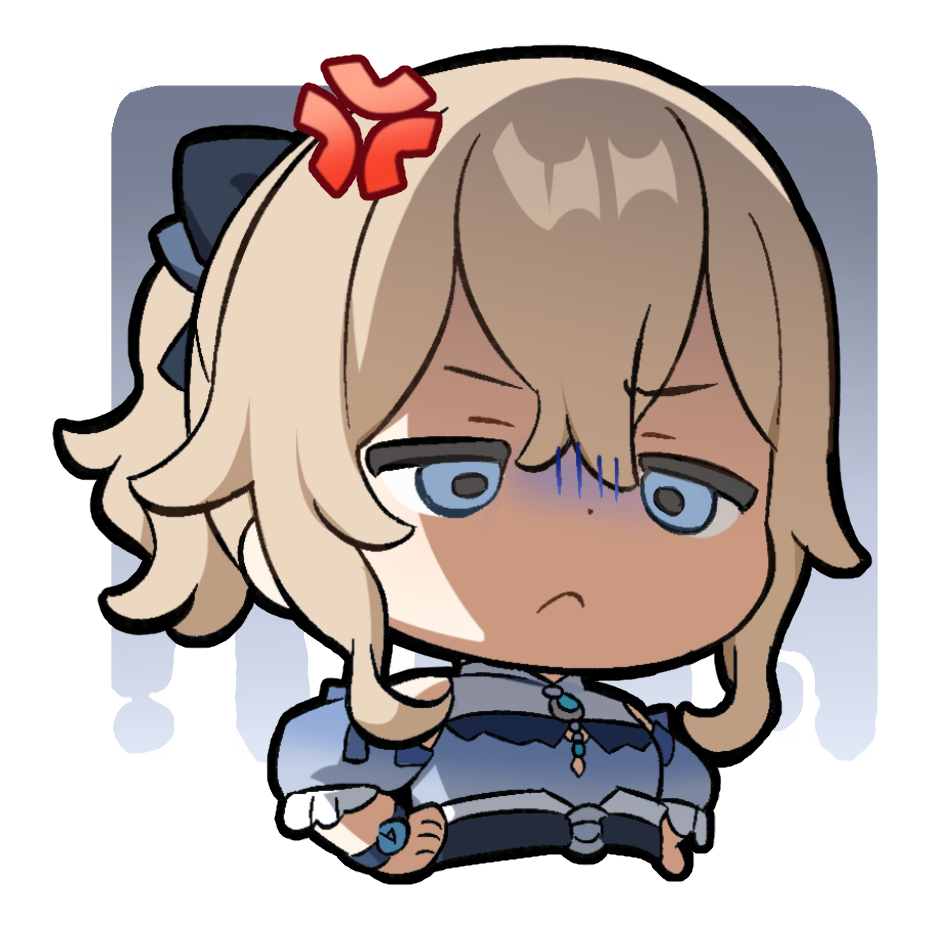

At the Golden Apple Archipelago, Klee and Albedo were talking about the reclining chair "Dodoco's Beach Nap", with Klee wanting to tie three of these chairs together to make a giant slingshot and send Jumpy Dumpties over the city walls into Cider Lake. As such, Albedo had to write a guarantee that "mementos from the Golden Apple Archipelago will not be modified for use in pranks" on Klee's behalf after these reclining chairs were brought back to Mondstadt.

### Jean can sing quite well

However, she is quite shy and humble about it, saying she can only sing a few simple songs and that it is nothing to brag about. Despite this, she does sing Happy Birthday to the Traveller, even allowing them to take it easy that day! (Birthday voice line, in all languages)

### Jean granted the "Honorary Knight" to the Traveler

As Acting Grand Master, Jean was the one who granted the title of "Honorary Knight" to the Traveller.

This happened during Mondstadt - Prologue Act II [Archon Quest]. She asked the Traveller to accept the title of "Honorary Knight" and the gratitude of the Acting Grand Master, asking them for their continued assistance in investigating the case of Stormterror.

### Jean is a normal person

Outside of work, Jean is, like everyone else, a person with emotions.

Even surprise parties are able to surprise our dear Acting Grand Master.

During Leo Minor Chapter: Act I [Story Quest], her friends (Amber, Kaeya, Lisa, Diluc, Venti and Barbara) decided to take the chance during her time off to organise a surprise party for her to enjoy herself. The surprise was a success! Jean was so surprised that she was speechless and was quite shy about being the subject of this party. She was very grateful too. (And as usual, she was worried about the work she had to do. She would later find out that her friends had already dealt with her work for her, just so that she would not have to worry about it. So all is good!)

Jean is also not as confident as she seems to be as the Dandelion Knight and Acting Grand Master.

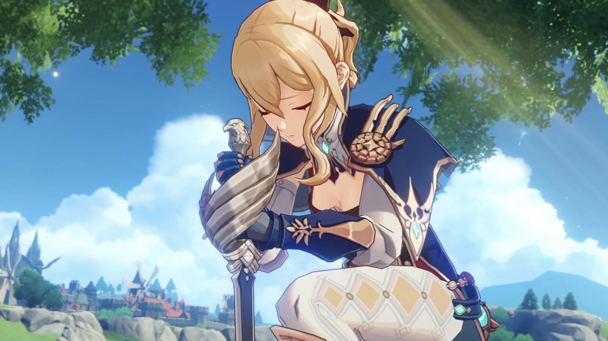

Jean may seem confident in her skills and capabilities, but she too can be unsure of herself sometimes, wondering if she is doing enough for the people of Mondstadt. How can she be the protector that Mondstadt needs her to be? The protector that Vennessa was…

And due to her busy schedule, she would oftentimes soldier through her exhaustion or sickness, leading to her burning out.

To this day, whenever Jean feels weary or feels herself beginning to waver, feeling lost and confused, she would go and stand before the great tree at Windrise and let the wind console her once more. It carries away her fatigue, so that she may once more have the strength to carry on.

### Jean on her birthday

Whenever it is Jean's birthday (March 14), her friends from the Knights of Favonius would chase her out of her own office and opt to take all of her work upon themselves.

Jean would protest of course, but her friends are persistent, saying that she is allowed to go anywhere else but headquarters to relax on her birthday. They would even instruct the knight guarding the door to her office to prevent her from entering right in front of her.

Jean, however, does not see the need to celebrate her birthday.

As a child, she always spent her birthday with her mother. They would do away with the usual entertainment and birthday cake, opting for a simple trip to Windrise. She has grown used to that tradition, which is why she is not accustomed to the notion of having a birthday banquet and is unsure how she should celebrate her birthday.

So instead, Jean would go out on a walk, or well, a patrol around Mondstadt. Sighs, she is still working, even on her birthday. Jean is ever so diligent and dutiful.

## Lore Implication(s)

As Master and Acting Grand Master of the Knights of Favonius, Jean is devoted to protecting Mondstadt with her life. She plays an important role in protecting the City of Freedom from any harm, which can include but is not limited to Fatui plots, Abyss Order plots, or corruption of key figures in Mondstadt such as Dvalin or any of the Knights of Favonius. All of the Knights of Favonius are at her command; how she will lead the Knights of Favonius in protecting their home will ultimately determine the fate of the City of Freedom and its citizens.

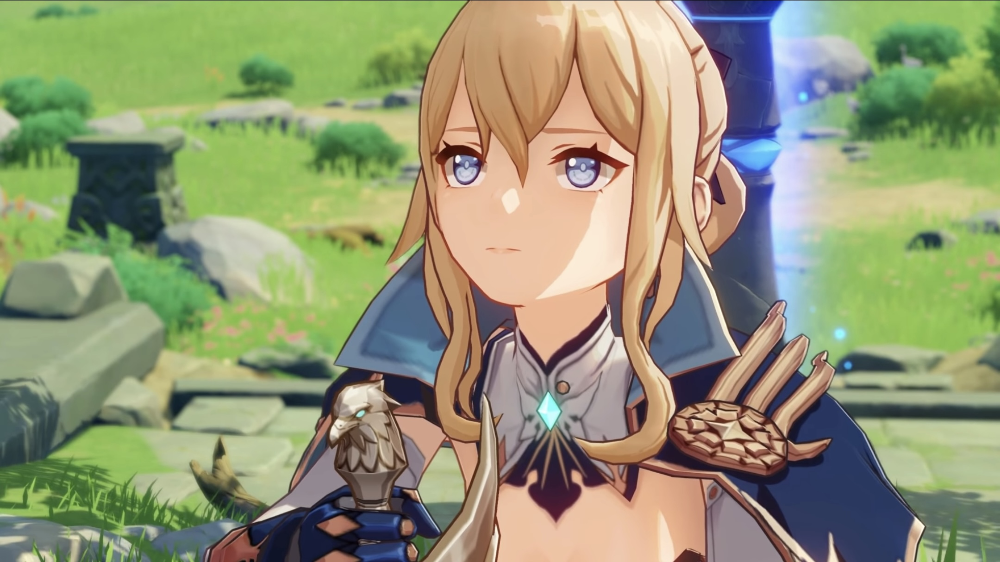

## Speculative Theor(ies)

As Jean is a romantic who desires true love, fans have speculated the possible evolution of her relationship with one of her friends to become romantic in the future.

## Misconception(s)

* Jean is simply another "overworked" character

While it is true that Jean is often working at the expense of her health, being "overworked" is not her only trait as a character. It is a problem that stems from her overall upbringing and circumstance, which is what her character is about.

Jean has much pressure and weight put on her shoulders. She is not only the Master of the Knights, the Acting Grand Master, and the Dandelion Knight but also the successor to the esteemed Gunnhildr Clan. From a young, she was trained to become a great knight, to uphold her family's motto "For Mondstadt, as always". She was taught to always put Mondstadt first before herself in order to protect her nation and its freedom. She also looks, up to Vennessa, the first Grand Master, who is also the first Lionfang and Dandelion Knight. Jean had always hoped to follow in her footsteps, to take on the huge responsibility of being as gentle as the Dandelion Knight and yet as fierce as the Lionfang Knight.

Her aspiration of continuing to protect Mondstadt and its freedom comes first before everything else, even herself. This is the burden that she willingly carries, for Mondstadt, as always.

It does not help that even though she is not the current Grand Master of the Knights of Favonius, she seems to do most of Varka's work on top of her own work as the Master of the Knights. And with Varka being absent, Jean has to cover for both jobs and not only lead all of the remaining Knights of Favonius, but also deal with diplomatic pressures from other nations such as the Fatui. Without Jean, Mondstadt would be very vulnerable to any attacks.

The people of Mondstadt seem to also freely take advantage of the Acting Grand Master's chivalry and passion to help. Even though Jean is the Master of the Knights and the Acting Grand Master within the Knights of Favonius, both of which are highly ranked titles, the people of Mondstadt see Jean as someone they can all depend on, one who they can ask for help whenever and for whatever reason. Jean too does not care for her role or title within the Knights of Favonius, her work ethic will always remain the same. This coupled with Jean's popularity among the citizens of Mondstadt leads to the Acting Grand Master being tasked with helping her citizens with trivial matters such as finding their cat even though she has more important tasks at hand. These matters could have been handled by the other knights as well.

With all these factors combined, Jean is "overworked", but this one word is not nearly enough to describe her entire characterisation. She is much more than just someone who has too many tasks on her hand to complete. Her relationship with the Knights of Favonius and the City of Freedom is a part of her characterisation as well. (She is also not just a knight, but a person with personal life and interests outside of her work!)

## Conclusion

As Kaeya says, "You need to give her your full support".

Jean has always been seen as a role model to others, one with grace and without flaws, but she too is human through and through. She struggles and sometimes falls under pressure, yet her desire to protect her home and people burns ever so bright, giving her the strength to continue walking into the future she so wishes to protect. She truly is fortunate to have the Knights of Favonius and her friends by her side to share her burdens and support her on this path they take together, even if it means pushing Jean to leave the office and take leave from work for once. Perhaps someday, you will be able to witness their glory too.

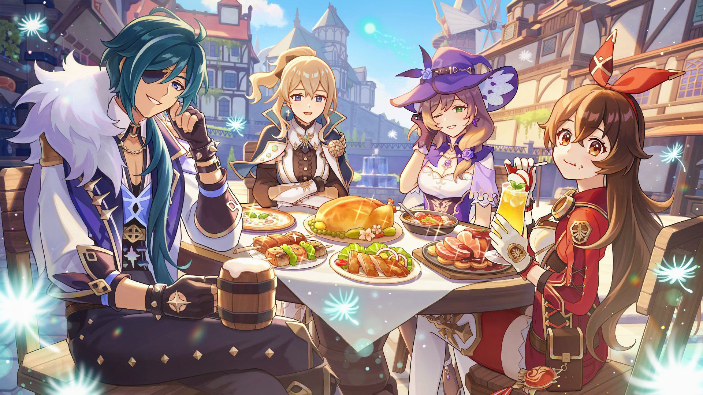

Well then, it seems that the Acting Grand Master is interested in meeting you, and formally invites you to the Knights of Favonius Headquarters.

So go, windborne traveller. Let the Wind lead.

> "_For Mondstadt, for freedom, that is what I fight for."_

