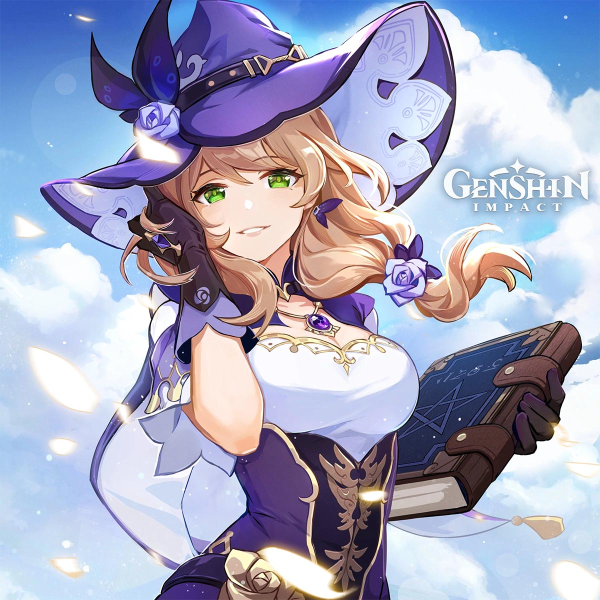
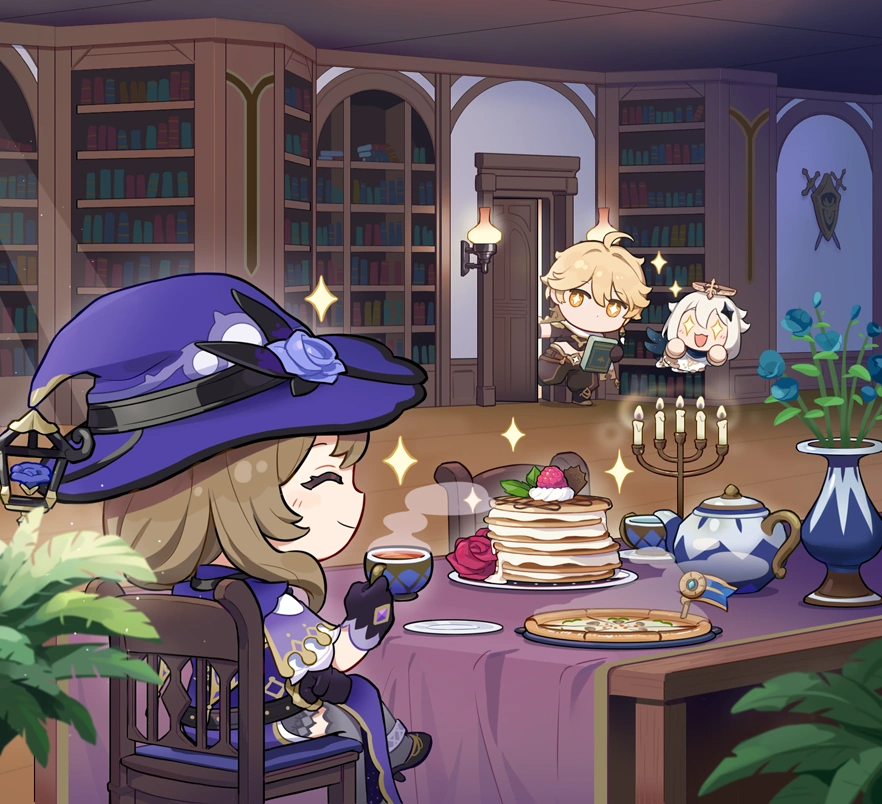
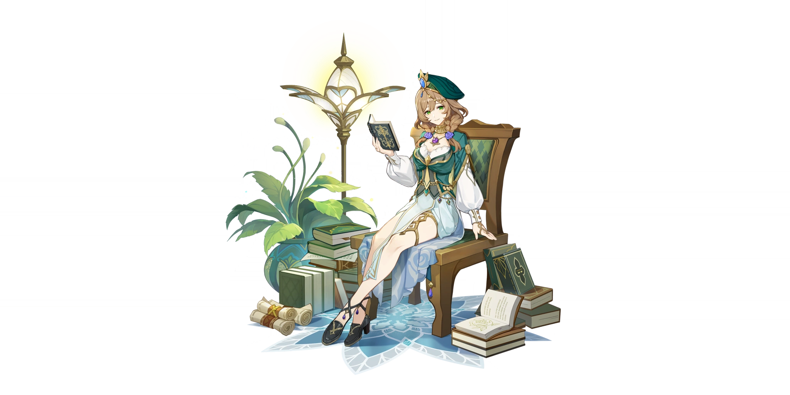
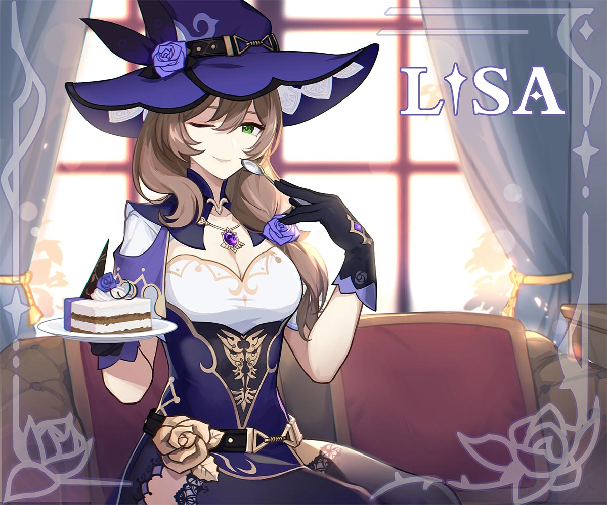
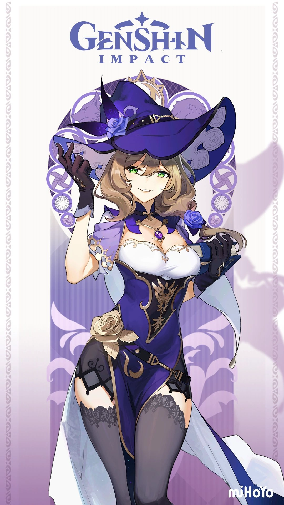
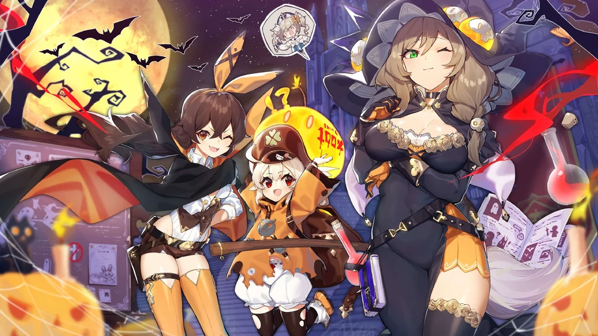

Table of Contents

- [Lisa - Witch of Purple Rose](#lisa---witch-of-purple-rose)
  - [Credits](#credits)
  - [Lisa Minci](#lisa-minci)
  - [Etymology](#etymology)
  - [Constellation: Tempus Fugit](#constellation-tempus-fugit)
  - [Before the Academia](#before-the-academia)
  - [Lisa in Sumeru](#lisa-in-sumeru)
  - [Official Press Release](#official-press-release)
  - [Lisa leaving Sumeru](#lisa-leaving-sumeru)
  - [Librarian of the Knights of Favonius](#librarian-of-the-knights-of-favonius)
  - [Connections](#connections)
    - [Razor](#razor)
    - [Jean Gunnhildr](#jean-gunnhildr)
    - [Collei](#collei)
    - [Cyno](#cyno)
  - [Quirks, Misconceptions, and Theories](#quirks-misconceptions-and-theories)
    - [Lisa hates pumpkins](#lisa-hates-pumpkins)
    - [Don't ever make Lisa mad](#dont-ever-make-lisa-mad)
    - [She has a special cauldron](#she-has-a-special-cauldron)
    - [Lisa is on an "energy saving mode"](#lisa-is-on-an-energy-saving-mode)
    - [Anime mom hairstyle](#anime-mom-hairstyle)
    - [Lisa has a purple rose](#lisa-has-a-purple-rose)
    - [She rejected her invite to the Hexenzirkel](#she-rejected-her-invite-to-the-hexenzirkel)
    - [Lisa knows where the traveler is](#lisa-knows-where-the-traveler-is)
  - [Conclusion](#conclusion)

> "I'm not lazy, I just know to save my energy for when I need it most."

# Lisa - Witch of Purple Rose

## Credits
* Written by: RowanBee
* Reviewed by: Arun
* Proofread by: Lare
* Last updated on: 8th March, 2023
* Character story updated till v3.4
* Story and Quest involvements - Work-in-Progress

## Lisa Minci

* Title - Witch of Purple Rose
* Type - Starter 4-star, Tall Female, Electro Catalyst playable character
* Birthday - June 9th
* Constellation - Tempus Fugit
* Affiliation - Knight of Favonius
* Special Dish - Mysterious Bolognese
* EN VA - Mara Junot
* CN VA - Zhong Ke (钟可)
* JP VA - Tanaka Rie (田中理恵)
* KR VA - Park Go-woon (박고운)

Table of Contents

- [Lisa - Witch of Purple Rose](#lisa---witch-of-purple-rose)
  - [Credits](#credits)
  - [Lisa Minci](#lisa-minci)
  - [Etymology](#etymology)
  - [Constellation: Tempus Fugit](#constellation-tempus-fugit)
  - [Before the Academia](#before-the-academia)
  - [Lisa in Sumeru](#lisa-in-sumeru)
  - [Official Press Release](#official-press-release)
  - [Lisa leaving Sumeru](#lisa-leaving-sumeru)
  - [Librarian of the Knights of Favonius](#librarian-of-the-knights-of-favonius)
  - [Connections](#connections)
    - [Razor](#razor)
    - [Jean Gunnhildr](#jean-gunnhildr)
    - [Collei](#collei)
    - [Cyno](#cyno)
  - [Quirks, Misconceptions, and Theories](#quirks-misconceptions-and-theories)
    - [Lisa hates pumpkins](#lisa-hates-pumpkins)
    - [Don't ever make Lisa mad](#dont-ever-make-lisa-mad)
    - [She has a special cauldron](#she-has-a-special-cauldron)
    - [Lisa is on an "energy saving mode"](#lisa-is-on-an-energy-saving-mode)
    - [Anime mom hairstyle](#anime-mom-hairstyle)
    - [Lisa has a purple rose](#lisa-has-a-purple-rose)
    - [She rejected her invite to the Hexenzirkel](#she-rejected-her-invite-to-the-hexenzirkel)
    - [Lisa knows where the traveler is](#lisa-knows-where-the-traveler-is)
  - [Conclusion](#conclusion)

Lisa is an intellectual and a knowledgable sorceres, who works as a Librarian of the Knights of Favonius. Often told by many as someone "overqualified" to be a mere Librarian, she often dismisses these claims and continues enjoy her peaceful life at Mondstadt.

She holds an Electro Vision from Mondstadt and wields a catalyst.

_Lisa birthday chibi artwork_

## Etymology

Lisa is a short version of the name Elizabeth, meaning "my God is an oath." Most famously known is the Mona Lisa, leading many to speculate that Genshin's Lisa is based on the Mona Lisa herself. Preliminary research on her last name indicates that "Minci" is based more on da Vinci. There are very few records of the surname in popular usage indicating that the nod to famous Renaissance artist and inventor Leonardo da Vinci is intentional. (Our Lisa, however, has eyebrows.)

## Constellation: Tempus Fugit

Lisa's constellation "Tempus Fugit" is rougly translated to "Time Flies"

Lisa's constellation depicts an hourglass with a rose-shaped circle at the top of the hourglass leading to a pool of sand at the bottom. In Mona's "About Lisa" she provides more insight into both Lisa and her constellation:

> "A Tempus Fugit… The constellation derives its name from the hourglass and stands for knowledge and time – or rather, the trade-off between them. As each grain of sand falls down, a moment of time – of life, even, dies for good. To stop the unrelenting flow of sand, one would have to turn the hourglass on its side. But once the sand comes to rest, it remains motionless forever… Hmm, maybe 'becomes lazy' is more accurate than 'comes to rest' in this case."

## Before the Academia

Not much is known of Lisa's early life. It can be surmised that she likely grew up in Mondstadt as many of the voice lines indicate that she returned to Mondstadt after graduating from the Akademiya in Sumeru.

## Lisa in Sumeru

_Lisa in her custom-made Sumeru Akademiya costume - A Sobriquet Under Shade_

The first question she ever asked the Sages in Sumeru on her first day at the Akademiya was

> "If you put enough flour into hydro slimes, do they become dough slimes?"

That's when the Akademiya sages knew they had someone special in their midst. She is said to be one of the most talented sorceresses the Sumeru Akademiya has seen and graduated in two years.

Cyrus of the Akademiya even called her the "Best student in two hundred years." It is during this time Lisa also received her electro-vision while studying the elements.

During her studies, Lisa came to the conclusion that, in order to better understand the elements, she would need a vision. Understanding the elements is crucial in magecraft, and what better way to understand them than by practical experience rather than dusty old tomes? As soon as the thought popped into her head, her vision appeared in her hand.

With the addition of a vision, Lisa found herself filled with both delight and dread.

> "For whatever reason, the gods gave humans the key to changing everything, but they did not explain the cost involved. Lisa grew fearful of the truth."

Whenever Lisa finds someone interesting who comes along, she will share her knowledge with them in hopes of finding someone (perhaps even our own dear Traveler) who can uncover the truth behind visions.

## Official Press Release

So, what ultimately led the "best student" to leave the world of the Akademiya behind in favour of becoming a humble librarian of the Knights of Favonius?

In an interview with [wccftech.com](https://wccftech.com/talking-with-mihoyo-about-genshin-impact-and-how-its-more-than-some-clone/), Hoyoverse stated the following story about Lisa:

> "(Lisa) touched a magic book when she was young that gave her most of her powers but it cut her life by half so she only has a few years left to live. It creates a very carefree personality of someone that just wants to live life."

While this information is not directly stated in the current known canon, it matches what Lisa herself as well as others have said about her departure from Akademiya.

## Lisa leaving Sumeru

At friendship level six, the story begins to reveal itself as to why she left.

Lisa witnessed the way many Sumeru Akademiya scholars went mad in their quests for knowledge, while others had skills and knowledge that went under-utilised by the bureaucracy of the Akademiya.

Lisa realised that there is a price to uninhibited knowledge and wisdom, one that she was not personally willing to pay. Or perhaps it is a price she has already paid and does not wish to test what anything further would cost.

> "It seemed such a high price to pay... How much did one have to sacrifice to attain the profoundest knowledge of all?"

That's when Lisa stopped taking things so seriously.

On an additional note, in the latest version 3.4 update, the limited time event "Second Blooming", we see Lisa telling the state of the Sumeru Akademiya directly to the Traveler and Paimon.

In his voice line about Lisa, Cyno states:

> "Of course, I know about Lisa, we once both studied under the same sage. As General Mahamatra, I've seen many tragedies befall those seeking knowledge too assiduously, so it's easy for me to understand her decision."

## Librarian of the Knights of Favonius

Of course, someone with the reputation Lisa has for being a brilliant scholar and sorceress was not immediately given the humble role of librarian. When she first joined the Knights of Favonius, Grand Master Varka wanted her to be the Captain of the Eighth Company.

Not everyone agreed with this proposal, however. Nymph, the Field Officer of the 8th Company, resented the idea of an academic being given the role. At Kaeya's suggestion, Nymph and Lisa faced off in a practice combat to display their magical proficiency.

Two minutes in, Lisa declined the role of captain on the grounds that _"Nymph manifestly possesses the requisite ability to fulfil the role."_

For the whole year following, the Grand Master received a constant stream of referral letters from Nymph in relation to the captaincy, and the only person ever named in them was Lisa Minci.

Eventually, the Grand Master began turning over the referral letters to Lisa directly, but every time, Lisa would come up with an excuse to decline the offer.

After all, more responsibility meant more workload and that simply would not do.

It's no secret that the 8th Company would likely have been stronger under Lisa's leadership, but Lisa deemed it too risky for her in a way that most would not understand or appreciate. As such, she ended up becoming the tea loving librarian of the Knights of Favonius we all know and love.

Despite the fact that most people only interact with her when checking out or returning books, her work always holds up to scrutiny and Lisa knows when to delegate the work and when to do it herself.

## Connections

As a former scholar of Sumeru's Akademiya, Lisa has many connections in both Sumeru and Mondstadt.

### Razor
Lisa is Razor's teacher in Mondstadt and taught him how to utilise his electro vision as well as basic education such as reading and writing and speech. Razor seems to hold a high amount of trust and respect for Lisa.

### Jean Gunnhildr
Acting Grand Master of the Knights of Favonius, Jean states that she always has peace of mind when Lisa is around and Lisa often encourages Jean to take tea breaks when she needs them.

### Collei
Alongside Amber, Lisa assisted Collei when she first arrived in Mondstadt. It is noted in Collei's story as well as the manga that Lisa showed her much compassion that Collei didn't quite know how to accept, but the compassion shown to her by people like Lisa and Amber changed Collei's life dramatically. It was at Lisa's invitation that Cyno came to Mondstadt to aid Collei.

### Cyno
Cyno and Lisa both studied under the sage Cyrus during their time at the Akademiya. As such, Cyno has a deep understanding of why Lisa chose to leave the Akaademiya and respects her decision.

On the flip-side, Lisa is quite proud of Cyno and often tells others that he is her junior in an action-packed job.

Added to that, in the latest v3.5 patch "Windblume" festival, in a conversation between Lisa and Cyno, she empathises why Cyno deeply cares about Collei as they are quite similar: Both have a spirit locked in them. On a wholesome note, she even teases Cyno to be her "baby brother" much to Cyno's embarassment.

## Quirks, Misconceptions, and Theories

### Lisa hates pumpkins

Lisa is terrified of pumpkins. No reason why is given in canon, but as you can imagine the harvest is a difficult time for her.

### Don't ever make Lisa mad
Kaeya once borrowed a book from the library and returned it past the deadline. In his voicelines, he mentions that one of his hands were a bit numb ever since - implying that she got mad and electrocuted him.

Even in her character story quest, the abyss mage who tried to steal the book, "The Pale Princess and the six Pygmies" was terrified at the amount of electro elemental energy she was able to accumulate in a short span of time to electrocute the mage.

While people often say that Lisa is hardly working, they always warn you to return the books on time and never to make her mad - for a good reason.

### She has a special cauldron

She invented a special heating cauldron that she mostly uses to keep her tea warm while she manages the books. One might even say her invention might rival that of Cloud Retainer's cooking contraption, but don't tell that to Cloud Retainer.

### Lisa is on an "energy saving mode"

Lisa's "laziness" is less of a laziness and more of a conservation of energy.

Lisa learned much at the Akademiya, including the valuable lesson of not taking herself so seriously. Having shortened her own lifespan in the process, it is implied by her ascension voice lines that the more powerful she gets, the less time she seems to have. After all, time flies.

### Anime mom hairstyle
One of the more popular theories about Lisa is that she will be the first playable character to die on screen. This is primarily from the death flag of the "anime mom hair," where motherly characters or moms are shown with the same hairstyle Lisa has in her primary outfit are later killed off. This has led many to speculate that Lisa's time is limited on screen.

### Lisa has a purple rose
Lisa's association with roses is another interesting piece of lore. In Mondstadt, roses represent secrets and are given to people to represent a secret they wish for them to keep private.

> What secrets does Lisa know to be granted such a title as the Purple Rose Witch?

While it's clear that this is also associated with the Sumeru Rose, it is unclear whether or not the Sumeru Rose holds the same association of secrets that other roses do in Mondstadt.

### She rejected her invite to the Hexenzirkel
There are spatters of information mentioning a covenant of powerful sorceror mages - called the Hexenzirkel. In one of her voicelines, she mentiones that she rejected their offer stating the study of irminsul and having tea parties are boring to her.

### Lisa knows where the traveler is
After the events of getting, "The Pale Princess and the Six Pygmies" book in her character story quest, she made the traveler as the custodian of the book and put a marker on the book to track it down. Since the traveler carries the book in their backpack in their journey all round Teyvat, the book acts as a tracker to find where the traveler is on Teyvat.

## Conclusion

As a starter character, much of Lisa's lore and gameplay is overlooked by much of the Genshin community, but upon further inspection, her lore is really quite deep if not tragic. Her lore continues to unfold as we learn more about both Sumeru and Mondstadt and no doubt this page will be expanded in the future along with any events that feature Lisa and give us more insight into her character.

> 'Before demanding too many miracles from the gods, first consider if you are willing to pay the price they ask.'

