

Table of Contents

- [Razor - Wolf Boy](#razor---wolf-boy)
  - [Credits](#credits)
  - [Razor](#razor)
  - [Etymology](#etymology)
  - [Constellation - Lupus Minor](#constellation---lupus-minor)
  - [Story](#story)
  - [Meeting Klee and the meaning of Lupical](#meeting-klee-and-the-meaning-of-lupical)
  - [Wienlesefest v3.1](#wienlesefest-v31)
  - [Vision](#vision)
  - [Aspirations](#aspirations)
  - [Connections](#connections)
    - [Parents](#parents)
    - [Andrius](#andrius)
    - [Varka](#varka)
    - [Lisa](#lisa)
    - [Klee](#klee)
  - [Quirks](#quirks)
  - [Lore implications](#lore-implications)
  - [Speculative theories](#speculative-theories)
  - [Conclusion](#conclusion)

_"The wolves are my Lupical. My family."_

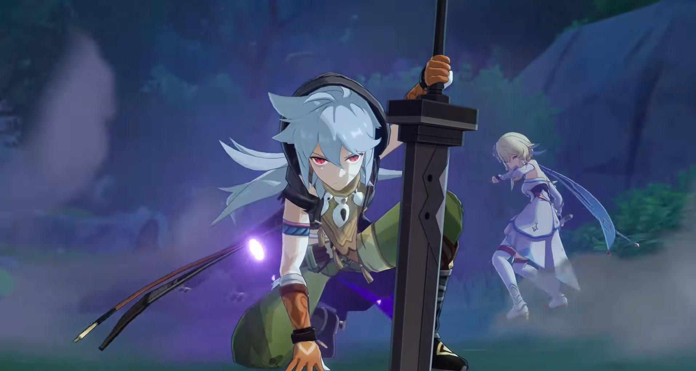

# Razor - Wolf Boy

## Credits
* Written by: Spieds
* Reviewed by: Arun
* Proofread by: Lare
* Last updated on: 9th April 2023
* Character story updated till v3.5
* Story and Quest involvements - Work-in-Progress

## Razor

* Title - Wolf Boy
* Type - Limited 4-star, Medium Male, Electro Claymore playable character
* Birthday - September 9th
* Constellation - Lupus Minor
* Affiliation - Wolvendom (Andrius)
* Special Dish - Puppy-Paw Hash Brown
* EN VA - Todd Haberkorn
* CN VA - Zhou Shuai (周帅)
* JP VA - Uchiyama Kouki (内山 昂輝)
* KR VA - Kim Seo-yeong (김서영)

Table of Contents

- [Razor - Wolf Boy](#razor---wolf-boy)
  - [Credits](#credits)
  - [Razor](#razor)
  - [Etymology](#etymology)
  - [Constellation - Lupus Minor](#constellation---lupus-minor)
  - [Story](#story)
  - [Meeting Klee and the meaning of Lupical](#meeting-klee-and-the-meaning-of-lupical)
  - [Wienlesefest v3.1](#wienlesefest-v31)
  - [Vision](#vision)
  - [Aspirations](#aspirations)
  - [Connections](#connections)
    - [Parents](#parents)
    - [Andrius](#andrius)
    - [Varka](#varka)
    - [Lisa](#lisa)
    - [Klee](#klee)
  - [Quirks](#quirks)
  - [Lore implications](#lore-implications)
  - [Speculative theories](#speculative-theories)
  - [Conclusion](#conclusion)

Traveling through the forest of Wolvendom, and with any luck, you might come across a young wolf boy, probably hunting with his family. A boy named Razor cherishes his Lupical and friends more than anything, usually leading the hunt, and everyone who sees him speaks of his bestial agility and senses.

Razor is a young pale-skinned boy with long silver hair and crimson eyes. His body is covered in scars from all the time in the wild, the most visible one being on his cheek.

He holds an Electro Vision, and wields a Claymore.

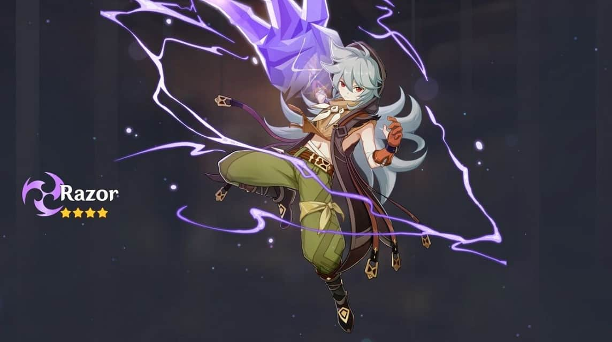

## Etymology

Razor's name means to cut something/a keen-edged cutting instrument.
It's also an Americanized form of German \"Rauser\" - nickname for a
noisy person.

## Constellation - Lupus Minor

Razor's constellation, Lupus Minor, depicts and means "Little wolf" in Latin. Other than "Wolf", the Latin "Lupus" could also be used to describe an animal which acts in the savage manner of a wolf or a tool which is shaped like a wolf's tooth.

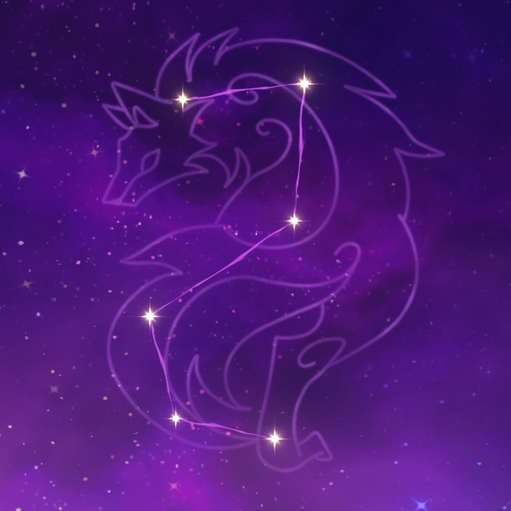

In ancient times, the "Lupus" constellation was considered an asterism within Centaurus, and was considered to have been an arbitrary animal, killed, or about to be killed, on behalf of, or for, Centaurus. The Greek constellation is probably based on the Babylonian figure known as the Ur(i)dimmu, meaning \"Mad/howling Dog\" or \"Gruesome Hound\". It was an ancient Mesopotamian mythical creature in the form of a human headed dog-man.

All of these meanings can be clearly seen in our wolf boy Razor, from obvious wolf imagery to his claymore being described as steel claw.

Also, just like Jean, Razor also has the word "minor" in his constellation. Could this be an indication that Grand Master Varka's constellation is "Lupus Major"? We are yet to find out.

## Story

Razor's story is one of tragic partings and fateful meetings. His parents were adventurers and presumably died when Razor was still very young and he has no recollection of them. Instead his memories start when wolves, most likely Andrius, took him in as part of their "Lupical" or family.

> "Andrius found humans to be a disappointment, but believed babies to be innocent. If both the wolf pack and the adopted children chose each other, then they become a Lupical, a fated family." - Boreal Wolf's Cracked Tooth

Razor's upbringing among the wolves was easy, filled with hunts on sunny days and hiding on rainy days. Finding food, quenching thirst and looking for a safe place to sleep were his only worries. While Razor is not the smartest, he knew he was different from his family, though that mattered little to him.

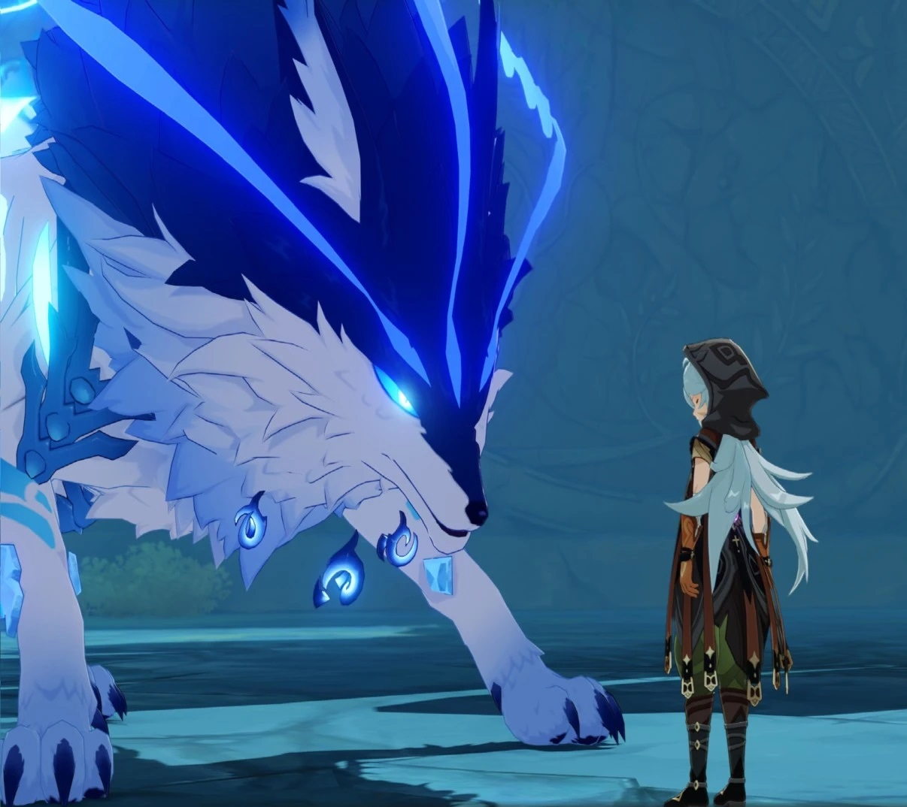

One day, a tall man came to the forests of Wolvendom, crossing paths with Razor. That man was none other than Varka, Knight of Boreas and Grand Master of Knights of Favonius, but Razor, of course, didn't know that at the time. With a friendly gesture, he invited Razor to return to Mondstadt; but the wolves and Razor, not understanding the meaning behind the gesture, hid the boy behind them to keep him away. On that day, a new question arose in Razor's mind:

> "Am I a human, or a wolf?"

Over time, Varka managed to become a mentor for the boy and, some might
even say, a third father, giving Razor his name and teaching him how to
wield a sword.

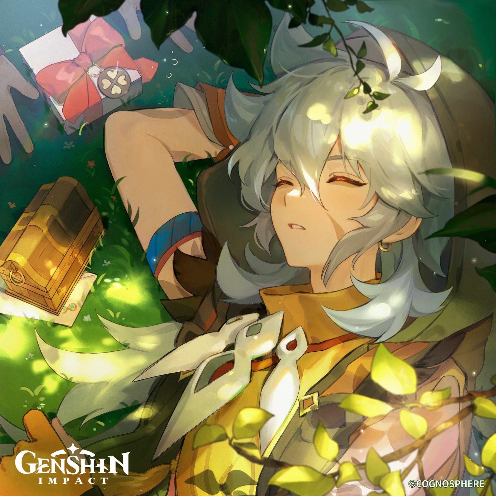

> "Now you can protect your friends."

> "Fr-ren-dzz..."

In this way, Razor learned another new word that would become widely used in his life, although at that time he did not know the meaning of this word.

In the future, Razor will meet a librarian in purple, Lisa, who will become his new mentor and teach him all sorts of things. When he asked her the meaning of that word he heard from the tall man, she simply smiled and yawned without answering him.

## Meeting Klee and the meaning of Lupical

That question would occupy his mind for days to come until, one day, Razor met a bright-red, 'burny' girl. The two wolf pups would spend a lot of time playing together, be it sunny days with warmth embracing both or rainy days pouring water over both from head to toe. The girl's name was Klee, and it was after meeting her that Razor understood:

*\"Friends\... is\... Lupical.\"*

*\"So\... protect friends\... Lupical\... with life.\"*

Razor may still not understand exactly how human relationships work, and
does not know whether he is a man or a wolf, but despite this, he is
still happy.

Later, Razor meets Traveler and Paimon on one of their ventures through Wolvendom, protecting them from some slimes. On the way back to Mondstadt, Traveler runs into Amber who asks them to help her with an investigation about apparent wolf attacks in Drunkard Gorge and Springvale.

During the investigation they meet up with Razor in the wilderness and find out that the rampaging wolves are not Razor's pack but instead the black wolves, rifthounds. Razor then leads them to an injured wolf, deeper into Wolvendom.

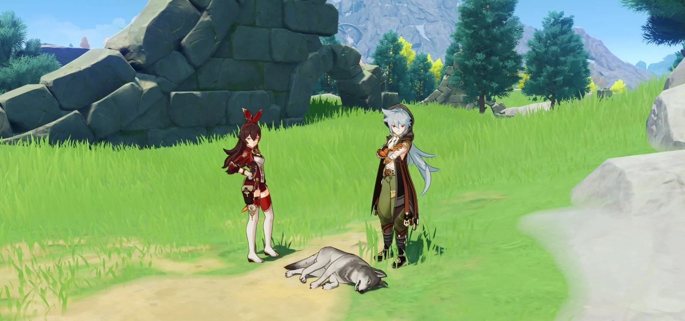

While tending to the wolf, some Springvale residents come and accuse Razor of leading the wolf attack. At that time, enraged by the unrest in the forest, Andrius awakens and challenges Razor for protecting outsiders, demanding that he clear their name with a sword.

With the help from Traveler, they manage to tame Wolf King's fury, and the latter confirms that the outside wolf pack was creating problems. However, as Andrius says, Razor is a human and no wolf, so he cannot intervene in their affairs.

In due time, Razor will also become friends with Bennet, getting stuck with him in the Thousand Winds Temple during the version 1.4 Windblume Festival and choosing Wolfhooks as his Windblume. He will also meet Klee's brother, Albedo, Diluc and Keaya while trying to help Klee on the Golden Apple Archipelago during the version 1.6 Midsummer Island Adventure.

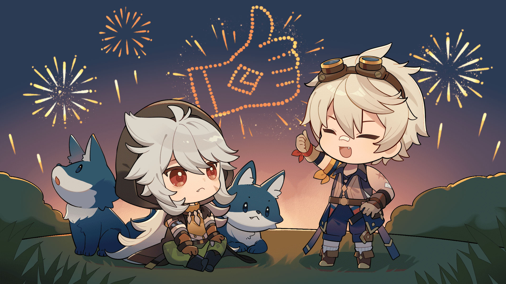

## Wienlesefest v3.1

A year after that, during the Weinlesefest, Varka would send a letter to Lisa, asking her to handle something for him. He wants her to give Razor a wooden box with some items that his parents left for him, thinking that now is the right time. As it turns out, Varka might have known Razor's parents and had not randomly stumbled upon him in the woods.

After hearing about this, Razor is not sure whether he wants to find out the truth about his real parents or not. Eventually deciding to believe in Varka, his mentor and the first human who was good to him, he goes with Traveler to Lisa.

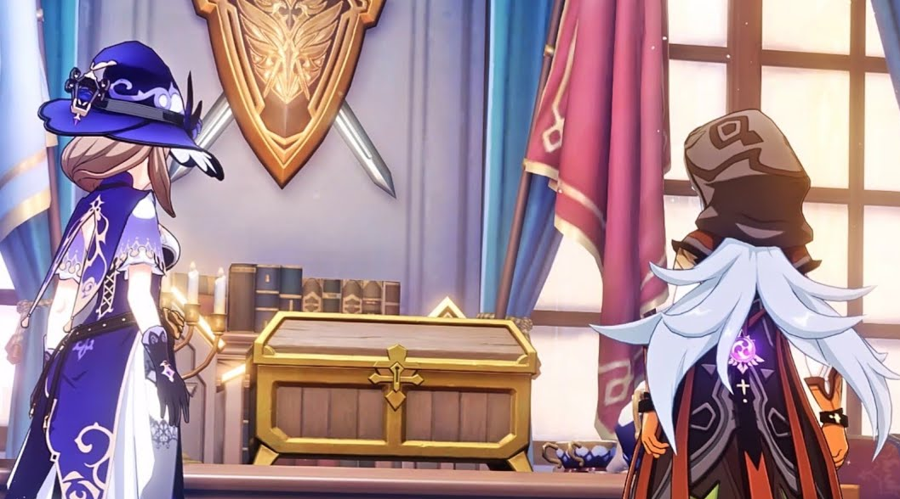

Upon opening the wooden box, Razor finds a few items with the scent of his biological parents: a woolen hand puppet, a ruin guard part, a few bolts, skeins of thread and a bottle of "Thousand-Wind Wine". Wanting to learn more about the wine, Razor decides to ask around during the festival.

Desiring to learn what is in "Thousand-Wind Wine", he asks a person whom he already knows -- Venti. In return, the bard serenades a romanticized song about wine-making and proposes that Razor and friends try to make the wine themselves.

After taking some time to collect his thoughts, Razor runs into Klee and they come to the festival plaza where they meet the Traveler and Paimon. Shortly after Bennet finds them, having learned about the situation from Lisa, and offers a Small Lamp Grass as one of the ingredients. After this, Bennet decides to go adventuring with Klee to allow Razor and Traveler to continue their search.

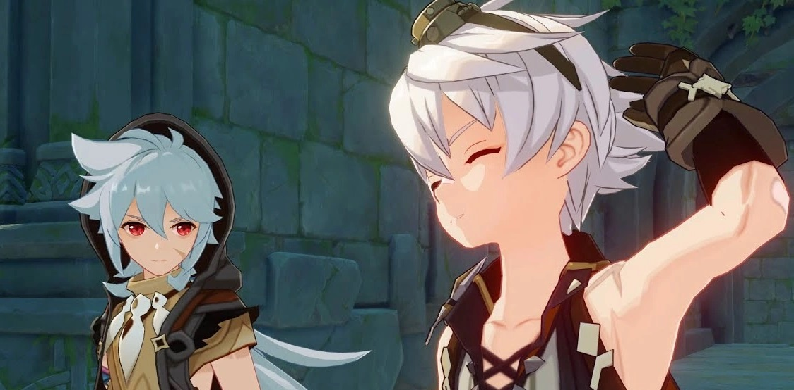

While looking for other ingredients Razor ponders about familial ties and what they mean. He thinks he might come to better understanding by asking and learning about other people's mother and father first.

On the way to the city, they run into Rosaria, a sister of the Church of Favonius. After hearing about Razor's situation, she says that blood ties might not matter as much as people want to believe and that it's not worth spending energy on somebody you're never met. And as hard it might be to hear this for Razor, Rosaria believes that he needs to hear this as nobody else in Mondstadt will tell him that. She still helps him with his endeavor by giving him Mist Flower Corolla.

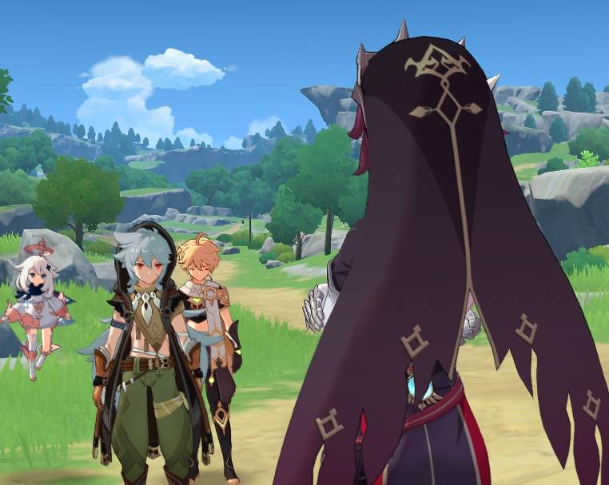

To find a suitable barrel for their wine, Traveler goes to Dawn Winery with Kaeya to ask Diluc for help, while Razor stays with Lisa. On the way back and upon entering the Knights of Favonius Headquarters, Traveler and Paimon encounter Sucrose and Noelle who made bio-alchemized Quadruple-Sweetness Sunsettia for Razor's brew.

At the Angel's Share stand they meet Klee and Diona, the latter of whom, after a little persuasion, agrees to brew the wine for them. To store it, they decide to go to the Windrise where Venti seems to be waiting for them. He gives them the last ingredient to add - Dandelion Seeds, as they are supposed to capture the wind in the moment of sealing the barrel. After reminiscing about everyone who helped Razor, the company seals and buries the barrel in the ground under the Symbol of Mondstadt\'s Hero.

Having come back to the festival plaza for the grand toasting ceremony, Razor takes a sniff of "Thousand-Wind Wine" left by his parents. Suddenly, he has a vision of them, sitting on a cliff, keeping the wine and deciding on Razor's name. After the vision ends, he looks at the bottle of wine before catching up with all of his friends.

## Vision

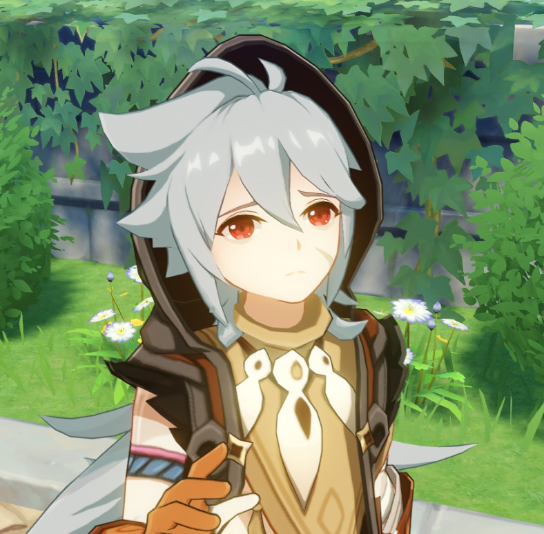

Today, Razor uses his Electro Vision to protect those dear to him, to prevent a repeat of what happened on that day he got the Vision.

On a stormy day, Razor was dragged away by an Abyss Mage after falling in its trap. His wolf family tried to help and fight the abyssal creature, yet their strengths were incomparable to those of the Abyss.

The sight of his Lupical being hurt and defeated fueled Razor's rage, unleashing his primal side. With Electro\'s ever-growing power, he fought the Mage to avenge his family, to protect those who cared about him as much as he cares about them; but life was not as generous as it seemed at that moment, and by the time Razor dealt with the Abyssal Mage, there was no one left to save.

## Aspirations

Although Razor had received the Vision, he still did not have enough experience to fully master it at the time. And so he made a resolution:

> "Friends, hurt... Never again! I will... protect them."

After that, he used every day to improve his skills, for there might come a day when his friends or family might come under another threat, so he must be ready to protect them.

> "I will become stronger. I will become the strongest of them all."

## Connections

### Parents

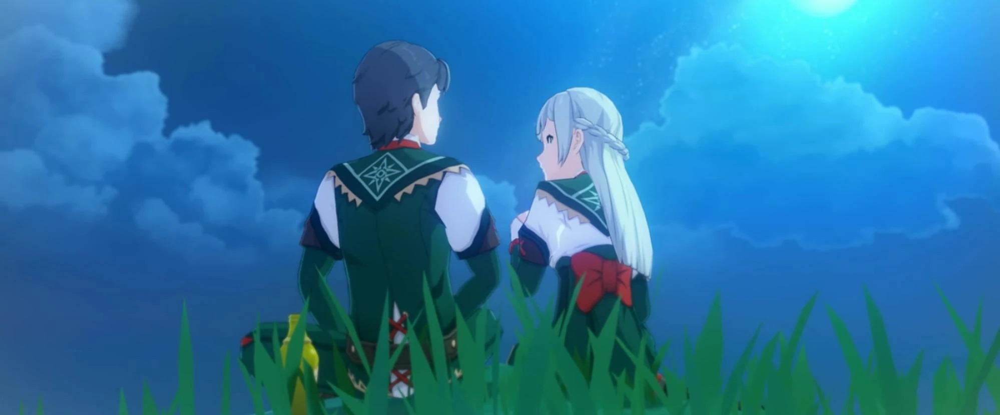

Little is known about Razor's parents except for their appearance and their occupation as adventurers. He inherited his mother's hair color and has similarities with his father's hairstyle. It's not known for sure what happened to his parents and why or how Razor ended up in Wolvendom, yet most assume that they met an unfortunate fate.

### Andrius

Lupus Boreas was a powerful God in Mondstadt. Having shed his mortal form, his spirit remained to keep watch over the nation, continuing living in the forests of Wolvendom.

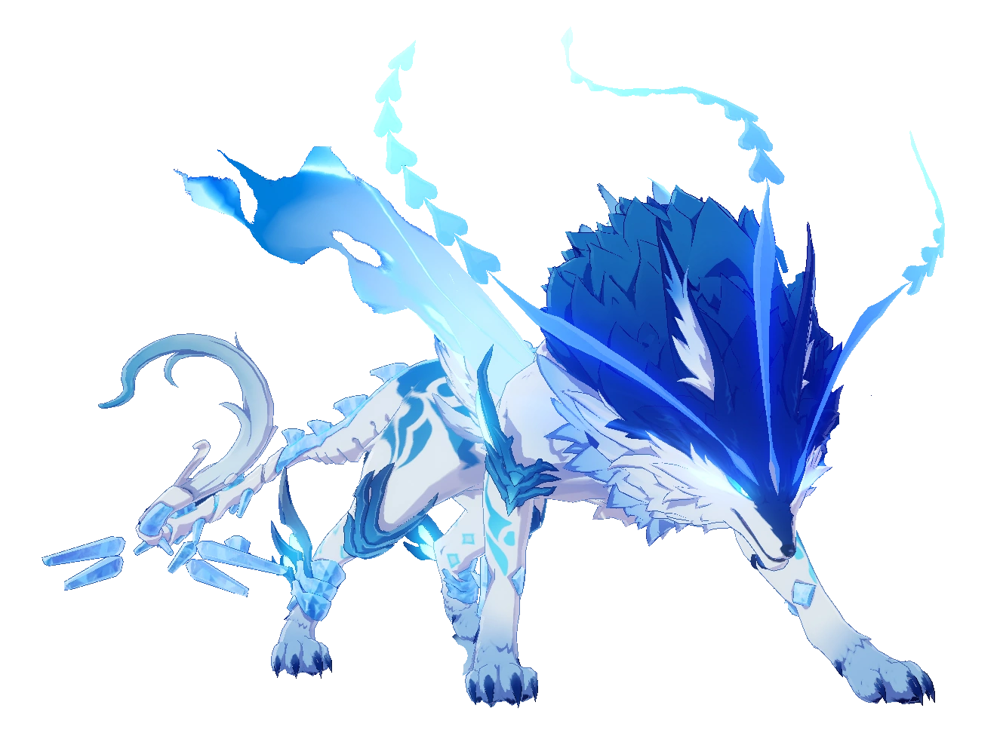

> "Even without its physical body and beyond death, Boreas still possesses extraordinary powers. It took a form comprised of ice and wind to embrace a new challenge, but even such form could not house all of its power." - Tail of Boreas

He's the one who found and took up Razor in their wolf family and could be called the second father for Razor. Although the boy was human, Andrius believed children to be innocent of sin, so he had no qualms about raising a human in the ways of the wolf. Yet, Boreas doesn't consider Razor to be a true wolf, so he limits his involvement in the affairs of the wolves.

### Varka

The "Titan of the Knights of Favonius" probably had the most involvement in Razor's life and the one who instilled a lot of principles the boy lives by today. He cares for Razor dearly, as evident with his recent letter during version 3.1 Weinlesefest about Razor's parents. Varka also might have known Razor's biological parents personally.

### Lisa

The Witch of Purple Rose took up the mentorship over Razor sometime after Varka. She taught him most of the human knowledge and helped him hone his mastery of Elemental Energy.

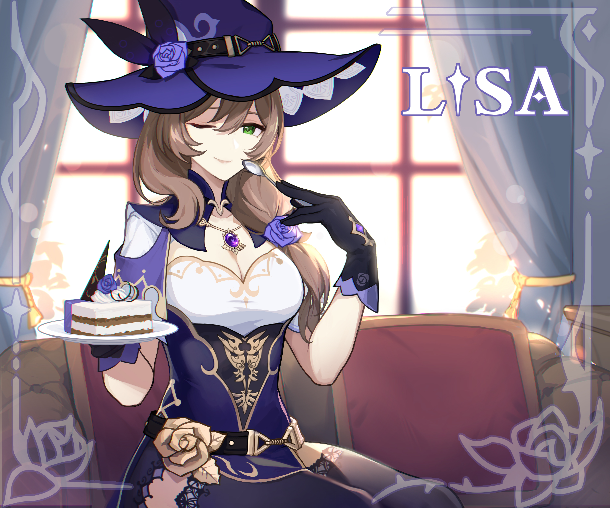

> "When I taught Razor how to utilize Elemental Energy, I never expected him to master the technique so quickly" -- More about Lisa: III

She still helps Razor with his problems and combat practice today and dotes on him often.

### Klee

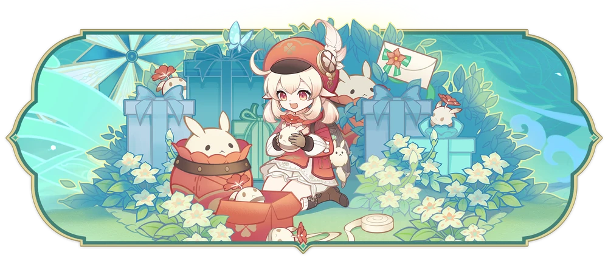

The little knight in red is one of Razor's best friends and his Lupical. He always tries to keep Klee safe and knows the best way to fix the disasters left by her. Being the first human friend of Razor, she showed him what true friends are.

> "I like things that are fluffy~! Like Dodoco! And dandelions! And Razor\'s hair!" - Klee's Hobbies

## Quirks

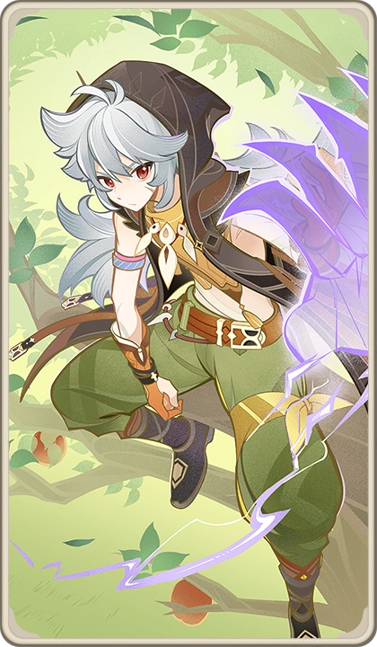

* Razor's vocabulary is quite small, so he uses simple words to describe most things.

* Razor really likes the night sky.

> I like the stars at night. So many stars. In the sky, in the lake. And in the city." - Something to Share

* Razor keeps a wooden box with items from his friends. He considers it to be his greatest treasure.

> "The broken-off hilt of a greatsword, a children\'s storybook called The Wolf and the Windwheel Aster, and a dry, withered four-leaf clover.
> 
> ... Razor knows that these are gifts from the ones known as 'friends' --- and that is what makes them his most treasured possessions of all."

* Talking is very taxing for Razor but he still tries to improve his speech.

* Razor has an extraordinary sense of smell.
 
He was able to remember and pick his parents' smell from the wine bottle - even though he was an infant.

Razor also sometimes remembers people by their smell: Traveler - Stars, the sea, and Windwheel Aster; Sucrose - potion, nectar, and Anemo Crystalfly.

## Lore implications

Razor has gone through a lot since birth: having been abandoned as a child, raised by wolves yet not being one, having lost those dear to him.

Yet, even after all of this never has broken him and he still strives to find new connections and protect already existing ones. And even though the protector of the Wolvendom doesn't need help, Razor will always be there to protect his Lupical.

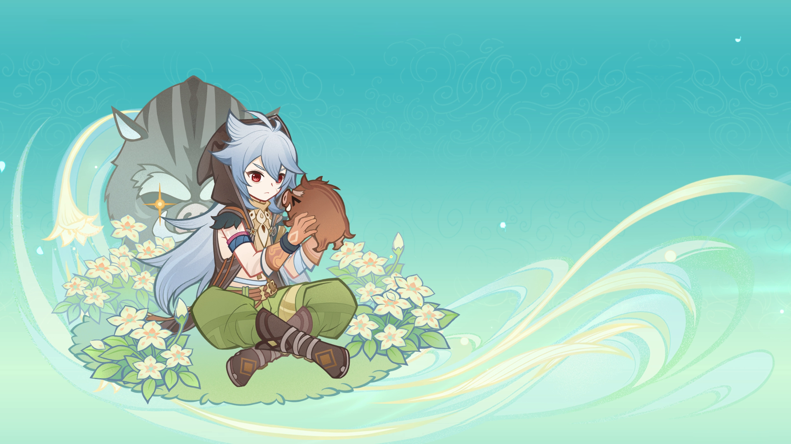

## Speculative theories

* Many speculate that Razor might have connections to Cyno, either in origin of birth or their electro spirits.

* From the way Razor refers to his and Varka's weapons as steelclaws, some people speculate that the Grand Master of Knight of Favonius also wields a claymore.

* Because of Rifthounds' involvement in Mondstadt during Razor's story quest, it could be theorized that Abyss Order aims to invade Mondstadt.

* Some other theories say that Varka might intend for Razor to become he next Knight of Boreas. In addition to this, there is speculation that Razor was given to Varka by his biological parents before going adventuring. Varka, in turn, gave Razor to Andrius for upbringing.

## Conclusion

Razor might not be the brightest of mind and not know a lot about humans, but that won't stop him in trying to understand and befriend those around him. No matter what hurdles life might throw at him and his Lupical, Razor will always be ready to stand tall and face any adversities. He will never let go of that primal loyalty of his.

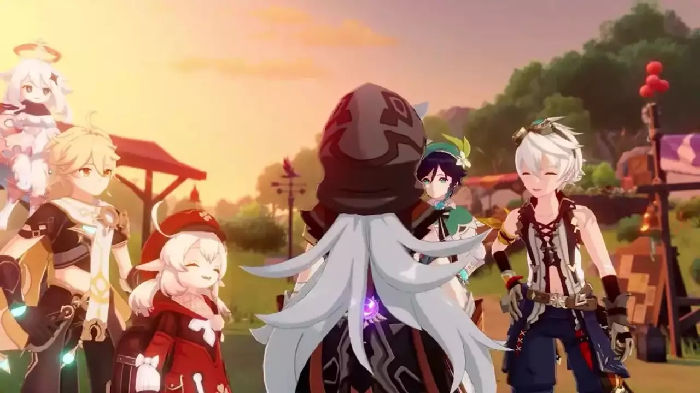

> When I run with you, when I hunt with you, I am happy. With you, I am not a wolf, I am not a boy, I am just me. I am Razor. Because you are my friend. You are my Lupical. I hope you feel happy, too!

