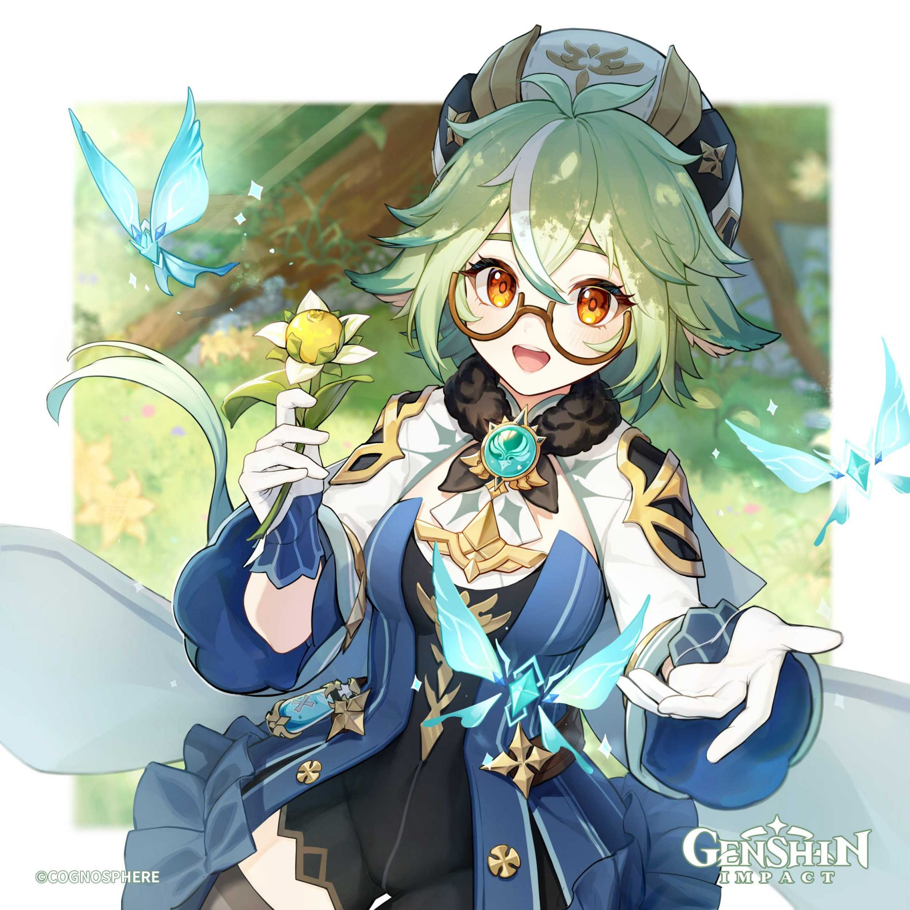
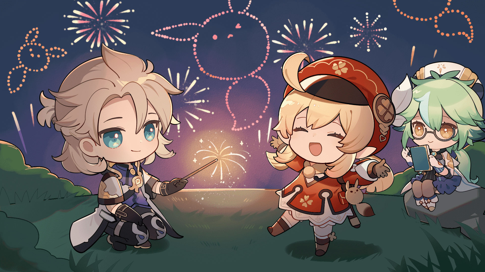
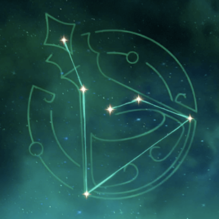
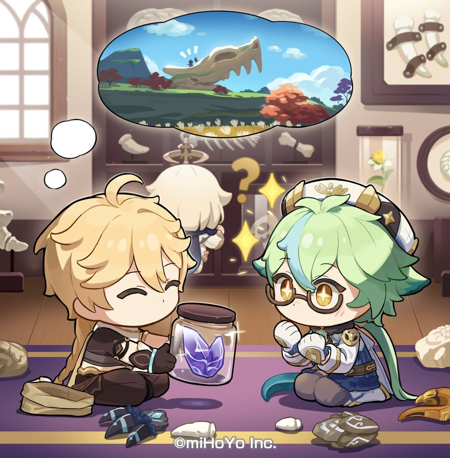
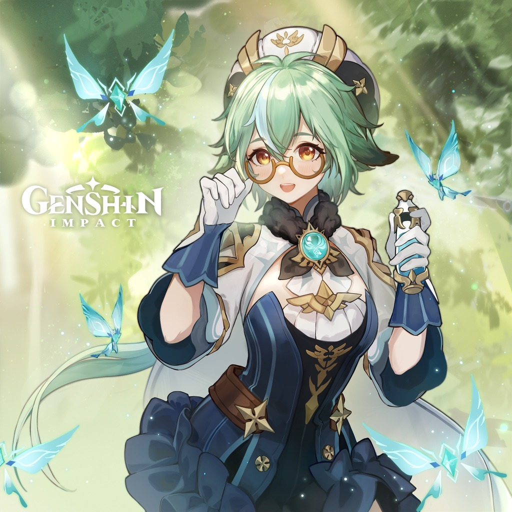
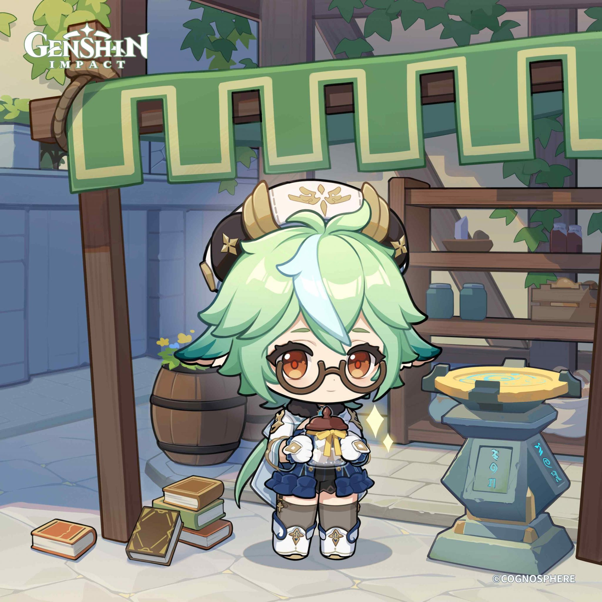
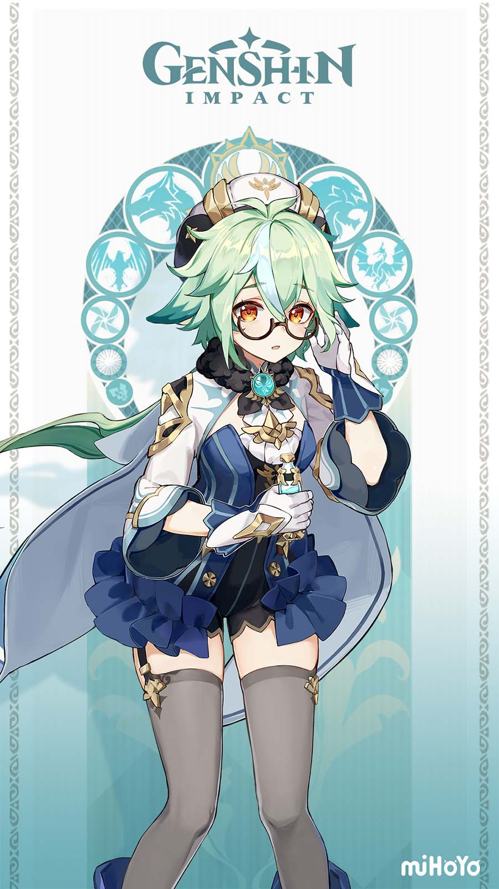
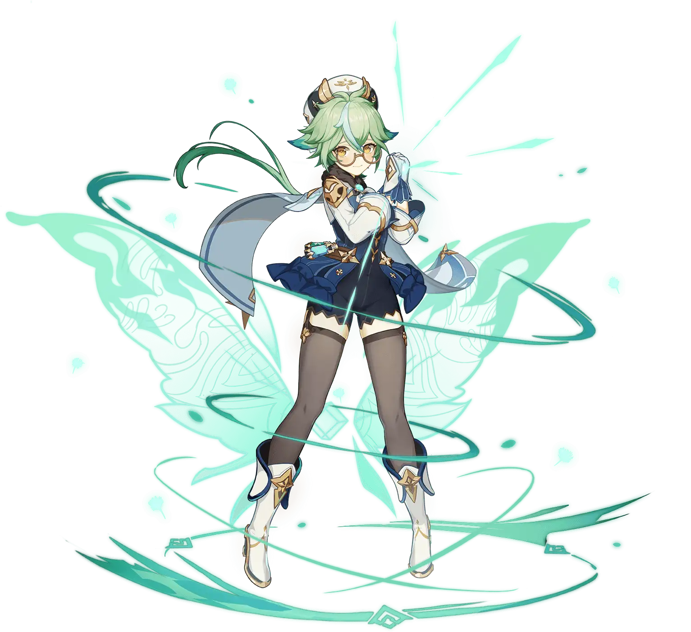
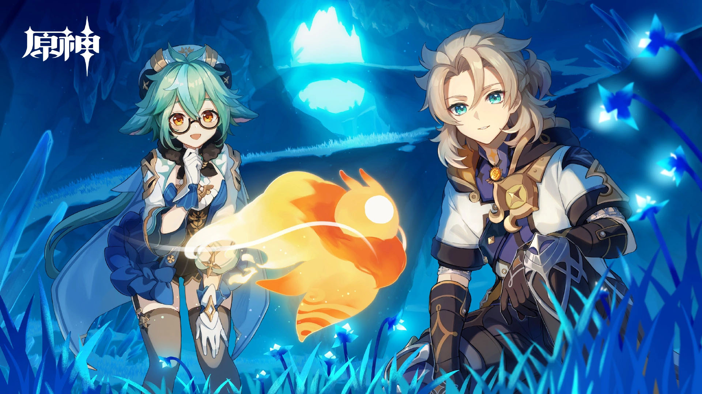

Table of Contents

- [Sucrose - Harmless Sweetie](#sucrose---harmless-sweetie)
  - [Credits](#credits)
  - [Sucrose](#sucrose)
  - [Etymology](#etymology)
  - [Constellation](#constellation)
  - [Childhood Paradise](#childhood-paradise)
  - [Aspirations](#aspirations)
  - [Vision](#vision)
  - [Relationships](#relationships)
    - [Her Parents](#her-parents)
    - [Albedo](#albedo)
    - [Timaeus](#timaeus)
    - [Diona](#diona)
    - [Noelle](#noelle)
  - [Quirks](#quirks)
    - [She is indecisive with her free-time](#she-is-indecisive-with-her-free-time)
    - [She likes bones](#she-likes-bones)
    - [She masks her cat ears](#she-masks-her-cat-ears)
    - [She is obsessed with organising](#she-is-obsessed-with-organising)
    - [She has difficulty understanding people](#she-has-difficulty-understanding-people)
    - [She can create an unstable anemo hypostatis](#she-can-create-an-unstable-anemo-hypostatis)
    - [She smells of Anemo Cystal Flies](#she-smells-of-anemo-cystal-flies)
  - [Lore Implications](#lore-implications)
  - [Theories](#theories)
  - [Misconceptions](#misconceptions)
  - [Conclusion](#conclusion)

> "_The essence of research is the process of finding the answer. Sometimes, working through that process can be tedious, but every time I see the cumulative result of my efforts…I know that I'm doing what I love."_

# Sucrose - Harmless Sweetie

## Credits
* Written by: Muse
* Reviewed by: Arun
* Proofread by: Lare
* Last updated on: 9th March 2023
* Character story updated till v3.4
* Story and Quest involvements - Work-in-Progress

## Sucrose

* Title - Harmless Sweetie
* Type - Limited 4-star, Medium Female, Anemo Catalyst playable character
* Birthday - November 26th
* Constellation - Ampulla
* Affiliation - Knights of Favonius
* Special Dish - Nutritious Meal (V.593)
* EN VA - Valeria Rodriquez
* CN VA - Xiaogan (小敢)
* JP VA - Akane Fujita (藤田茜)
* KR VA - Kim Ha-yeong (김하영)

Table of Contents

- [Sucrose - Harmless Sweetie](#sucrose---harmless-sweetie)
  - [Credits](#credits)
  - [Sucrose](#sucrose)
  - [Etymology](#etymology)
  - [Constellation](#constellation)
  - [Childhood Paradise](#childhood-paradise)
  - [Aspirations](#aspirations)
  - [Vision](#vision)
  - [Relationships](#relationships)
    - [Her Parents](#her-parents)
    - [Albedo](#albedo)
    - [Timaeus](#timaeus)
    - [Diona](#diona)
    - [Noelle](#noelle)
  - [Quirks](#quirks)
    - [She is indecisive with her free-time](#she-is-indecisive-with-her-free-time)
    - [She likes bones](#she-likes-bones)
    - [She masks her cat ears](#she-masks-her-cat-ears)
    - [She is obsessed with organising](#she-is-obsessed-with-organising)
    - [She has difficulty understanding people](#she-has-difficulty-understanding-people)
    - [She can create an unstable anemo hypostatis](#she-can-create-an-unstable-anemo-hypostatis)
    - [She smells of Anemo Cystal Flies](#she-smells-of-anemo-cystal-flies)
  - [Lore Implications](#lore-implications)
  - [Theories](#theories)
  - [Misconceptions](#misconceptions)
  - [Conclusion](#conclusion)

Sucrose is the assistant of Albedo and an alchemist interested in modifying existing life, known as bio-alchemy. She is a shy and introverted, yet amazingly brilliant researcher who is doing her own research on alchemy.

She holds an Anemo Vision from Mondstadt and wields a catalyst.

## Etymology

Sucrose comes from the scientific name for sugar, which connects to her alchemical studies into Sweet Flowers and Sunsettias, while also referencing her kind personality and her title as the "Harmless Sweetie."

## Constellation

Sucrose's constellation is "Ampulla" which means 'flask' in Latin. This is of course an instrument used in scientific experiments. We also see Sucrose handling flasks in her idle animation, and is how she summons her Forbidden Creation - Isomer 75 / Type II.

## Childhood Paradise

When Sucrose was a child she read a story about an undiscovered domain with massive pink flowers, tiny fairies flying all over, and beautiful unicorns. Sucrose and her two best friends believed that if they could reach this magical place, then they would live happily ever after. Though, it seems like reality was happy to get in the way of their friendship.

As eventually one of her friends left on a long journey with her adventurer parents, never to return to Mondstadt. The other friend's father fell ill and passed away, and she broke off her friendship with Sucrose. The promise that they had made to reunite one day in the future seemed like an unrealistic dream.

Even if they were destined to never meet again, Sucrose was desperate to honor their past friendship. This is when she discovered the existence of alchemy from a book, and realized that, even if she never finds that wondrous place, she now has the means to create her own paradise.

## Aspirations
Sucrose is inspired to create a paradise of her own creation based on the stories she and her friends read. Through this dream, she hopes to push the boundaries of what bio-alchemy has already accomplished through her rigorous studies and experimentation.

## Vision
One day, while conducting one of her many bio-alchemical experiments, Sucrose's cauldron filled the room with steam. Unfortunately, the transmutation was a failure as the Dandelion Seeds had burned, again. However, lying among the blackened seeds was a Vision. Instead of removing her Vision, she lit the fire to continue boiling the contents. She still continues to make use of her Vision to help her conduct all kinds of experiments.

## Relationships

### Her Parents
Her relationship with her parents is quite normal and warm. Although not much is known about her parents, it is clear from her character story quest that both of them were present during her peaceful childhood. And they are alive and well even today.

### Albedo
Sucrose has a student and mentor relationship with Albedo. She has great respect for him which leads to her referring to him as Mr. Albedo. He has repeatedly told her the title isn't necessary.

### Timaeus
Timeus is her fellow alchemy student and is jealous towards Sucrose gaining Albedo's appreciation. Even though she is more skilled in alchemy he questions the practicality of her creations.

### Diona
Sucrose was once interested whether her and Diona had a shared ancestry due to both of them having cat ears. Due to being too nervous to confront her, Sucrose resorted to observing. For one whole month, Diona had the unnerving feeling that she was being watched, but could never find out who was stalking her.

### Noelle
During Weinlesefest, Sucrose and Noelle worked on the Quadruple-Sweetness Sunsettia. Noelle's field study and samples on Sunsettia's across Mondstadt were utilized by Sucrose in order to produce the perfect fruit for the wine. Even though early on Sucrose was too self-conscious to correct a Noelle when she moved boxes that had just been placed outside back into Sucrose's laboratory.

## Quirks

### She is indecisive with her free-time
Sucrose does not understand what to do with her free time and finds herself staring off into space. On the other hand she will spend days working on an experiment without a break because she is compelled to finish what she started.

After a spell of experimentation for five straight days, Albedo noticed Sucrose was on the brink of exhaustion and organized a mandatory seven-day vacation for her.

However, the workaholic researcher couldn't rest at all. Her vacation lasted one day. She reached her lab the very next day for research - saying that staying idle without questioning and researching is torture.

### She likes bones
Besides her experiments on Sweet Flowers, she has a fascination with bones. Every three days at dusk, Sucrose will head out to the butcher's, the Adventurers' Guild, and the Springvale hunters, looking for the freshest bones.

She has a large collection of bones including those of a Hilichurl. Then, one day, she overheard a mother disciplining her child with tales of a scary lady that takes the bones of children who don't behave. This tale being eerily similar to her circumstances did not help with Sucrose's fear of socializing with strangers.

In one of her idle animations, it can be seen that she takes a bone out of her pocket and observers it.

Also, in one of her voicelines, she tells the traveler that she has a sedated hilichurl kept in a wine barrel in her apartment - and even calls a hilichurl cute.

### She masks her cat ears
While it is not completely known, the fandom suspects that Sucrose is a cat. Her green cat ears is a big giveaway. She intentionally adjusts her hair and keeps a hairstyle to make sure people do not notice her cat ears. She says this in one of her voice lines.

### She is obsessed with organising
All her experimental creations, and potions have a specific and unique name with a project number, version number etc.,. For the untrained and overlooking eye, these may mean nothing. But to her, each name and number has a specific meaning. In her voicelines, you can hear her correcting the Bio-potion she gives the traveler for their birthday when the traveler accidentally says the wrong version number.

Likewise, you would find her organizing her research findings with a rather elaborate and specific name. But do note that each name she gave has a meaning.

All of her research notes are compiled in notebooks of the exact same thickness. All her potions are lined up according to effect and hue.

### She has difficulty understanding people
She struggles in understanding the dramatically different personalities of people, which is why she is socially awkward in conversations. This isn't helped by the fact that she doesn't want to upset anyone by saying or doing the wrong thing.

### She can create an unstable anemo hypostatis

Because of her intellect, hardwork, and her understanding of her Anemo powers, she is able to create a synthetic anemo hypostatis capable of elemental absorption and elemental reactions. However, this one has no sentience and it is unstable - lasting for a few seconds before vanishing without a trace. This is her elemental burst during her combat.

### She smells of Anemo Cystal Flies
It was Razor who made it vocal during the Wienlesefest. When a shy and nervous Sucrose ran away handing Razor's gift to Noelle, Razor could catch her scent and commented that she smells of Anemo Cystal Flies.

## Lore Implications
On her own, Sucrose will most likely not play a huge role when it comes to major plot developments; though she will be involved in some way as we continue to explore Albedo's story when it comes to his role as a homunculus and his connections to Khaenri'ah.

## Theories
There is a strong possibility that the Paradise from Sucrose's childhood fairy tale is a reference to Ay-Khanoum. This was an ancient city in Sumeru that was jointly ruled by King Deshret and the Goddess of Flowers, and was built for the Jinn. The fairies in Sucrose's story could be a reference to the long forgotten Jinn. While the Goddess of Flowers is associated with the Padisarah, of which the original blooms were said to be pink like those in Sucrose's story.

## Misconceptions
On the surface, Sucrose seems very antisocial, but in actuality she's just awkward around strangers. This makes it hard to express herself and so she would much rather not engage in conversation in the first place. It takes her a while to feel more comfortable with someone new.

## Conclusion
The wind of inspiration will continue to swirl around the shy alchemist as she continues to make her paradise a reality. As she gradually grows closer to her companions within the Knights of Favonius.

"_Life really is fascinating. Just how much do we really know?"_

