

Table of Contents

- [Venti - The Windborne Bard](#venti---the-windborne-bard)
  - [Credits](#credits)
  - [Venti](#venti)
  - [Etymology](#etymology)
  - [Constellation: Carmen Dei](#constellation-carmen-dei)
  - [Meeting the bard](#meeting-the-bard)
  - [Revolt against Decarabian](#revolt-against-decarabian)
  - [Aristocratic Rule](#aristocratic-rule)
  - [The Cataclysm](#the-cataclysm)
  - [Freedom in Mondstadt](#freedom-in-mondstadt)
  - [Vision](#vision)
  - [Historical references](#historical-references)
  - [Aspirations](#aspirations)
  - [Connections to other characters](#connections-to-other-characters)
    - [Eula](#eula)
    - [Xiao](#xiao)
    - [Zhongli](#zhongli)
    - [Raiden Shogun](#raiden-shogun)
  - [Quirks](#quirks)
  - [Lore implications](#lore-implications)
    - [Last members of the original seven](#last-members-of-the-original-seven)
    - [Queen Gnosis](#queen-gnosis)
    - [Him writing songs have a deeper meaning?](#him-writing-songs-have-a-deeper-meaning)
    - [Why Venti sleeps a lot?](#why-venti-sleeps-a-lot)
    - [Venti is quite suspicious](#venti-is-quite-suspicious)
  - [Misconceptions](#misconceptions)
  - [Conclusion](#conclusion)

> "Come on Traveler, let's go! The world is full of lost ballads just waiting to be rediscovered".

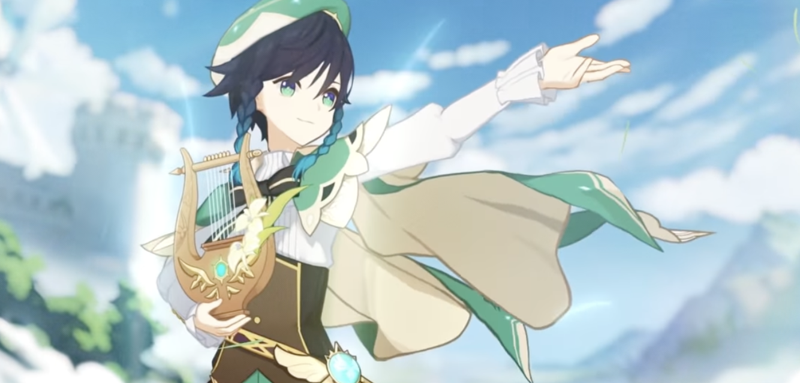

_Venti the windborne bard_

# Venti - The Windborne Bard

## Credits

* Written by: BeastBoy
* Reviewed by: Arun
* Proofread by: Lare
* Last updated on: 24th February, 2023
* Character story updated till v3.4
* Story and Quest involvements - Work-in-progress

## Venti

* Title - Windborne Bard
* Type - Limited 5-star, Medium Male, Anemo Bow playable character
* Birthday - June 16th
* Constellation - Carmen Dei
* Affiliation - City of Mondstadt
* Special Dish - A Buoyant Breeze
* EN VA - Erika Harlacher
* CN VA - 喵酱 (Miaojiang)
* JP VA - 村瀬歩(MURASE Ayumu)
* KR VA - 정유정 (Jung Yoo-jung)

Table of Contents

- [Venti - The Windborne Bard](#venti---the-windborne-bard)
  - [Credits](#credits)
  - [Venti](#venti)
  - [Etymology](#etymology)
  - [Constellation: Carmen Dei](#constellation-carmen-dei)
  - [Meeting the bard](#meeting-the-bard)
  - [Revolt against Decarabian](#revolt-against-decarabian)
  - [Aristocratic Rule](#aristocratic-rule)
  - [The Cataclysm](#the-cataclysm)
  - [Freedom in Mondstadt](#freedom-in-mondstadt)
  - [Vision](#vision)
  - [Historical references](#historical-references)
  - [Aspirations](#aspirations)
  - [Connections to other characters](#connections-to-other-characters)
    - [Eula](#eula)
    - [Xiao](#xiao)
    - [Zhongli](#zhongli)
    - [Raiden Shogun](#raiden-shogun)
  - [Quirks](#quirks)
  - [Lore implications](#lore-implications)
    - [Last members of the original seven](#last-members-of-the-original-seven)
    - [Queen Gnosis](#queen-gnosis)
    - [Him writing songs have a deeper meaning?](#him-writing-songs-have-a-deeper-meaning)
    - [Why Venti sleeps a lot?](#why-venti-sleeps-a-lot)
    - [Venti is quite suspicious](#venti-is-quite-suspicious)
  - [Misconceptions](#misconceptions)
  - [Conclusion](#conclusion)

Venti is a playable Anemo character and the mortal vessel of the Anemo Archon of Mondstadt in Genshin Impact. Venti has a carefree and playful attitude with an affinity for music and poetry. Venti usually roams around Monstadt, serenading people who are unaware of his true identity yet appreciate his songs regardless.

He’s well-liked among the people of Mondstadt due to his musical talent, having won the title of “The Most Popular Bard of Mondstadt” thrice. He’s also an avid drinker and has a high tolerance to alcohol with his favourite drink being the Dandelion Wine.

Despite his normally playful personality as the bard Venti, he speaks wisely and somewhat philosophically whenever he assumes his true identity due to the many experiences he has being one of the original members of [The Seven](https://genshin-impact.fandom.com/wiki/The_Seven).

He holds a fake Anemo Vision (since he is the anemo archon and he does not need a vision to manipulate the elements), and wields a bow.

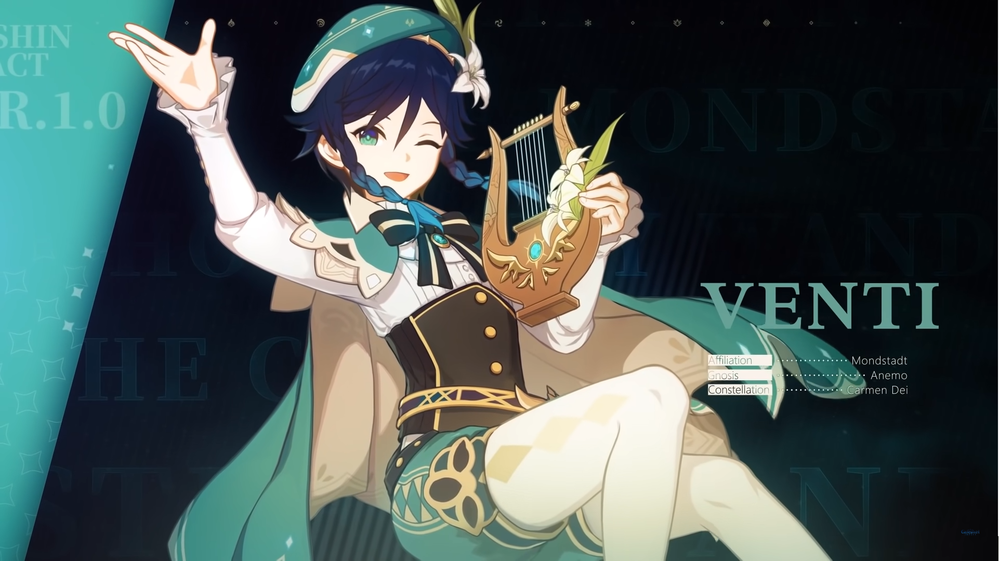

## Etymology

Venti's name is derived from the Italian word "_vento_" which means wind and it comes from the Latin term "_ventus_".

His archon name "_Barbatos_", is derived from the eighth demon in the _Ars Goetia_ of the same name who was a duke of hell. Barbatos can speak to animals, can tell the future, conciliates friends and rulers, and can lead men to treasure hidden by the enchantment of magicians.

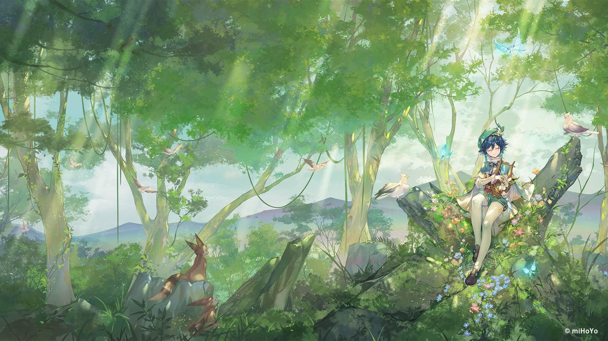

## Constellation: Carmen Dei

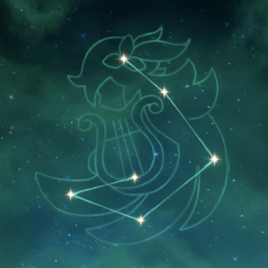

Venti’s Constellation is _Carmen Dei_ which means “God’s Song” or “Song of the god” in Latin. The name of the constellation in Chinese means “Song of the Immortal”. Venti’s constellation shows him holding a lyre symbolising his title of “The God of Song” and a reference to when venti was a mere wind spirit.

Interestingly enough, Venti is one of the few characters to have a human form in his constellation. At the moment, the archons and the wanderer (who nearly reached godhood) are the only ones to have a human form in their constellations.

The rest of the characters have an animal or an object as their constellation.

And because of his godhood, astrologers cannot read his constellation. When Mona looked into Venti’s constellation, her scry glass became quite muddy - implying external factors are obscuring her from reading his fate.

## Meeting the bard

Around 2,600 years ago, the Archon War had yet to end, and the world had yet to fall under the dominion of The Seven. In those days, the city called “Mondstadt” was surrounded by gales impenetrable even to the birds of the air. The wind’s ceaseless howling ground the soil and the rock of that city into smooth, flowing dust.

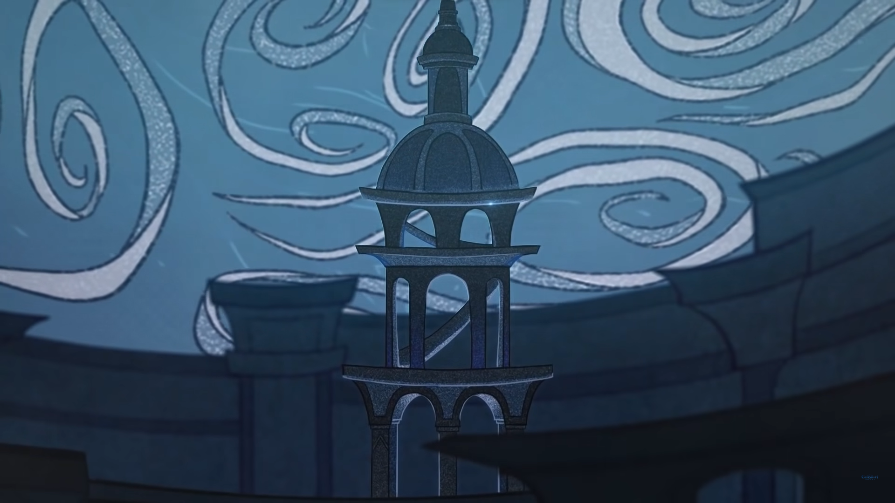

_Old Mondstadt, covered in storms_

The Lord of Wind who lived in his high tower was Decarabian, God of Storms. He squinted from on high at his subjects, who bowed before him in the unceasing wind, and, believing them submissive, thought this good. In those days, Venti, who would in latter days be known as “Barbatos” was but a tiny wind spirit, without a shred of divine dignity.

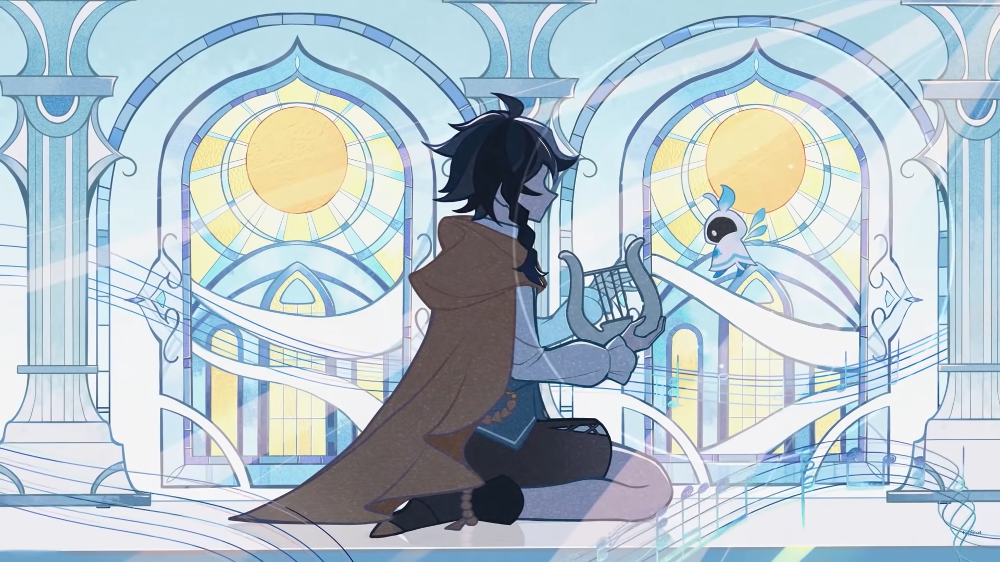

_Venti as a wind-spirit meets the unknown bard_

In the Mondstadt of old, Venti met a young boy. This lad knew how to play the lyre, and longed to write the greatest poem of all.

> "I do so wish to see the birds in flight."

So said the boy who had never seen the blue sky, eagles, or the green grass, his voice almost utterly drowned by the wind.

> "Friend, will you not come along?"

## Revolt against Decarabian

The windspirit Venti obtained the feather of an eagle for the lad living in that storm-shrouded city, who had never seen a bird in his life.

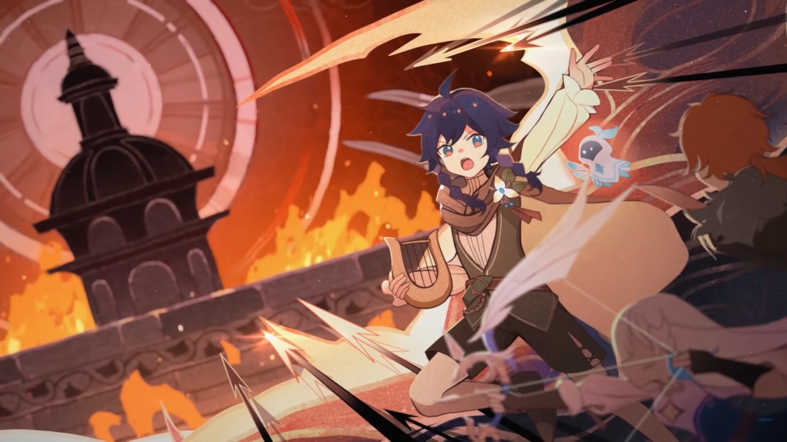

_The unknown bard rallies everyone to fight against Decarabian. You could see Venti the windspirit, warrior Amos with her bow, and an ancestor of the Ragnvindr clan fighting with him_

Then, war broke out in Mondstadt, in the name of freedom.

With the feather tucked away in his breast pocket, Venti watched the fall of Decarabian amid the wrack and ruin of revolt together with his friend.

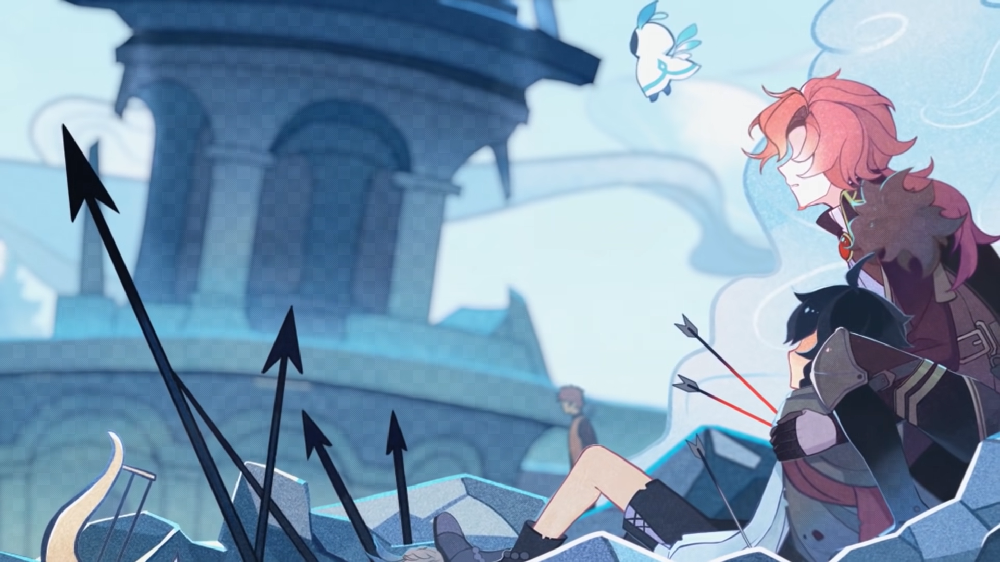

They were victorious, however, Venti was never able to give the lad that eagle's feather, for that lad had fallen in the battle for the sake of song, sky, and birds, and for the people who, like him, had dwelled within the storm-wall.

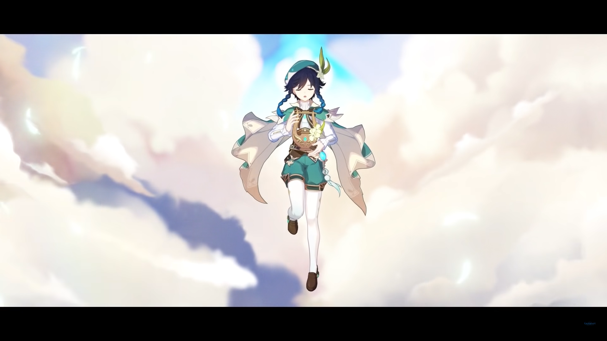

_Venti the windspirit took his dead friend's form and ascended as the new Anemo Archon Barbatos_

With the crumbling of an ancient seat of divinity, a new god was born. The Anemo Archon Barbatos felt power flowing at his fingertips.

His first use of this power was to reconstitute himself in the likeness of that young lad. For only if he wore a human shape could he play the lyre that the lad so loved.

Plucking its strings, he scattered the ice and snow and split the mountains with a divine wind.

He commanded Mondstadt, to become a city of freedom, a nation without a king.

> "Still, the winds change direction.
> Someday, they will blow towards a brighter future...
> Take my blessings and live leisurely from this day onward."
> 
> Barbatos, in the description for Vayuda Turquoise Gemstone

In future, he believed, it would become a better, more romantic city.

> "Surely, he too would have wanted to live in such a place."

Thus, a new age began for Mondstadt.

## Aristocratic Rule

> Think you can get away?

After 1,600 years of history, Mondstadt's "freedom" had sunk to a heretofore unseen low. Barbatos, unwilling to become a tyrant, had departed. But he had never imagined that those to whom he had gifted freedom would make for themselves a tyrant.

The aristocracy ruled Mondstadt with a cruel hand, bringing slaves into this land and ignoring the cries of the oppressed.

Thus the Anemo Archon returned after these 1,600 years to what was once the City of Freedom.

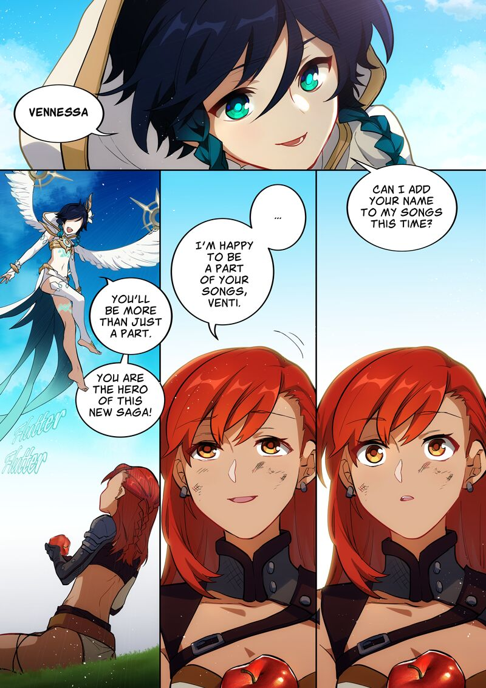

_Venti returns to help Vanessa fight against the aristocrats_

He heard the cry of the slave girl Vennessa, and together with her raised a rebellion that overthrew the aristocracy.

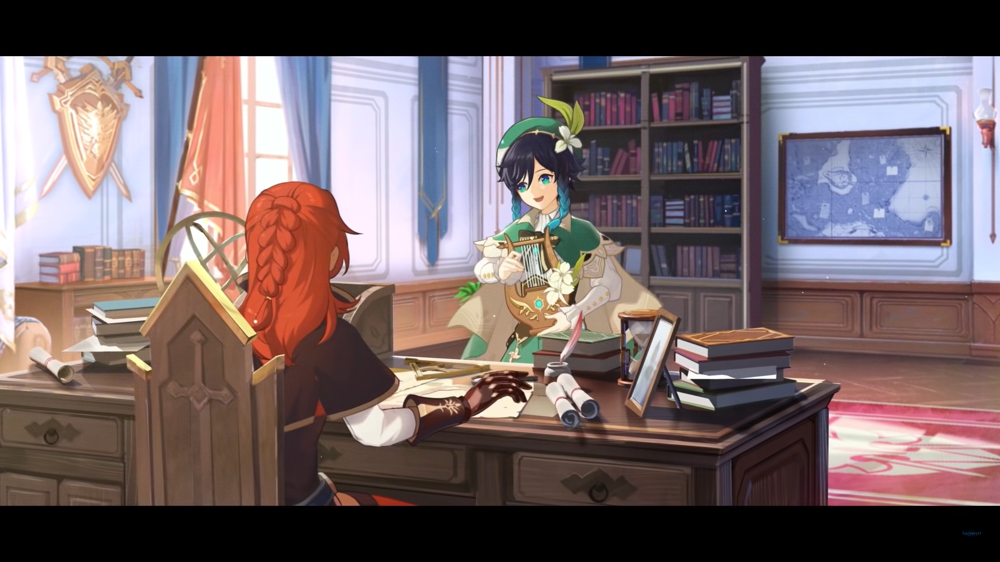

_Venti talks to Venessa - the first Grand Master of the Knights of Favonius_

Following the fall of aristocracy, Venessa went to establish "Order of Favonius" we see in the present day, and becoming the first Grand Master. She became the first "Lion Fang Knight" for her bravery and courage to fight back the aristocrats and win the freedom for Mondstadt. Later on, she embodied the title "Dandelion Knight" for working hard to ensure the peace and prosperity of Mondstadt.

## The Cataclysm

> Time for takeoff!

When the [cataclysm](https://genshin-impact.fandom.com/wiki/Cataclysm) happened about 500 years ago, Venti went to fight against the Dark Dragon [Durin](https://genshin-impact.fandom.com/wiki/Durin).

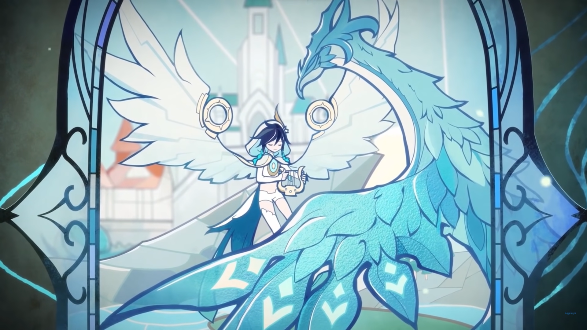

An alchemist named Rhinedottir, known as "Gold" at the time, created many dark monsters like Durin. Durin appeared in Mondstadt and laid waste to the area, and none in the nation were strong enough to fight it; the Knights of Favonius had led an expedition into Khaenri'ah to quell the monsters and suffered many casualties, including Wolf Pup [Rostam](https://genshin-impact.fandom.com/wiki/Rostam), which left the then Grand Master Arundolyn desolate and unable to fight.

Upon hearing the cries of his people, Barbatos awakened and summoned [Dvalin](https://genshin-impact.fandom.com/wiki/Dvalin), doing battle alongside his old companion and ultimately slaying Durin over the mountain thereafter known as [Dragonspine](https://genshin-impact.fandom.com/wiki/Dragonspine).

According to Venti, Barbatos's mortal form, Khaenri'ah was destroyed because of its practice of the [Art of Khemia](https://genshin-impact.fandom.com/wiki/Art_of_Khemia), a form of [alchemy](https://genshin-impact.fandom.com/wiki/Alchemy) that allowed for the creation of life. However, at some point during the cataclysm, a certain incident occurred that left the Tsaritsa greatly embittered. Whatever happened during that time angered her enough that she cut all ties with him as a result, despite having a relatively close relationship beforehand. 

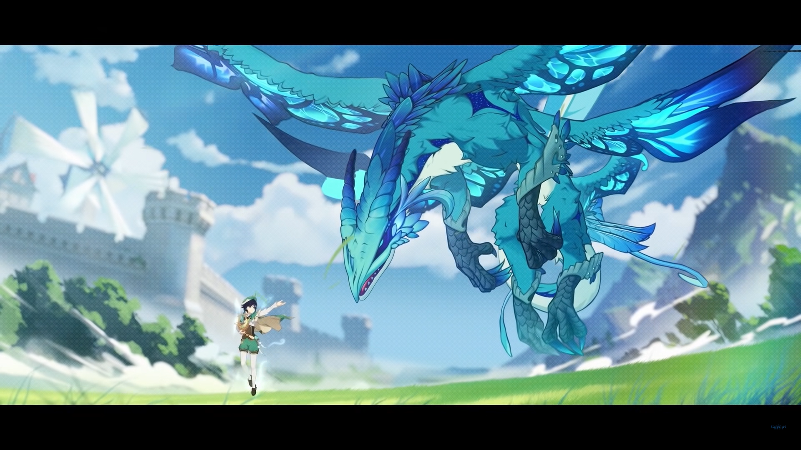

_Venti, and Dvalin - the unsung heroes of Mondstadt during the Cataclysm_

Following the cataclysm, Barbatos returned to slumber. In the 500 years afterwards, the people of Mondstadt forgot about the cataclysm and the Four Winds. As a result, they no longer remember Barbatos' appearance that protected them from Durin 500 years ago.

## Freedom in Mondstadt

> What does freedom really mean, when demanded of you by a god?

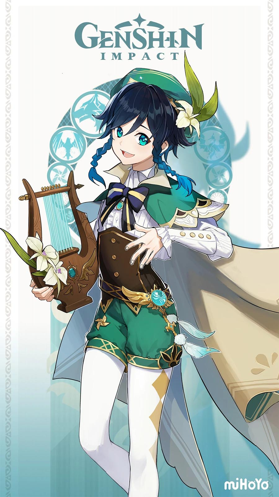

Back when traveling bard Venti had only been in Mondstadt for a few months, he was poorer compared to the more established bards in town. But once he had a few Mora in the pot from his performance, you could be sure he would hurry off to spend it at the same place every time — one of the city’s taverns.

Unfortunately for Venti, his childlike appearance meant that his attempts to acquire alcohol failed at every turn.

The first time he was refused service, he was heard grumbling: “I’m sure there were no such preposterous regulations last time I was here…” Once he realized that the same rule applied to all taverns in town, he decided he would have to change his approach…

The strategy he developed was drinking on the job — that is to say, playing the lyre while holding a wine cup in his mouth, urging his audience to buy him a drink from the bar if they liked his performances instead of giving him Mora.

The novelty of this made him quite popular in Mondstadt.

## Vision

The Seven Archons do not need visions to harness their great power. However, in order to roam freely in Mondstadt as "Venti", Barbatos constructed a glass ornament fashioned to look like visions bestowed upon chosen mortals by the gods. Venti doesn't rely on the ornament to channel elemental power, however since he's too lazy to bring a normal lyre, he gave his fake vision the ability to turn into the wooden lyre "Der Frühling."("The Spring")

## Historical references

The name Venti was used by the Romans to refer to a group of wind deities that were associated with the cardinal directions. Venti's two lyres have German names. One is called Holy Lyre der Himmel, which is mixed English and German for "Holy Lyre of the Heavens", the other one is called Der Frühling, which is German for "The Spring".

Because Mondstadt is mostly based on Germany, and central Europe, Venti can be inspired by the Latin motto "Videtis illam spirare libertatis auram," meaning "See that the wind of freedom blows", by the German poet Ulrich von Hutten (1488–1523). It was later translated into German as "Die Luft der Freiheit weht," meaning "The wind of freedom blows," which became the official motto of Stanford University.

## Aspirations

> My greatest wish? It has always been to roam free and experience the whole world. Now I would add that wherever I go, it simply must be with you! Each day with you is an adventure, and where adventurers go, storytellers must follow!

## Connections to other characters

### Eula

> "_I heard that bard sing a few songs about the Lawrence Clan... They were lighthearted and funny stories that mocked the clan in a way I've never heard anyone else do. Even I couldn't help but burst out laughing... And for this, he must pay!"_

### Xiao

There was once when most of Xiao’s strength was spent fighting from dusk till dawn, with him emerging victorious by a mere hair.

The reeds in the fields had been sliced to ribbons in the fierce fighting. Plucking his spear from where it had been planted in the ground, Xiao began the trek home.

Well, one says “home” — yet, where did Xiao have to return to? He was merely leaving the battlefield.

Long exhausted, Xiao felt the divine hatred that tainted his body take effect.

Limitless hate flooded his senses, and he fell to the ground in agony.

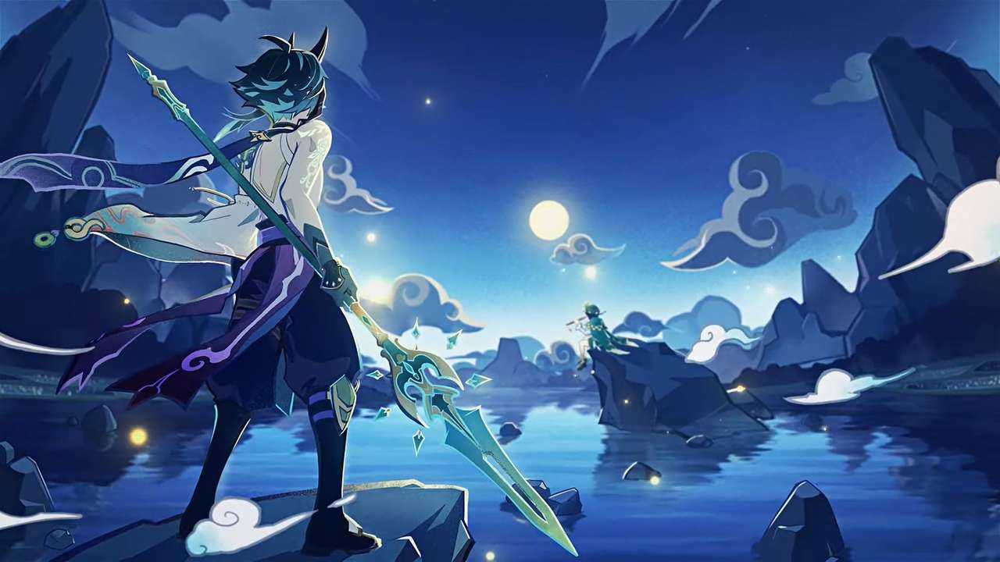

But it was also at that moment that the pain vanished without warning.

This was not by Xiao’s own strength, for he had been rescued by the sound of a flute.

The clear, lovely sound of the flute came over the mountains and rivers, carried on the wind to where he lay.

And clear it continued to ring till the first light of dawn brought with it the startled flight of distant birds.

It protected Xiao, massaging his wild senses, and giving him a moment’s peace.

Who was playing this music? Xiao was curious but did not pursue the matter. For he already had something approaching an answer.

The last person who could help him was one of The Seven themselves.

### Zhongli

Venti had once practiced the art of forgery in order to play pranks on the Geo Archon, but could never deceive the god of wealth and transactions. Even so, his adeptness would come into play after several hundred years.

During the aristocratic rule of Mondstadt, to seal the deal and win the common crowd to rally him and Vanessa, Venti forged a secret treaty.

In that, he mentions that the aristocrats had forsaken the wind, and sold the entirety of Mondstadt to the Geo Archon of Liyue.

At the treaty’s end was carved a recognisable insignia by the deity named Rex Lapis. The soldiers that had once oppressed the slaves shuddered when they saw that they too would become slaves in a foreign land.

The news, and the conflict, spread like wildfire, consuming the aristocracy from within. And this made people rally against the aristocrats and win their freedom once again.

However, this treaty was fabricated! It was only many years later that historians would discover that this treaty was fake.

Who would’ve thought the pranks and shenanigans of the Anemo Archon with the Geo Archon actually made the tide shift! A happy coincidence, indeed.

> " _Tsk... It reeks of wine. That bard has just been through here, hasn't he? That drunkard is a disgrace to the arts. Oh... Has he tricked you into getting drunk? You're slurring a little. Wait a moment, I'll brew a pot of sobering tea. It'll be ready in only six hours, so just wait a moment."_

### Raiden Shogun

> "_Hmm. So, the Anemo Archon still goes by that name among mortals these days? Truth be told, from the very first moment I met him, I could somehow sense that we were not going to get along. Also, he sure can drink a lot."_

## Quirks

* Due to residing in a vessel manifested through his Archon powers, Venti has a large amount of alcohol tolerance; he drinks at least 37 glasses of wine to no ill effect.
  
* However, it didn’t prevent him from being allergic to cats. It is unknown whether this is particular to Venti’s chosen vessel or not.

* Venti can be often seen in the in-game cut-scenes, and in trailers to be sitting on the hands of his statue.

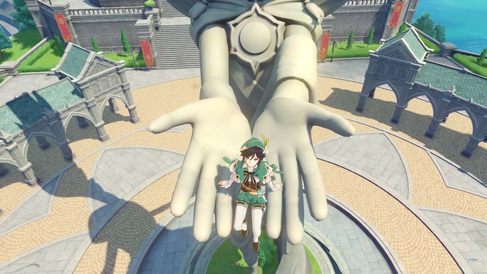

* A good number of the fandom speculate Venti sits on his own statue because it reminds him of being held in the palms of his unnamed bard friend 2600 years ago.

* He himself quotes that he is the weakest among the archons for not directly governing Mondstadt.

* Venti knows how to forge a signature. Infact, to turn the Mondstaders against the aristocrats, he forged a fake document made by the aristocrats - declaring to sell the nation to Rex Lapis. He even faked Rex Lapis’s signature. Although fake, it did the job.

* However, it took several hundred years for historians to fact-check the information to realise that the agreement and the signature were fake. Well played, Venti! Well played.

## Lore implications

### Last members of the original seven

Venti is one of the last remaining original archons of the seven left alive besides Rex Lapis, which puts his mortality into perspective.

### Queen Gnosis

One of the major end-story implications Venti has is due to his Anemo Gnosis that looks like a "Queen" chess piece. As we know, Queen the most powerful piece in the game. To think a weak god having the most powerful piece in the game - this is quite suspicious. Does that imply Venti is actually strong when he puts his mind to it? Or was he the strongest among the original seven that ascended to Celestia at that time? While there are good educated guesses, the final answer is yet to be revealed.

### Him writing songs have a deeper meaning?

With the latest archon quest in v3.3 regarding wanderer and memory erasure from the irminsul tree, it became explicitly clear that encrypting information is one way of safeguarding the memories of the world from the tampering of irminsul.

Nahida wrote the story of scaramouche in a fictional fairy tale. Venti being a bard himself, writes songs, ballads, and tales about people with a fictional touch to it.

In contrast to the more canonical works, Venti’s ballads tend to include bizarre adventures and acts of mischief, such as the time that Barbatos pinched the Cryo Archon’s scepter and replaced it with a hilichurl’s wooden club …

Worshippers of Barbatos are quick to decry these frivolous tales as blasphemous fabrications. But whenever someone confronts Venti about this, his response suggests that he has not an ounce of remorse. Only Venti knows the truth behind his song lyrics, and it is a truth he hides behind an enigmatic smile.

Reason being, yes — Venti’s tall tales of Barbatos’s unorthodox exploits are entirely fabricated.

But why though? Why go to all this trouble to make ballads mixing reality and fiction? This seems suspiciously similar to the strategy Nahida uses to avoid irminsul wipes.

### Why Venti sleeps a lot?

It seems like Barbados goes to a long hibernation for 500-1000 years only to be awakened at times when his intervention is greatly needed, such as Xiao succumbing to Karmic debt, Mondstadt needed help to fight the aristocrats, cataclysm, and Dvalin going rogue in the Mondstadt archon quest.

Zhongli and Ei have mentioned quite clearly about the ramifications of Erosion.

Zhongli retired from being an archon so that if he does face erosion, he will not affect Liyue.

Ei does not have a physical body and is thus immune from physical erosion. She spends an enormous amount of her waking hours meditating in the Plane of Euthymia. This seems like her way of resisting mental erosion.

The question being, why does he need to sleep for such a long time? Is it his way of battling erosion? We don’t know.

There are also (speculative) theories that Venti is a ‘son’ of Istaroth, the God of time. It is mentioned quite explicitly in his demo trailer that he is “being born from the branches of time.”

### Venti is quite suspicious

Venti has also been hiding information from the traveler regarding prior events which might have something to do with a contract from celestia.

When the traveler confronts Venti for answers many times, he often shrugs it off with his iconic “ehe” and changes the topic.

Even in the manga, it is explicitly implied (although it can be easily glossed over) that Venti knows a lot of stuff regarding the formation of Tevyat.

Venti states that the Tsaritsa cut all ties with him after the events of the Cataclysm. What exactly happened for her to make such a decision is still unanswered.

Venti requests the traveler if they want to become one of the four winds after their travel. Is Venti looking for a replacement?

## Misconceptions

Unlike the ruling deities of the other nations, Barbatos has long left Mondstadt. In fact, the only visible proof of his connection with Mondstadt is the Statues of The Seven that appear across the land. Fortunately, Barbatos’s past deeds are recorded in books and epics, sung and passed on by the bards.

Our beloved “tone-deaf bard” is infact lazy and a heavy drinker for the most part. This is the persona Venti adorns as a mortal.

While it is true that he is lazy to rule Mondstadt, it is not the only reason.

> What does freedom really mean, when demanded of you by a god?

He strongly believes this to be the case.

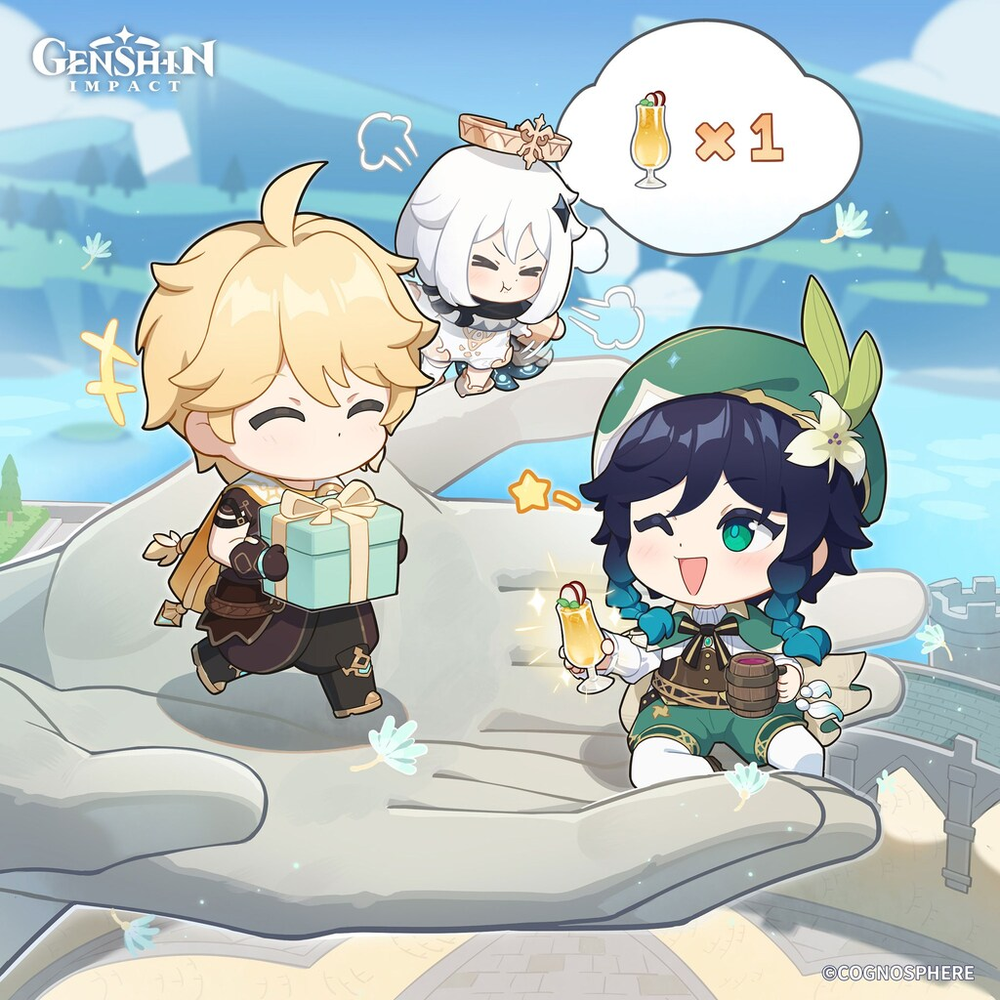

And to every foreigner's surprise and dismay, Barbados has a lot of devout worshippers silently praying to him and chanting his name despite not making an appearance for thousands of years.

While foreigner's might criticise him for being the "absentee archon", it is precisely because of his absenteeism that Mondstadt cherishes Freedom, Poetry, Romance, Dandelion, Adventure, and Wine for the way it is.

Perhaps it is because he gave his citizens the true freedom to be who they want, the devotion he gets is unconditional, as it came due to the citizen's own free-will, and not because of any obligations.

## Conclusion

> "_I have decided to write a song about you! What are you giving me that look for? Can't afford it? Don't be preposterous, the price for you, my friend, is precisely zero Mora! Although... one thing you could do is tell me a few more of your stories!"_

In an ironic twist of fate, Dainsleif - the one who is known for his lack of trust on gods, and his dislike towards religious devotion pretty-much summed up Venti's nature the best way possible in his ending dialogue in Venti's collected miscellany.

> As we all know, poetry and language flow like the wind...
> 
> Venti captures this spirit in his ballads. Flora and fauna he sings of seem to have a life of their own and transport us to the moon and the star
> 
> This self-proclaimed "Best Bard of the Mortal World", gets his strength and unfaltering inspiration from the wind. However what Venti seeks in life is not eternal fame for his ballads. Instead, he'd be happy with a cup of wine and a lyre to sing the marvelous stories of the world.

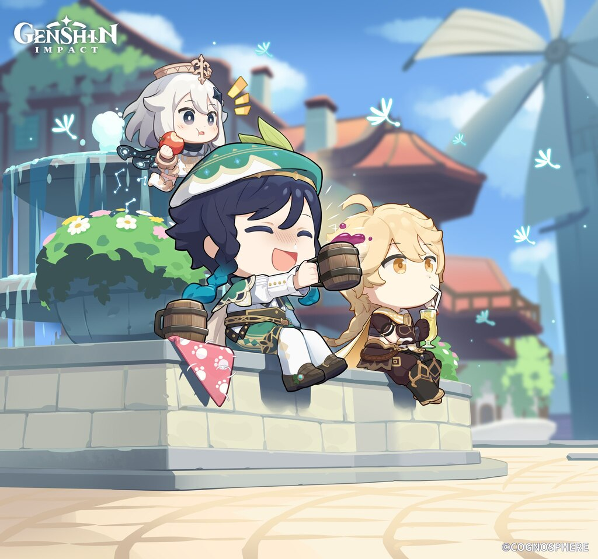

Probably this is why he is the least ambitious among the gods we've seen in the game at the moment. And also why a lot of people love him for being a kind god.

> So, if you're asking me ..., What should we do, on this day? How should we do it? Who should we do it for? Quietly? Or boldly? Make the first move? Or trust to chance? ... My answer is this: So long as we can both share fond memories, it doesn't matter. Let the heart decide.

