> _"If only I could have burned to death in that fire too... no, in fact... I wish I was never born at all"_

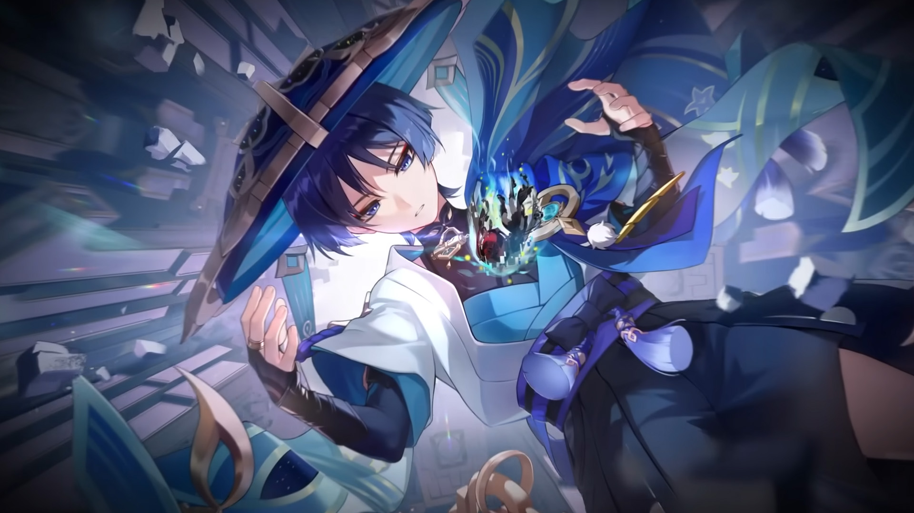

_Wanderer Poster Image from Version 3.3 Live Stream - All Senses Clear, All Existence Void_

# Wanderer - Character Story: The Hifumi, Kaimetsu and Saisei

> _"It took three betrayals for me to finally understand... the world is just an elaborate tapestry of lies" - Story teaser: The "Divine" Will_

## Introduction

Kunikuzushi, Kabukimono, Scaramouche, The Balladeer. I'm sure these names all ring a bell in your head — an iconic character in Genshin Impact. His story is quite intriguing, complex, and well-written. From being a product of a God to making contact with humans, to eventually hating both, he went through a lot. He, who has walked the border of God and Humans, only wished to be wanted. Such is this fascinating character, crafted by taking many references from real-world folklore and mythology. Let's walk down memory lane from his origin, betrayals, grief and finally, acceptance, shall we?

Table of Contents

- [Wanderer - Character Story: The Hifumi, Kaimetsu and Saisei](#wanderer---character-story-the-hifumi-kaimetsu-and-saisei)
  - [Introduction](#introduction)
  - [Voice Actors](#voice-actors)
  - [Prologue](#prologue)
  - [The First Betrayal](#the-first-betrayal)
  - [The Second Betrayal](#the-second-betrayal)
  - [The Third Betrayal](#the-third-betrayal)
  - [The Fatui](#the-fatui)
  - [The Present](#the-present)
  - [Acceptance: Wanderer](#acceptance-wanderer)
  - [Vision Story](#vision-story)
  - [Aspirations](#aspirations)
  - [Connection With Other Characters](#connection-with-other-characters)
    - [Raiden Ei](#raiden-ei)
    - [Katsuragi](#katsuragi)
    - [Niwa Hisahide](#niwa-hisahide)
    - [The Young Boy](#the-young-boy)
    - [Nahida](#nahida)
    - [The Traveler](#the-traveler)
  - [Character Meanings](#character-meanings)
    - [Kabukimono:](#kabukimono)
    - [Kunikuzushi:](#kunikuzushi)
    - [Scaramouche/The Balladeer:](#scaramouchethe-balladeer)
  - [Constellation meanings](#constellation-meanings)
  - [Reference from the real world](#reference-from-the-real-world)
  - [Quirks and Misconceptions](#quirks-and-misconceptions)
  - [Theories](#theories)
    - [The False Sky:](#the-false-sky)
    - [Wanderer meeting Kazuha:](#wanderer-meeting-kazuha)
    - [Wanderer vs Dottore:](#wanderer-vs-dottore)
    - [Wanderer meets Ei:](#wanderer-meets-ei)
  - [Conclusion](#conclusion)
  - [The End](#the-end)
  - [Inspirations:](#inspirations)
  - [Credits:](#credits)

## Voice Actors

* English - Patrick Pedraza
* Chinese - Lu Yin (鹿喑)
* Japanese - Kakihara Tetsuya (柿原 徹也)
* Korean - Min Seung-woo (민승우)

_Artwork for his birthday_

"_My chest will never again be defiled by worldly filth. I will scrub away every last trace of human emotion." - Scaramouche_

## Prologue

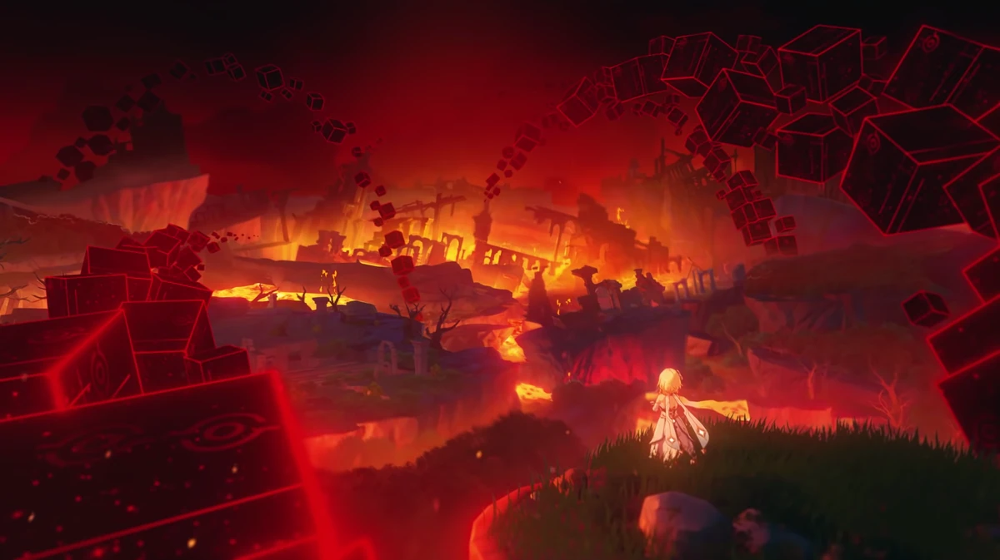

_Lumine witnessing the destruction of Khaenri'ah_

> _"The arrogation of mankind ends now!" - Unknown God_

To begin, we must head back to where it all began. In the glorious land of Inazuma, where there lies the Electro Archon, who had risen to power and ruled over for centuries. The citizen worshiped only that one god, but what they didn't know was that the nation was ruled by twin gods: Baal, and Beelzebub. Baal, the first ruler of Inazuma, and Beelzebub, her shadow, otherwise known as Makoto and Ei. Both had divine ideals of "Eternity", however, both saw it differently. Ei's was the pursuit of solemn stillness, where time will neither flow nor turn back, just comes to a stand-still.

However, Makoto cherished every moment, every minute, hour, year, everything, within time and space. Although Ei was a far more formidable warrior than Makoto, she always felt Makoto was meant to be the better ruler. As such, they ruled over Inazuma together, Makoto ruled everything, while Ei did the dirty work in Makoto's place as her Kagemusha - her "shadow".

The two would coexist ruling the nation, and enjoying periods of peace sandwiched between times of war, destruction, and losses. Maybe the peaceful times were indeed cherishable. But all that changed when the Cataclysm occurred 500 years before the Traveler awakened. The cataclysm caused monsters to appear throughout Inazuma, which left massive tracks of devastation in their wake. Makoto headed to Khaenri'ah alone without informing Ei, as she was compelled to do so, as the same applied to the other Archons. Fearing her welfare, Ei left the nation in the hands of Kitsune Saiguu to find Makoto. When Ei finally arrived, it was all too late. Makoto died while fighting against the Cataclysm, and Ei carried her remaining consciousness and her blade with a heavy heart back to Inazuma.

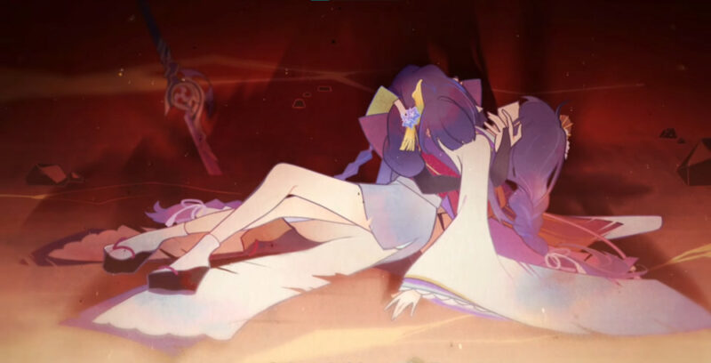

_Raiden Ei crying over the her dead sister, and the Electro Archon, Raiden Makoto_

When she returned to Inazuma - raged in war and destruction - she had no time to grieve.

With the aid of the Sakura tree that seemingly appeared out of nowhere, and her warrior tenacity, Ei fought against all the beasts of the cataclysm and saved Inazuma, from what seemed like a war that went on for eternity.

To the entire world and Inazuma, the electro archon left Inazuma during a dire time, only to come back and save them single-handedly.

When the dust finally settled, only Ei and a select few in her close circle knew the brutal truth. The original electro archon died, and it was the former archon's shadow - her Kagemusha - who saved Inazuma. And the price Ei paid - was a devastating blow - losing her friends, faithful retainers, and above all, her sister she treasured all her life.

Ei, now the new ruler of Inazuma, was left with an electro gnosis in her possession. But, it was not all celebration of peace. Ei had lost it all. Her friends, her sister. All alone and terrified of the future. If only the world could stay still, she thought. When she discovered the craftsmanship of humanoid creation from Khaerin'ah, she knew what to do. A mechanical being, to take the role of the Electro Archon, free of erosion. Maybe, that is how she will achieve eternity.

## The First Betrayal

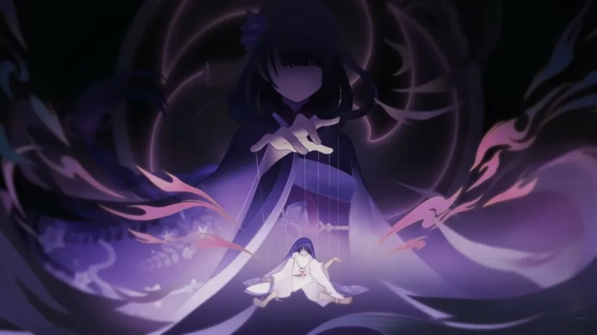

_Traveler seeing a vision of Scaramouche's past during a cut-scene in Archon Quest, Chapter 2, Act 3._

> _"The first to betray me was a god. My creator... my mother. Valuing strength above all, she saw no worth in me, and I was discarded."_

The creation of the puppet began, as Ei developed a humanoid to wield the power of the Gnosis and the title of the Electro Archon. And thus, Scaramouche was born. But he wasn't called Scaramouche, not yet. He was a nameless puppet, a successful creation, capable of meeting all criteria laid out by Ei. But he had one fatal flaw. When Ei attempts to give him the Gnosis, tears started to dwell on his face.

Ei was a warrior. And a warrior shouldn't have feelings or emotions. That wasn't her field: it was Makoto's. So why is the puppet showing emotions? Such emotions can chain strength, show weakness, and lead to death. Maybe that's why Makoto suffered her demise. And it wasn't so different for a mere puppet. She couldn't entrust the Gnosis and Title to the nameless puppet. But instead of destroying him, throwing him away, she wanted him to live a free life, free from the burdens of wielding the Gnosis, free of the grasp of God, free from his role. Ei wanted him to live a life as a normal human.

> _"He came about as a byproduct of creating the Shogun. Perhaps it's because I feel like I owe him something, but I do not wish to assert control over him" - Raiden Ei_

_via Raiden Shogun's voice line, it does show that Ei did not want the puppet to bear the weight of such duties._

So, Ei left him at the Shakkei Pavillion in a slumbering state, leaving him a tiny gold feather as a memento of his "identity". Although he was meant to sleep for a long time, he awakened, blank as a piece of paper. Blankly observing the beautiful surroundings inside: the gorgeous window lattices, the burning maple leaves etc., He lost all sense of reality in that magnificent prison.

He could not do anything, nor feel anything. As such, he begins to question,

"Why was I born?"

"Why was I discarded?"

"Why did my creator leave me?"

These questions began to develop an underlining hatred for God. "How could my mother leave me? For I had just been born. I can't please her, and I hate her for that." As such, he saw this as his first betrayal.

## The Second Betrayal

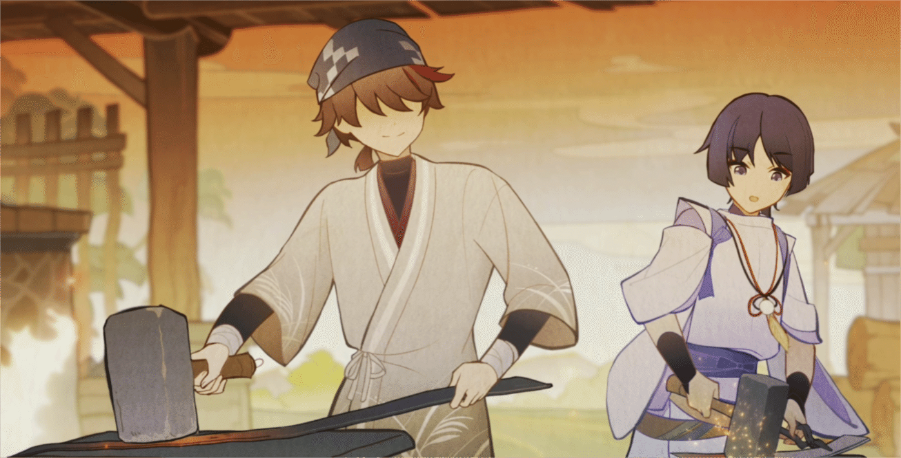

_Niwa teaching a young and inexperienced Kabukimono the art of swordsmithing. There is a distinct hint that Niwa is an ancestor of Kaedehara Kazuha due to the red tuft of hair Niwa has similar to Kazuha._

> _"The second was a human. My family... my friend. Consumed by fear, he saw me as an abomination."_

In Tatarasuna, there was the Mikage Furnace. Although manufacturing ceased owing to war, this plant served as the primary production facility for Inazuma's renowned Jade Steel. At that time, a Fontaine mechanic, Escher, arrived in Tatarasuna. His role was to revolutionize the smelting process of the Mikage Furnance with the help of Niwa Hisahide, the chief officer managing the furnace. The second-in-command was Mikoshi Nagamasa, an inspector at the forge. He saved a person named Katsuragi who would later work under him as gratitude for saving him.

All such people at Tatarasuna were mostly bladesmiths who were part of the "Raiden Gokaden" of Inazuma.

On a fateful day, Katsuragi discovered the Shakkei Pavilion and decided to explore it. He stumbled upon the puppet, thinking it was trapped there, with nowhere to go, and no way to escape. As such, he decided to take him back to Tatarasuna so that he could have a better home, shelter, and food. The puppet was dumbfounded.

"How could I be loved? Likable. I go discarded. My life has no meaning." but the workers at Tatarasun thought otherwise. They were nice, friendly, and helpful. They started to call the puppet "Kabukimono".

"A name.."

The puppet was nameless all his life, and for a human, a mortal, to give him a name. It was a strange feeling. Niwa assured Kabukimono that even if he is a product of God, even if he is a mortal, they are all the same, even if he lacked a "Heart".

Sometime later, Mikoshi Nagamasa forged a sword, and an overjoyed Katsuragi performed a sword dance with Kabukimono to celebrate. Kabukimono considered Katsuragi, the person who saved and brought him to this home, as a friend.

Kabukimono felt happy and loved for the first time in his life. He could call these people his family and friends. Maybe, he finally found his nest.

But sometimes, we can't have good things in life forever, can't we?

Many workers of Tatarasuna started to die due to an unknown cause sometime later. Upon seeing this, Kabukimono quickly heads to Narukami Island with his "feather of nobility" to have an audience with "The Shogun", leaving Tatarasuna.

In reality, the workers were dying due to Tataragami released from the furnace. While the Mikage Furnace reached its critical point, Niwa confroted Escher about the modifications to the furnace. It was then Escher revealed his true identity. He is Il Dottore, a Fatui Harbinger from Snezhnaya. He had come to Inazuma due to an order by Pierro to create a little havoc in Inazuma.

To his amusement, hearing of the presence of the Electro Archon's puppet, the Harbinger grew curious about Kabukimono, to the point that he decided to use him as his new test subject. To do so, he killed Niwa, ripped out his heart and placed it in a device.

Dottore told Mikoshi Nagamasa that Niwa had fled Tatarasuna, making him the one in charge. As before this, this situation can result in the death penalty for Mikoshi. Katsuragi offered to take the blame, to be killed, in respect for Mikoshi's endurance and hard work to restore the honour of the Mikoshi clan.

During this time, Kabukimono had reached the Tenshukaku but was denied the audience by The Shogun. The shogun is a puppet - not programmed for such instructions.

The Shogun was the newly created 2nd puppet of Ei. Devoid of any emotion, the puppet was made to bear the weight of the Electro Archon. Ei not only made the Shogun puppet but also made the Plane Of Euthymia. She instilled the plane and her consciousness inside Makoto's sword, protected by the puppet. Ei decided to spend her time shut in the Plane of Euthymia, meditating towards Eternity.

Kabukimono decided to head to Grand Narukami Shrine to meet Yae Miko. Yae Miko quickly gathered men to head for Tatarasuna soon as she saw the gold feather Kabukimono had revealed.

Kabukimono returned to Tatarasuna, unable to find both Katsuragi and Niwa. Escher (Dottore) gave a device to Kabukimono, instructing him to use the device to save everyone in Tatarasuna.

Kabukimono - despite knowing that he might die - headed into the furnace with no hesitation. He was filled with determination to save the people whom he saw as his family. He couldn't just lose his only family just yet. He needed to do something. Even if it means he might die trying. But the heart in the purification device, Niwa's Heart, protected him. When Kabukimono questioned Escher (Dottore) about the heart in the device, Escher lied, convincing Kabukimono that the heart was from a servant that Niwa killed before fleeting Tatarasuna.

Kabukimono was shattered once again. He had been abandoned, all again, by someone he truly cared for and someone who truly cared about him. Niwa lied. Kabukimono was considered neither family nor friends to the people. So, he tore out the heart and left.

As such, this was the second betrayal. Now betrayed by humans and gods, he considered the help from Yae Miko pointless as it came too late. All neglected. All hated by Kabukimono.

## The Third Betrayal

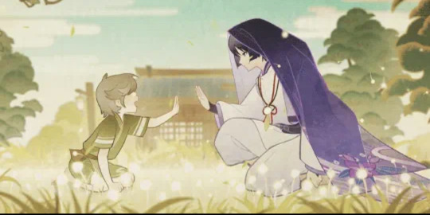

_Kabukimono sees the unnamed sickly child outside of Tatarasuna and starts to take a familial liking to him._

> _"The third was one exactly like me. A hope for the future... a fledgling barely out of the nest. Powerless before his mortality, he broke his promise to me."_

Sometime after the Tatarasuna Incident, Kabukimono met an ill young boy living near Tatarasuna. He was like Kabukimono, with no home, kin, friends, and family. A fledgling: barely out of the nest. Lost in this world, just the two of them, they promised each other to live together as a family. And that they will be there for eachother forever.

Kabukimono started to piece himself together again, the shattered pieces of his heart and life. Kabukimono developed a strong relationship with the boy and a family with a mortal once again. This time, maybe, is the one.

But mortals have such fragile lives, and Kabukimono had yet to learn that. One day, Kabukimono came home only to find the boy dead, succumbing to his illness. Kabukimono was already emotionally torn by the events of Tatarasuna, and to see another who he considered family gone, was just too much.

"Human don't keep their promises, it's like nature to them. They don't care about feelings, they only care about their ego. I can't trust them any more, I am done trusting them. And I can't even trust God as they left me as well. Can't even help me, can't even meet me, can't even talk to me. I'm not a human. I'm not a God. I'm just a mere puppet. No one wants me, I have nowhere to go, and no reason to live. No more."

The house caught fire and Kabukimono almost let himself burn with it, but he didn't die. Leaving the house and the island, he met up with Pierro. Pierro convinced him to become a member of the Fatui and accept his seat at the banquet where he would face the divine. The remarks of the Jester intrigued Kabukimono. Maybe, by joining an organisation like the Fatui, Kabukimono thought he could finally feel he was worth something.

Leaving his third and final betrayal behind him, he stripped away all past memories and the name "Kabukimono" to start a new life in Snezhnaya.

And thus, enter Scaramouche.

## The Fatui

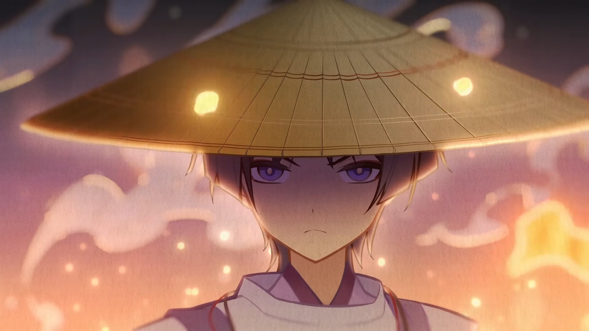

_Kabukimono decided to forsake this world and join the Fatui._

> _"Humans... they can't be trusted. And the gods fill me with pure loathing. So I said good riddance! I denounce the world and laugh in its face."_

Joining the Fatui, the puppet gained a new name - Scaramouche. Dottore unlocked Scaramouche's divine abilities that were sealed in him by Ei in the past. He also modified him to gain additional abilities, making him even more powerful and efficient during his missions. His early years were brutal, experiencing countless experiments by Dottore. Dottore gained new knowledge from all this experimentation, and this might've allowed Dottore to make his iconic "segments" at the peak of his abilities.

Scaramouche wouldn't be in contact with Dottore much after Pierro assigned him special recon missions that often took place in the abyss. When those missions started to dwindle, he found himself stepping on the soil of Inazuma. Once again back to his roots. His origin. Hatred and resentment towards the man who betrayed him all those years ago resurfaced. Niwa may be long dead, but he was a practitioner of the Isshin Arts, one of the five schools of the Raiden Gokaden, which made the sword-making clans a perfect target for scaramouche's cunning plan for revenge.

He enacted a series of events spanning several years - that in hindsight - looked like a series of unfortunate events. Events that led him to destroy three of the five schools of the Raiden Gokaden. When it was the time for the Isshin School's successor's demise - he hesitated - as if something was pulling him back. The Isshin school's successor - Kaedehara Yoshinori - was not only the adopted son of the head of the Kaedehara clan at that time but also the bloodline descendant of Niwa Hisahide himself. His former name was Niwa Yoshinori.

Something stirred in his heart, … All those good memories, all those happy moments. Within the heartless puppet were buried ashen feelings of a happier time. His memories. As much as he got betrayed, he cared deeply for Niwa.

Ei may be right about Scaramouche's emotions being the major flaw in him. He let Yoshinori live, instructing him to say his name, Kunikuzushi, to "her" before departing. Because of the incident, Yoshinori and the Yashiro head avoided discussing it for the fear of Scaramouche's retaliation.

He climbed the ranks of the Fatui, and as such, gained the seat of the 6th Harbinger, and was given a new title.

The Balladeer

Power. Strength. Fear. All these features were what made up The Balladeer. He was capable of sending mass destruction to anyone, anywhere.

> "Let it be known, that divinity is mine!"

## The Present

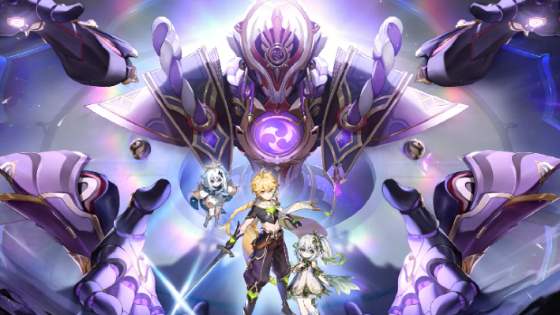

_Scaramouche vs Nahida and the Traveler._

> _"This is supposed to be a battle between gods, yet you choose to hide behind a mortal. And now, you're acting like you'd sacrifice yourself for a human. Are you having fun proving a false sense of heroism to yourself, Buer?" - Scaramouche says to Nahida during their confrontation._

And finally, we reach the present. The traveller has finally awakened from their slumber and started their journey exploring all of Teyvat, meeting the archons of each nation to find clues about their missing twin and the unknown god that separated them - and intentionally or unintentionally getting involved with a major crisis in each nation.

Scaramouche was sent to Mondstadt and Liyue by Pierro to study the fallen meteorites and the "False Skies".

During this, he meets the Traveler for the first time. The Traveler was unique as their clothing was not from Teyvat, and they did not possess any vision. But in any case, Scaramouche did not pay any heed. He was capable of defeating any foe that wanted to face him. To the traveller's fortune, the traveller was able to escape death from Scaramouche twice.

Many days later, Pierro assigns him to monitor a Delusion factory in Inazuma. At the same time, Signora was tasked with negotiations with The Shogun. The Traveller, who just so happens to be in the Delusion factory, faced off with Scaramouche again. Scaramouche, intending to kill the Traveler, releases Tataragami from Crsytal Marrow, hoping they will die to it.

But Yae Miko suddenly appears before him, offering a trade. The Traveler lives, in exchange for the Electro Gnosis. Yes, the very same Electro Gnosis that was meant to be given to Scaramouche. Of course, Scaramouche would accept such an offer, he was waiting for this moment all his life.

He cut all ties with the Fatui and went into hiding. The Harbingers meet up in Snezhnaya for Signora's funeral, for she was defeated in a "Duel before the Throne" by the traveler, only for the loser to be slayed by the shogun. Dottore anticipated Scaramouche's next move, heading for Sumeru. As he predicted, he found a wandering Scaramouche in the grassland of Sumeru and offers to turn him into the Nation's God.

Scaramouche agrees. Why wouldn't he? If he can neither trust mortals nor gods, he shall be the new God who will crease all others. The sages of Sumeru Akademiya, together with Dottore, began work to ascend Scaramouche into the new God Of Wisdom.

Now known as the "Shouki No Kami, The Prodigal", the sages expect him to be as powerful as Greater Lord Rukkhadevata, the first Dendro Archon. In the new body powered by the Electro Gnosis as its core, Scaramouche finally got the heart he had long desired.

"Finally, after all these years. Do you see me, Beelzebul? Your own creation, your own son, had finally fulfilled your wishes. Are you not satisfied?"

He demonstrated his new godly power to Sumeru, telepathically talking with the Traveler, changing the weather, and harming many Fatui and the Traveler's friends.

He had finally achieved Godhood. Or is it all really just about God? The cost of his Godhood was too much of a price for Nahida, who refuses her own people to suffer with such a tyrant. Escaping her imprisonment with the help of the Traveler, she placed Scaramouche in a samsara of his own making, finally seizing the Electro Gnosis away from Scaramouche, and crushing his dream for Godhood.

This defeat had destroyed what was left of Scaramouche's spirit. He tried so many times, but all ended in vain. He no longer had any reason and any will to exist.

## Acceptance: Wanderer

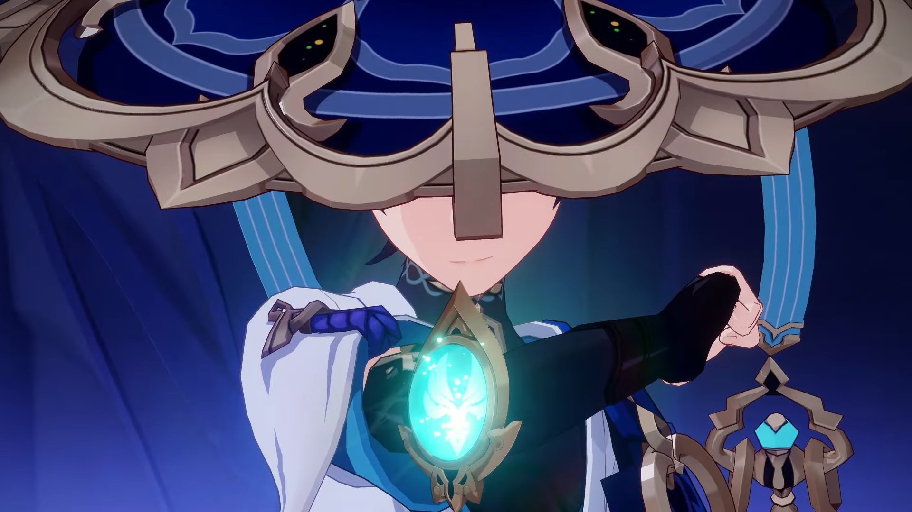

_Scaramouche accepts his past and gains his anemo vision_

> _"From this day forth, the names "Balladeer" and "Kabukimono" will cease to exist."_

But Nahida gave him a reason to live, offering him a deal. She will release him and stay in Sumeru if he agrees to work for her. Even though his individualism was shattered and crushed, Scaramouche had this desire to be wanted and needed. It is like a broken recorder at this point. Being abandoned by his mother, Niwa, everyone left him, so he did not hesitate to take that deal. If nothing else, it was the reason to live.

His first mission was to enter the Irminsul to search for information about the Traveler, but Nahida had other plans. While Scaramouche was finding information, Nahida secretly placed the information of the truth of what happened in Tatarasuna.

Scaramouche on seeing it, was filled with rage and regret. The truth was Niwa never betrayed him: he did not leave him. All those death and suffering was because of Escher, or should we say, Dottore. Dottore was the one who lied to him, who was pulling the strings like a puppeteer, pulling all of those unfortunate events onto Scaramouche, all under his grand plan. All those pain, all those suffering, all those lost, all those to blame for 500 years, was just all Dottore.

Once he completed his assignment, he pulled the Traveler aside and asked them a simple question.

> "Is it possible… to change the past?"

He took what little power he had left and connected to the Irminsul. If he could give the people of Tatarasuna, Niwa, another chance at life, he would gladly do so. Even erase himself if needed. In doing so, maybe, he could make things right.

But you cannot change the past. It cannot be rewritten or compromised. Not even by a god, not even by a mortal, not even a mere puppet can do such a feat. What's done, is done. What has been destroyed, is destroyed. Whoever died, died. There are no two ways to do this. That is the nature of the world. Instead of making it right, the world just forgot about him. However, his existence remains in this world regardless of who remembered it. Ei left him in the Shakkei Pavilion, but he still spent time with the people of Tatarasuna and still took him in. But no one would ever realise the truth, not even Scaramouche who had forgotten his past.

Now, he's a wandering shugensha, still alone, still aimless, but still existing. When the Traveler meets the wanderer, they remembers him. Due to being a Descender, they are immune to the Irminsul's alteration, as they recognize the wanderer wandering around Sumeru City. They could have left him alone, and let him live a normal life. But they instead offered him a chance to recover his memories.

Wanderer could've easily refuse this and walked away. But he had one desire in life.

To be valued. To be worth something. To be loved.

And even though Nahida and Traveler told Wanderer of the horrible person his past self was and will always be, he didn't care. He wants to know the truth because somewhere buried in that truth, somewhere buried in all those murders and heartless things he had done, was the meaning of his very existence. So he asks Nahida for his memories.

When faced with his memories, he accepts them all. He faced himself, his past self, filled with hatred for God and Mortal, but also in that hatred, a void of being wanted.

"You are me. I am you. We are always with each other. I exist, you exist. We can't do this without each other. We deserved better. We work together. We will get there together. It does not matter what happened in the past. You can only walk on, and become a better person. Isn't that what those people long ago wished you as well? Your own creator, wishes you as well?"

He wasn't forgiven nor redeemed with a second chance, but he took responsibility for all the things that had been done, and he wanted to take all the responsibility for all the things that had been done. For the people of Tatarasuna. For Niwa. For all the awful things he had done in the past.

He told the Traveler to tell the remains of the Raiden Gokaden what he had done despite the fact that there was no proof nor record of what he had done to them. He wanted to be better.

Now, working as Nahida's Shadow, he promises to help both Nahida and the Traveler, wandering around in Sumeru. Yes, the past cannot be changed, but he will atone for his sins. And become better. Being better does not come easily, but working towards it, shouldn't that matter?

That is the story of how Wanderer came to be. He started as a puppet - a fledgling barely out of the nest, to becoming a Harbinger, a false God, and his road to redemption.

## Vision Story

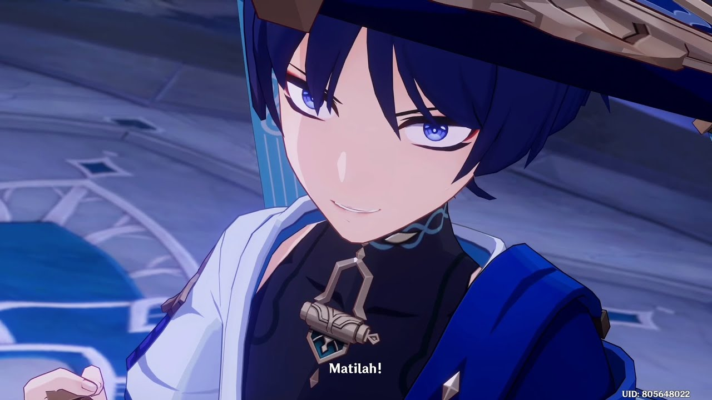

_Wanderer, now gaining his anemo vision, decides to destroy "Shoku No Kami"_

> _"Die." - Wanderer to his past self and to Shoku No Kami_

An instant before the Lord Of Arcane Wisdom's attack connected with the Traveler, time felt like it stood still. Wanderer could hear the wind blowing in his mind. That very wind greeted him differently.

The wind felt old and nostalgic. It was like an iron hammer hammering down on the metals. The furnace roared, and he felt the heat of the flames.

It brought along a peaceful time: a time when no harm was done. Nothing bad happened. A dream yet to be dreamed, but a terrifying past, many may not think he led a simple life.

To accept oneself is to accept one's regret. Only by acceptance can he finally see the road of redemption, carried by someone who had lost it all, someone tragic. To break his shackles and become free again.

He believed that the seeming tranquillity and beauty were only appearances. The true version of himself continued to exist in his heart. But, he can make a choice now. A bright light came between him and the Everlasting Lord Of Arcane Wisdom, blocking its attack.

When the Vision descended, a glittering ornament that appeared to be an eye on a happy face was trapped between blinding light and darkness and questioned him from a distance: Can you, who long desired this power, still be regarded as a person without a heart?

An Anemo vision suits the Wanderer, as he is referenced as a fledgling barely out of a nest, a puppet looking for worth and freedom in this big world. Trapped in his suffering, now finally free. He can walk on the world of his own free will, he will walk the road of redemption where nothing will hold him down, as he is as free as the wind.

## Aspirations

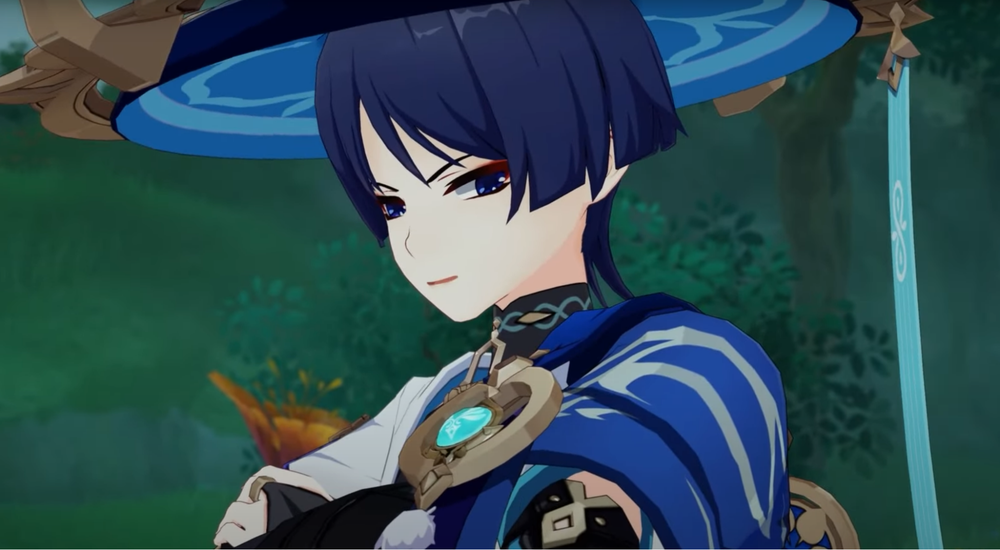

> _"Time for me to go out and find the truth. So long, suckers!"_

Wanderers' aspirations will always be to be wanted and needed. He wanted to be worth something. He couldn't do that with Ei as he showed emotions, he achieved that with the people of Tatarasuna but got "Betrayed" by Niwa and only to go through that again with the young boy. As such, he buried that ambition to join the Fatui because believed that joining them may fulfil that.

When he united with the Electro Gnosis, he took no hesitation to become a God. He can finally be what he was always meant to be. The void of emptiness has been filled. But was it really filled?

When he learnt the truth of what happened in Tatararasuna, he couldn't help but blame himself. He needed to give the dead another chance. He had to redeem himself. But it isn't all that easy. But, now as the Wanderer, he is working towards that ideal. He finally had people who want and need him, Nahida and the Traveler. Maybe, this was finally the conclusion of his search for being desired.

## Connection With Other Characters

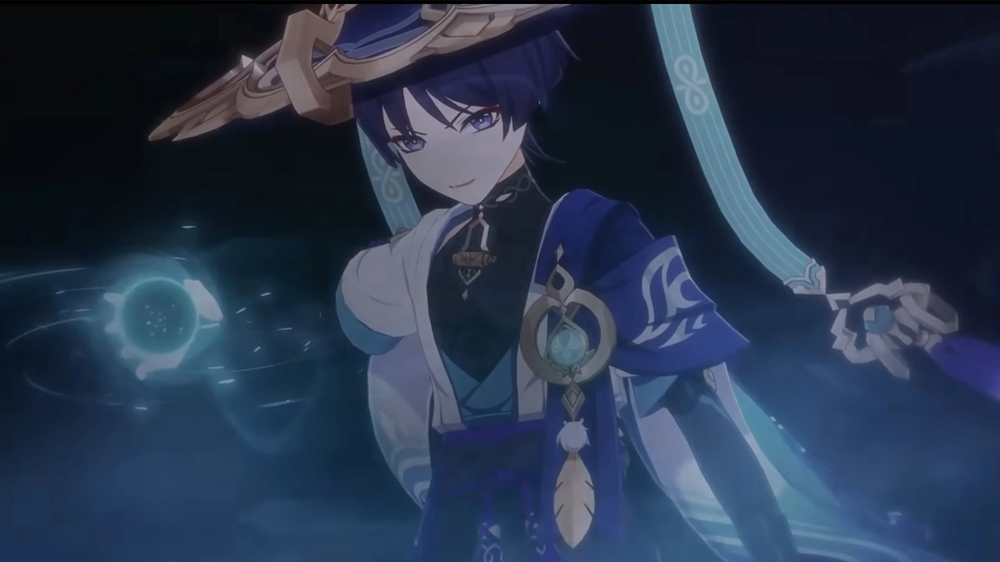

> _"Just like a bubble on the water. Beautiful for a moment, then total destruction"_

### Raiden Ei
His Creator. His mother. Who saw no worth in him. But in actuality, she just wanted to give him his own choice in life. She did not want him to become as emotionless as her. When he shed a tear, Ei knew he was just like Makoto. And Makoto will not want this. If only both could just meet up, and finally solve their misunderstanding. One day, maybe...

### Katsuragi
The first person Wanderer considered his friend, who found him in the Shakeki Pavillion. It was impactful for Wanderer, for he had finally found people he could trust and call family. Spending time in Tatarasuna was probably the most memorable time for Wanderer.

### Niwa Hisahide
Niwa played a significant role in the Wanderers' life. He was the one who told Wanderer that he is just like him - a mortal - who only lacks a heart - but a human in every other way. But even then, Wanderer is capable of feeling happy, spending time with Niwa, and experiencing everything with him. Those were happier times. When Scaramouche thought that Niwa betrayed him, he was blinded by rage and hatred. Learning the truth opened a view in that blindness, that Niwa had always cherished Wanderer, and led him to cherish him even more than he ever did, to take action against his misguided hatred towards Niwa.

### The Young Boy
As Wanderer would describe, he was just like him, a fledgling barely out of the nest. They had no family or friends, no home, and no hope for the future. But they promised each other, they will be their hope for the future. But being mortal is cruel, being subjected to death by illness is cruel. It shattered Wanderer even more as he was recovering from the events of Tatarasuna. He wished he wasn't born at all.

He had a conversation with the young boy in Character Teaser - "Wanderer: Ashes"

Wanderer wishes he had a heart. In return, the boy told him a story. There was a puppet soldier who wished to be with a ballerina doll forever, to be by her side. But this soldier neither had a heart nor knew where his feelings came from. His owner didn't want him anymore and threw him into a fire. But even in that flames, his eyes did not leave the ballerina. So elegant, so gentle in her motive, so beautiful. The next day, the people found a tiny heart in the ashes.

Wanderer didn't believe such a story, indicating it was probably ashes in the shape of a heart. It wasn't a real heart at all.

But maybe, a heart can be born from ashes? If Wanderer had burdened all these events, his flames burning inside him burn all. Maybe when the flames finally fizzle out, will he realise that he had a heart set in stone all along?

### Nahida
The Dendro Archon of Sumeru. When defeated by the Traveler, Wanderer lost all will to live. He had lost it all over again. Why should he try again? But Nahida gave him another chance in life. She thought that Wanderer was broken deep down. All he needed was guidance and someone to be there for him. So she offered him to be her "shadow" and even snuck in the truth of Tatarasuna for Wanderer to uncover and reveal. She wanted him to know everything and what really happened. She didn't want Wanderer to live a life of illusion that people betrayed him. When he finally became the Wanderer, he decided to work under Nahida as her shadow.

### The Traveler
At the start, Scaramouche saw the Traveler as a stepping stone, not threatening his plans. When he met the Traveler in the Delusion factory, he fully intended to kill them, only to be interfered with by Yae Miko. He faced off with the Traveler again in Sumeru as their new God, who shortly after was defeated after being trapped in Nahida's scheme.

The Traveler was the key to Scaramouche's plan to erase himself from Teyvat. They were the ones who did not belong in this world, so maybe they knew something that no one else knew. When the Traveler found the Wanderer, they offered him to see Nahida and reclaimed his memories. "You can't run away from the past, you have to face it. Accept it, and move on."

After everything that happened, the Wanderer allowed the Traveler to name him, signifying a relationship between each other.

## Character Meanings

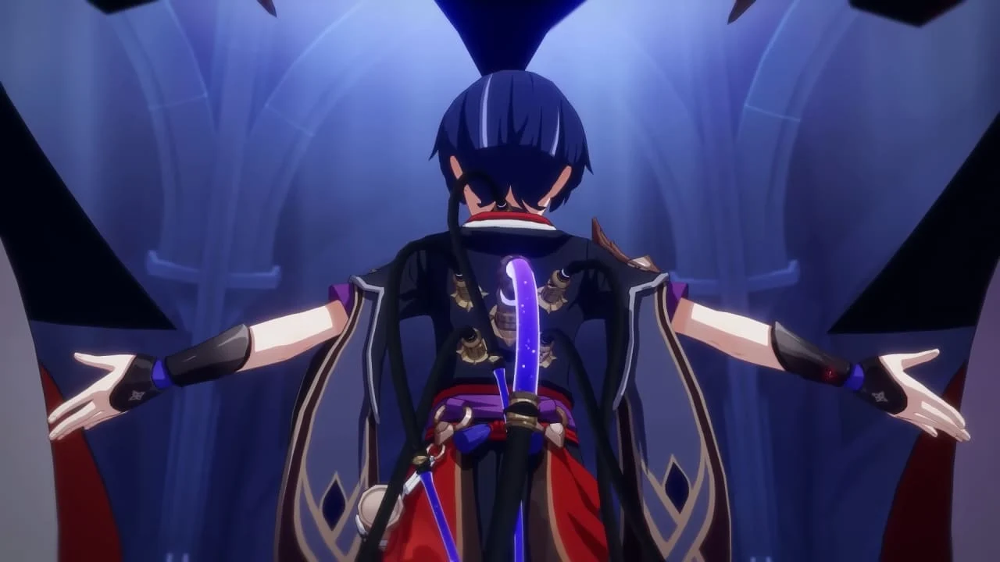

_Backshot of Scaramouche being attached to 'Shoku no Kami' with tubes and connections. One could only imagine how much pain he must've endured in the process._

> _Eternity stretches things out over a long time. But each moment within it becomes all the more fragile_

### Kabukimono:
It means "strange thing'', or "the crazy one". The word is derived from kabuku which means "one who leans away from normal."

It is quite fitting for Wanderer as before this, the people of Tatarasuna called him this because of his unique outfit of being different from the regular clothing.

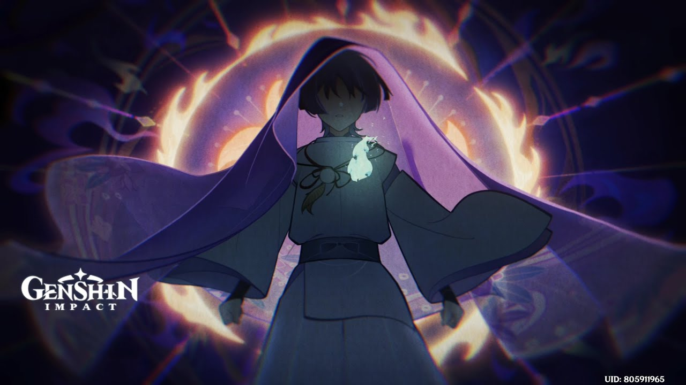

It could also be possible that because Wanderer lacks a heart, which makes him different from the mortals born with one. However, Niwa assures him they are all alike.

### Kunikuzushi:
It means "Destroy a country" or "Country destroyer". It refers to a large-than-life villain capable of taking over the entire realm which slightly corresponds to Scaramouche who became a God in the Sumeru quest, wielding his godly power over Sumeru. Kunikuzushi was the name Scaramouche (at that time) told Yoshinori and the Yashiro head to warn The Shogun about it. That could mean Scaramouche planned to take action against The Shogun as he became embittered by both gods and humanity. Destroying his very homeland will be enough to show his worth to his creator, should he must. He already did so to the Raiden Gokaden, and led to the downfall of both the Kaedehara and Kamisato clans. Imagine what he could have done to the entire nation? Also, as a funfact: Kunikuzushi is a name of a cannon. The little fellow literally named himself a cannon. And you can find the same cannon all over Tatarasuna, which is ironic if you ask me.

### Scaramouche/The Balladeer:
Ah yes, the Iconic name. Scaramouche, 6th of the Fatui Harbinger, otherwise known as The Balladeer. References to Scaramouche, a stock clown character of the Commedia Dell'arte. He generally possesses a variety of evil qualities, but his main vices are dishonesty and irresponsibility, as well as a fondness for intrigue that puts him in perilous circumstances. Scaramouche, in contrast to his other Harbingers, wears a mask on the top of his hat rather than his face. This may be in reference to the original Scaramouche, played by actor Tiberio Fiorillo, who lacked a mask. The stylised "kasa" hat worn by Scaramouche may be a nod to the character's attire, which had a big floppy hat that hung down over the character's neck. The fact that Scaramouche was initially a puppet for The Shogun may be the reason why the term Scaramouche has come to refer to a group of puppets with extending necks.

Shouki No Kami, The Prodigal - Literally means "The God who can be redeemed" symbolizing Scaramouche's ideals to finally become the very God he was meant to be after being thrown away by Ei, no longer useful of his role of being the very puppet to wield the Godhood of Eternity. It is also referencing Neon Genesis Evangelion.

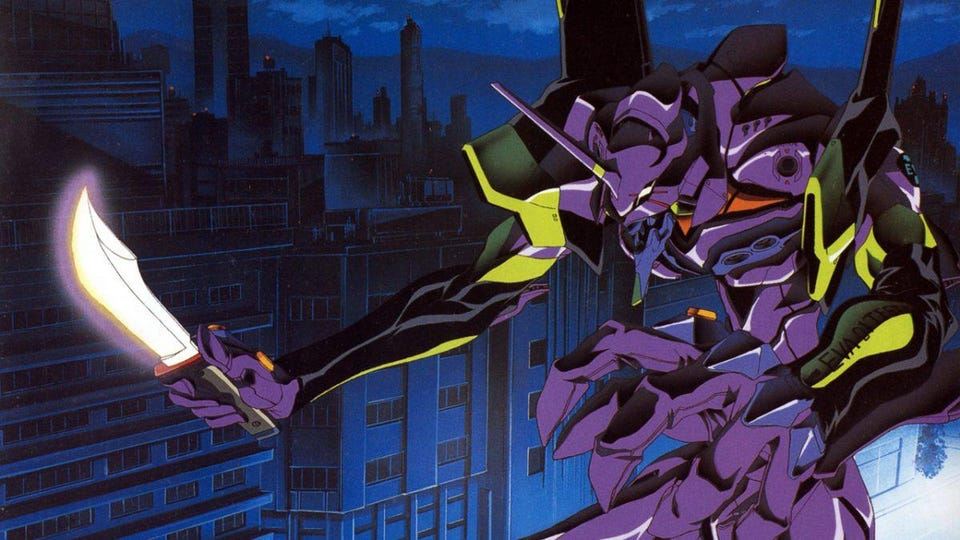
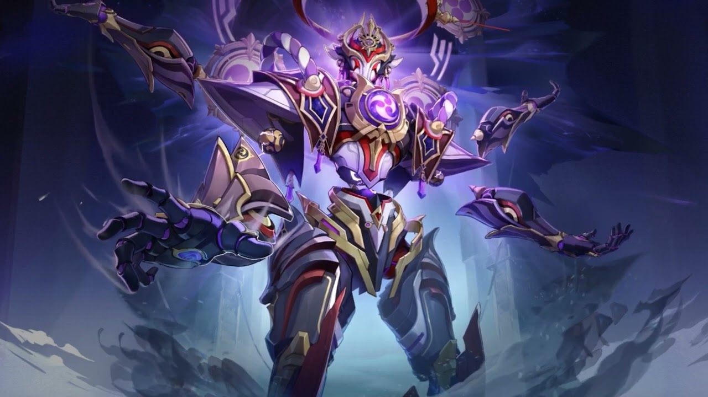

I hope you can see the similarities. Plus, even the game has an achievement: "It All Comes Tumbling Down", a nod to a lyric from Evangelion's song. Scaramouche is literally Shinji while inside the robot which is like a puppet, showing how Ei wanted to use the puppet to achieve eternity. Shinji's father, Gendo Ikari, is like Dottore, abusive to Scaramouche.

Wanderer- A broad name that he told the Traveler that they could call him whatever they like. Wanderer means someone who travels from place to place without any clear aim or purpose, which relates to the puppet in the sense that he is free from the Fatui and can write his own story now, while also seeking redemption by working with Nahida, wandering Sumeru. Finally, that same fledgling barely out of the nest had shown its wings.

## Constellation meanings

> "Are you deaf, or just stupid? When did I give you the right to issue your own orders?"

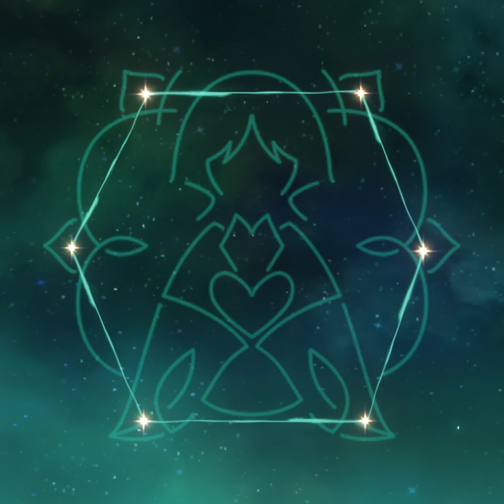

_Wanderer's constellation: Peregrinus - it means "Wanderer"_

**Peregrinus** means "Wanderer" and references a philosopher of the same name. His life story seemingly parallels Wanderers'. In his early life, he was accused of parasites and the murder of a family member, which forced him to leave his homeland. This is similar to the people of Tatarasuna dying to the Tataragami and Kabukimono leaving the scene. He, later on, rose into an authority in a Christian Community, quite like the Fatui. After being imprisoned by the Romans, Peregrinus left his inheritance, and wandered the world, only to burn himself in Egypt. This is similar to how Scaramouche lost his Gnosis and wandered the world before erasing himself from the Irminsul.

Wanderer is the only non-archon character besides the twins to have constellations that represented himself. It is also shaped like a Kokeshi Doll. It's an emblem of hope, which is like Wanderer's hopes for the future, a new fate in his life where he can make the choice.

His constellation is the result of his Ascension into Godhood.

Each of his constellations has its own meaning, as such, there is [another google document](https://docs.google.com/document/d/18FT-XdoFGFWa9qF_C6SdkEQusjoRLr77JPGK2TUULl8/edit#heading=h.251yrdg0yyh7) made specifically for that. (Credit: [Zaura](https://twitter.com/emanatingauras))

## Reference from the real world

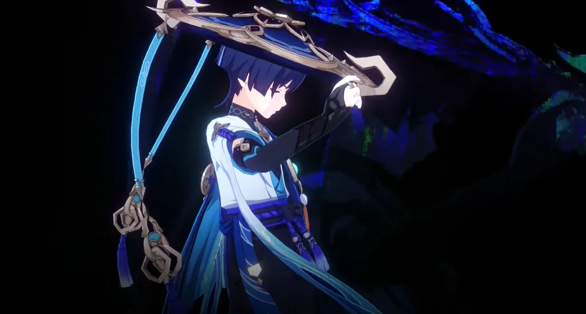

> _"Scaramouche, Scaramouche, will you do the fandango?" - a line from Bohemian Rhapsody, by Queens_

When the thoughts of Scaramouche come to mind, many people will think of Bohemian Rhapsody. There are many references from Bohemian Rhapsody to Scaramouche, so let's go through them, shall we?

First, the lyrics.

> _"Is this real life? Is this just fantasy? Caught in a landslide, No escape from reality Open your eyes, look up to the skies and see, I'm just a poor boy, I need no sympathy, because I'm easy to come, easy go, little high, little low, anyway the wind blows doesn't really matter to me, to me"_

This could symbolize Scaramouche questioning his very existence when he was in the Shakkei Pavillion. His purpose in life was missing, gone, and as a puppet, he does not have a heart.

> _"Mama, oooh, I don't want to die, I sometimes wish I'd never been born at all."_

In his character teaser, he wishes he wasn't born at all, he suffered so much, and everyone he trusted left him, so why should he still be carrying on?

> _"Thunderbolts and lightning, very, very frightening me"_

This can be a reference to Ei, the Electro Archon, as well as the following line,

> _"Beelzebub has a devil put aside for me, for me,"_

"A devil" may most likely be the Electro Gnosis. And on which he tied his very existence in life and aspired to wield it as his core.

> _"So you think you can love me and leave me to die? Oh, baby, can't do this to me, baby, just gotta get out, just gotta get right outta here"_

This can be a reference to the betrayals Scaramouche suffered and his wanting to have no more of such disgust.

* Not only the song lyrics but also Hoyoverse's soundtrack that accompanied his introduction cutscene during the "Unreconciled Stars" limited event is called "Ominous Fandango"

* His "collected miscellany": "Anyway the Wind Blows" is literally a line in lyrics as well.

* Bohemian Rhapsody was released on 31st October 1975. And when was the drip market release of Wanderer? 31st October 2022! Hoyoverse is not joking around with the similarities.

* Wanderer's birthday, the 3rd of January, is also a reference to the date when the Tokugawa Shogunate was abolished in Japan. Is this a nod to how Scaramouche hoped to overthrow The Shogun of Inazuma? Maybe?

Quite honestly, there are so many references it hurts my head. There are more references, but these are some of them. Now let's go over other references to the real world, shall we?

"The Prodigal" is one of the parables of Jesus Christ in the Bible. It means "a man or boy who has left his family in order to do something that the family disapprove of and has now returned home feeling sorry for what he has done". This is quite similar to how Wanderer left Inazuma for the Fatui because of the betrayals he faced, to only learn the truth that those betrayals weren't actually betrayals. And as such, regret filled him, only for him to seek atonement to become a better person for them.

The Wanderer's outfit also has many references to Buddhism. His weapon also is similar to that of a type of ritual bell, accompanied by Vajra. It is used to drive evil spirits away. Together they represent enlightenment, similar to how Wanderer gained back his past memories and accepted them, ascending to someone better than he was before.

While I only touched the surface of his outfit (not even his Kabukimono and Balladeer outfit), you can watch a [complete Scaramouche design analysis](https://youtu.be/cA7XOV9lyzA) made by Ashikai, who is known for creating meaningful and knowledgeable lore videos.

## Quirks and Misconceptions

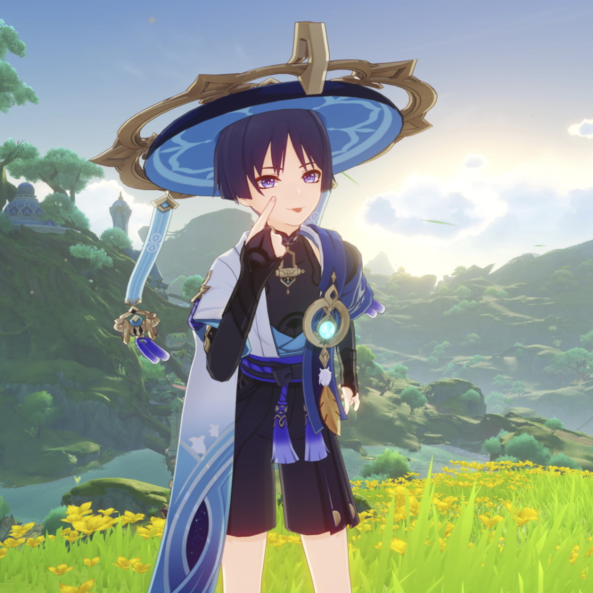

> _"It's the way of the world. Human life is worthless. They were always going to die, with or without a Delusion. At least having one gives them a chance to fulfil their ambitions"_

- Although cunning, Wanderer does care for the Traveler, he just masks it in his egoist words (Like a typical "tsundere" Japanese archetype.)

- During his time as the Fatui Harbinger, neither the other Harbingers liked him, nor did Scaramouche like them. In his voice line, he generally has a loathing tone while talking about the other Harbingers.

- He uses his hat as an umbrella. That's it. Have you seen the size of that thing?

- The symbol on his nape is the negative symbol of the Raiden Shogun's nape.
  
- He was probably a proper Pinocchio-like puppet with wood-like joint lines that gradually merged/vanished to give him human-like joints.
  
- He has a doll that he carries with him - most likely the doll the unknown child had with him. This makes him quite cute (in some way).

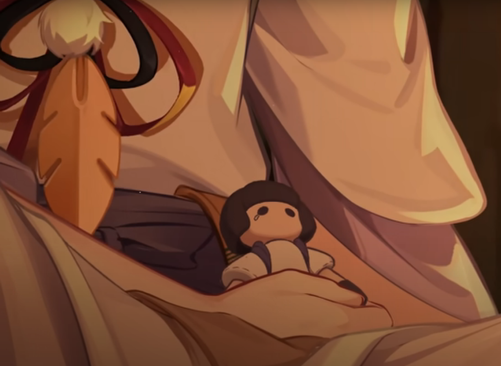

Many people thought Wanderer would be an Electro User. But him becoming an anemo user has to do with how he accepted himself and his past. Also, him being an Anemo user with god-like powers with his "sister" puppet Raiden Shogun being an Electro user parallels the Japanese twin gods "Fujin" - the god of wind, and "Raijin" - the god of thunder.

## Theories

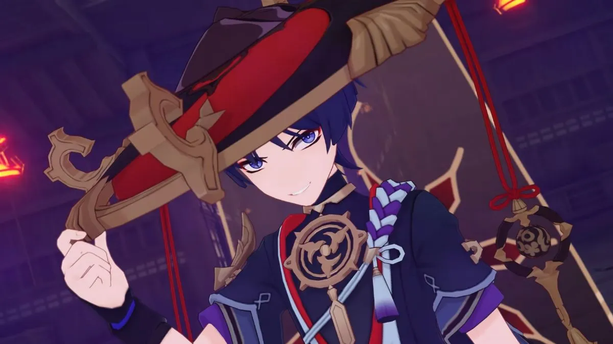

Some theories about Wanderers have been discussed in the community.

For example:

### The False Sky:
As early as version 1.1, Scaramouche came out of nowhere and told this monumentally big line - tossing every theorycrafter and lore reader into an eternity of suspicion.

> _"Ugh, whatever! I have bigger fish to fry! I've discovered something far more important... and far more terrifying. The stars, the sky... it's all a gigantic hoax. A lie."_

There are a lot of speculations and theories that the world of Tevyat is a "bubble dimension". As to what that means, we'll discuss in an another page.

### Wanderer meeting Kazuha:
This will be something to witness. A descendant of the Kaedehara clan, a clan Scaramouche almost destroyed, and the very descendant who went toe-to-toe with The Shogun.

> "You speak of the descendant of the Kaedehara clan? Then isn't he … Wait, he also possesses an Anemo Vision? … And even managed to take on the Raiden Shogun's Musou no Hitotachi? Hehe… Ahahahaha!"

Wanderer will be pleased. Very, pleased.

### Wanderer vs Dottore:

The 2nd Harbinger vs the former 6th Harbinger. What a battle that will be. The very person who pulled the strings of Scaramouche's life, and Wanderer now standing tall against him. My money's on Dottore though, he is hiding so many secrets we are yet to uncover, plus him being 4 ranks above Scaramouche and being stated to be relevant to God, I think that says a lot.

### Wanderer meets Ei:

The meet-up we all hope for. Mother and Son, finally reunited. I hope, both can settle their misunderstanding. It has been long overdue. It would be so awesome (... It would have been so cool) to see them finally talking it out. Wanderer, although may show some resentment, will probably be nice to his creator, just like Ei would. (Also hope they will go for family therapy)

## Conclusion

> _"Hmm? A birthday present?... You didn't put something strange in there, did you?"_

People in life have a difficult time facing themselves. It is just an internal conflict that everyone will inevitably face. Especially if they know they made mistakes, when they know they hurt people, lose touch with people, and destroy their world. Soon, they will hurt themself, hate themself, and wish they never exist at all. And the less support they get from people around them, their friends and family, the harder it is to deal and cope with the hatred and accept who they are and what is revealed to them. Growing up, and becoming a better person is just painful. But that is what makes up humans. That is what humans will always go through, and that's why this was impactful for Wanderer. He had to face his past, in his worst state.

Scaramouche, Wanderer, Kabukimono, Kunikuzushi - whatever you call him, his story is a powerful lesson: of learning to accept oneself, one's past, mistakes, regrets, misguidance, and learning to trust others, just like they trust you. You can't run from them. No one can run from them. You can only accept, learn, and move on. And no, you are not worthless. No one in this world is born for nothing. Everyone has a purpose in life. It is just self-acceptance that is key to finding that buried purpose.

I have seen many people shaming his "Good Arc" for spoiling his character and calling him poorly written. But he isn't. The Wanderer Arc was THE conclusion of his story. All he ever wanted was to feel wanted and needed, and he did by Nahida and the Traveler. He learnt the truth of his past and regrets that he sent his anger on Niwa who didn't even do anything wrong. His drawbacks and difficulties in his life are what some people can relate to, who may feel they have no meaning to live, no one to go to, and may have their hearts shattered because of being taken advantage of or being left behind. But I want you to know, that you should just face the music. You can't get better if you don't. So just look up at the horizon, accept your shortcomings, aim to be better, smile, and just…

Walk on.

## The End

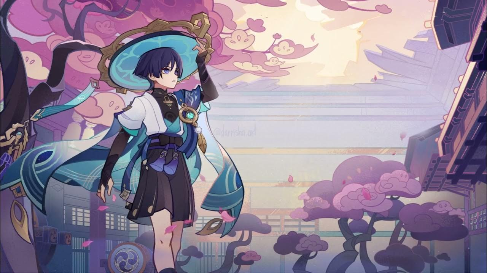

Thank you for taking the time to read the story, lore, and references of Wanderer, Scaramouche, or whatever you want to call him. I had a lot of fun and emotion writing this because I feel the same as Wanderer. Accepting the past may be challenging for some, but I promise you, you will get there. If there are any changes or suggestions you would like to see, please contact me at **blanky#5796**

## Inspirations:
* Ashikai for some information regarding Wanderer's lore, check out her [youtube!](https://www.youtube.com/@Ashikai)

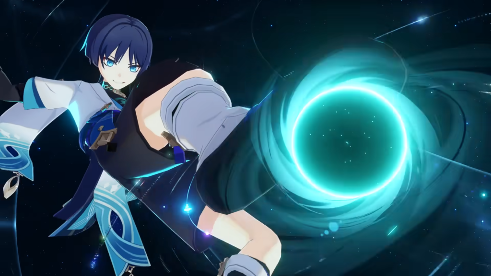

> _"Never Been Born At All... Is That Really All You Wished For?" - Wanderer to his old version_

## Credits:
* Author - Blanky
* Reviewed by - Arun

